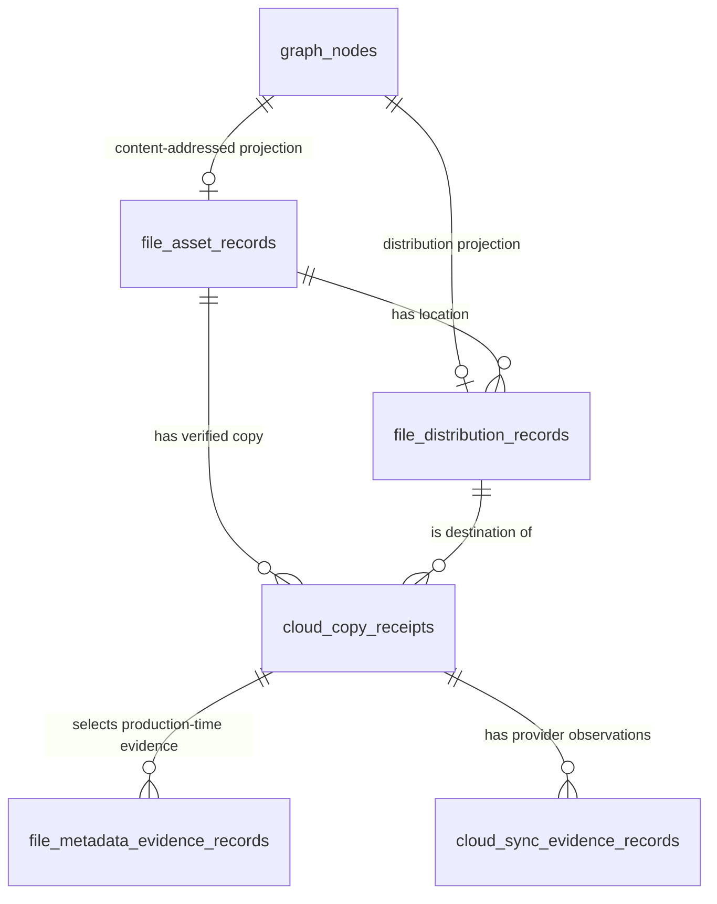

# DiskSage post-copy lineage ERD

This relational read-model records only integrity-verified copy lineage after
the corresponding file asset and distribution graph nodes exist. It does not
authorize a copy, provider write, sync, or local eviction. Source paths are not
stored; the ingress contract supplies only `source_locator_sha256`.



The schema deliberately leaves the generic `graph_edges` mirror unchanged.
Its seed path can create relationships before both endpoint nodes exist, while
post-copy lineage requires pre-existing asset and distribution nodes. All seven
new foreign keys use `ON DELETE RESTRICT` so catalog or graph cleanup cannot
silently erase receipt evidence.

## Reproducible pg-erd snapshot

After applying `migrations/0001_init_graph_vector.sql` and
`migrations/0002_file_copy_lineage.sql` to a temporary PostgreSQL 17.10 database,
capture the catalog through the Unix-socket-only pg-erd CLI:

```bash
pg-erd-snapshot \
  --host /tmp \
  --database semantic_data_portal_erd \
  --schema public \
  --pretty > semantic-data-portal.snapshot.json
```

The validated snapshot contained 12 relations, 100 columns, 44 constraints,
24 indexes, 16 primary-key columns, and 7 foreign-key edges. The pre-migration
snapshot contained 7 relations and no foreign-key edges.

The seven observed foreign-key edges were:

| Child | Column | Parent | Column |
| --- | --- | --- | --- |
| `file_asset_records` | `graph_node_id` | `graph_nodes` | `node_id` |
| `file_distribution_records` | `graph_node_id` | `graph_nodes` | `node_id` |
| `file_distribution_records` | `asset_node_id` | `file_asset_records` | `graph_node_id` |
| `cloud_copy_receipts` | `asset_node_id` | `file_asset_records` | `graph_node_id` |
| `cloud_copy_receipts` | `destination_distribution_node_id` | `file_distribution_records` | `graph_node_id` |
| `file_metadata_evidence_records` | `receipt_id` | `cloud_copy_receipts` | `receipt_id` |
| `cloud_sync_evidence_records` | `receipt_id` | `cloud_copy_receipts` | `receipt_id` |

## Persistence boundary

- `local_copy_verified` must be true for every persisted receipt.
- `provider_sync_confirmed` remains distinct from local copy verification and
  may only be updated from a bound provider evidence record.
- Human-review fields are all required for review-gated copies and must record
  an approved disposition; they must all be absent for non-review candidates.
- Production time remains bound to ordered metadata evidence. The portal does
  not reinterpret filename dates as embedded production metadata.
- Provider authority, quota, and tenant policy are upstream copy gates. A row in
  this read-model is evidence, not permission to copy or evict.
