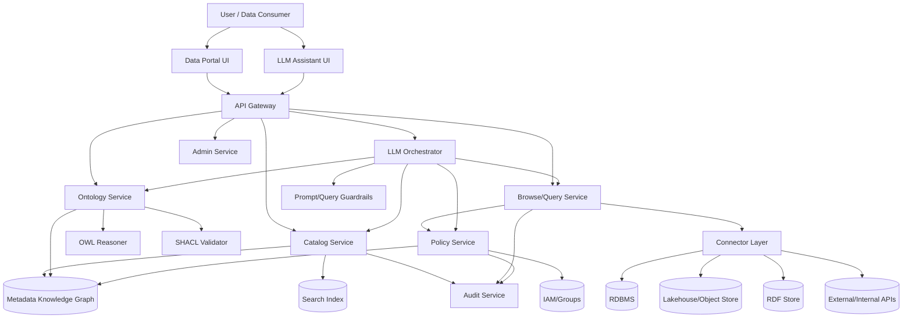
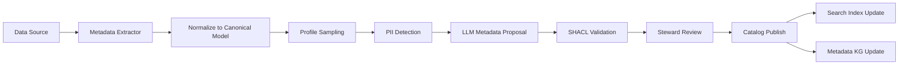
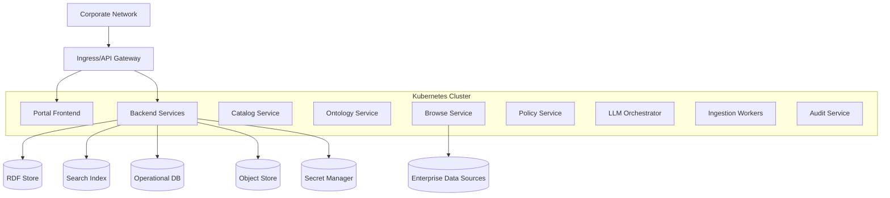

# 온톨로지·LLM 기반 데이터 카탈로그 및 데이터 브라우징 플랫폼 PRD/TRD

**문서 버전:** v0.1  
**작성일:** 2026-06-29  
**문서 상태:** Draft for Product/Architecture Review  
**대상 독자:** Product Owner, Data Platform Architect, Ontology Engineer, Backend/Frontend Engineer, Data Governance, Security, ML/LLM Engineer  
**제품 가칭:** Semantic Data Portal, SDP  

---

## 0. 문서 요약

본 문서는 **LLM을 활용한 온톨로지 기반 데이터 카탈로그 서비스와 데이터 브라우징 서비스**를 하나의 데이터 포털로 제공하기 위한 매우 구체적인 PRD(Product Requirements Document)와 TRD(Technical Requirements Document)이다.

핵심 설계 결론은 다음과 같다.

> **데이터 카탈로그와 데이터 브라우징은 동일 포털에서 사용자에게 통합 제공하되, 백엔드에서는 별도 모듈로 분리한다.**  
> 카탈로그는 metadata plane, 브라우징은 data access plane, 온톨로지는 semantic plane, LLM은 orchestration plane, 정책/보안은 governance plane으로 설계한다.

```text
사용자 / LLM Assistant
        ↓
통합 데이터 포털 UI
        ↓
┌─────────────────────┬──────────────────────┬─────────────────────┬─────────────────────┐
│ Catalog Service      │ Browse/Query Service  │ Ontology Service     │ Policy Service       │
│ Metadata Discovery   │ Data Exploration      │ Semantic Grounding   │ Access/Masking/Audit │
└─────────────────────┴──────────────────────┴─────────────────────┴─────────────────────┘
        ↓                       ↓                       ↓                       ↓
Metadata KG / Search      Source Connectors       OWL/SKOS/SHACL         IAM/ABAC/Logs
        ↓                       ↓
RDF Store / Search Index  DB / Lake / API / RDF Store / Graph DB
```

---

## 1. 전제와 설계 원칙

### 1.1. 기본 전제

1. 조직 내 데이터는 RDBMS, Lakehouse, Object Storage, API, RDF Store, Graph DB 등에 분산되어 있다.
2. 사용자는 데이터셋 이름보다 “고객”, “매출”, “이탈”, “재고”, “위험”, “활성 사용자” 같은 비즈니스 용어로 데이터를 찾는다.
3. LLM은 자연어 의도 해석, 용어 매핑, 검색 질의 생성, SQL/SPARQL 초안 생성, 메타데이터 보강에는 유용하지만, 권한 판단과 최종 의미 확정의 주체가 되어서는 안 된다.
4. 온톨로지는 데이터의 의미, 용어, 관계, 품질 규칙, lineage, 정책의 연결점을 제공한다.
5. 실제 데이터 preview/query는 반드시 별도 Browse/Query Service를 통해 수행하고, 권한·마스킹·감사 로그를 통과해야 한다.

### 1.2. 설계 원칙

| 원칙 | 설명 |
|---|---|
| Semantic-first | 물리 테이블명보다 비즈니스 개념과 표준 URI를 중심으로 탐색한다. |
| Metadata/Data 분리 | 카탈로그는 메타데이터를 관리하고, 브라우징은 실제 데이터 접근을 담당한다. |
| Policy before data | preview/query 전에 반드시 policy decision과 masking decision을 수행한다. |
| LLM as orchestrator | LLM은 직접 DB에 접속하지 않고, 검증된 API와 query gateway만 호출한다. |
| CQ-driven ontology | 온톨로지는 competency question과 사용 사례를 기준으로 확장한다. |
| Testable semantics | OWL reasoner, SHACL, SPARQL, API test로 검증 가능한 구조를 유지한다. |
| Explainable results | 검색/추천/질의 결과에는 출처, 정의, lineage, 품질, 권한 근거를 함께 제공한다. |
| Incremental adoption | 처음부터 전사 전체가 아니라 핵심 도메인과 데이터셋부터 단계적으로 적용한다. |

---

# Part A. PRD

## 2. 제품 개요

### 2.1. 문제 정의

현행 데이터 플랫폼에서 일반적으로 발생하는 문제는 다음과 같다.

1. **데이터 발견성 부족**  
   사용자는 필요한 데이터가 존재하는지, 어디에 있는지, 누가 관리하는지 알기 어렵다.

2. **비즈니스 의미와 물리 데이터의 단절**  
   예를 들어 `customer_status`, `cust_st_cd`, `active_yn`이 실제로 같은 의미인지, 다른 정의인지 파악하기 어렵다.

3. **카탈로그와 실제 탐색의 단절**  
   카탈로그에서 데이터셋 설명을 찾더라도 schema, profile, sample, lineage, 권한 상태까지 자연스럽게 이어지지 않는다.

4. **LLM 질의의 위험성**  
   LLM이 사용자 질문을 SQL로 변환할 수는 있으나, 비즈니스 용어 매핑 오류, 권한 우회, PII 노출, hallucinated table/column 문제가 발생할 수 있다.

5. **거버넌스 자동화 부족**  
   owner, steward, lineage, 품질, 보안등급, 사용 정책이 데이터 자산과 느슨하게 연결되어 있다.

### 2.2. 제품 비전

> 사용자가 자연어와 시각적 탐색을 통해 조직 내 데이터를 발견하고, 의미를 이해하고, 안전하게 preview/query하며, lineage와 품질·정책 정보를 근거와 함께 확인할 수 있는 **온톨로지 기반 지능형 데이터 포털**을 제공한다.

### 2.3. 핵심 사용자 가치

| 사용자 | 가치 |
|---|---|
| 데이터 소비자 | “내 업무 질문에 맞는 데이터셋을 빠르게 찾고, 의미·품질·접근 가능성을 확인한다.” |
| 데이터 분석가 | “테이블/컬럼을 직접 외우지 않고 비즈니스 용어 기반으로 후보 데이터를 탐색한다.” |
| 데이터 엔지니어 | “데이터셋 메타데이터, lineage, 품질, schema 변경 영향도를 체계적으로 관리한다.” |
| 데이터 스튜어드 | “용어 정의, owner, 품질 기준, 사용 정책을 자산과 연결해 관리한다.” |
| 보안/거버넌스 담당자 | “데이터 접근과 preview/query를 정책 기반으로 통제하고 감사할 수 있다.” |
| 온톨로지 엔지니어 | “도메인 개념, 관계, 용어, 매핑, 검증 규칙을 버전관리하며 운영한다.” |

---

## 3. 목표와 비목표

### 3.1. 제품 목표

| ID | 목표 | 측정 지표 |
|---|---|---|
| G-001 | 데이터 발견 시간 단축 | 사용자가 적합 데이터셋을 찾는 평균 시간 50% 이상 감소 |
| G-002 | 데이터 의미 이해 향상 | 데이터셋 상세 페이지에서 business term, owner, quality, lineage 표시율 90% 이상 |
| G-003 | 안전한 데이터 preview 제공 | 모든 preview/query 요청에 policy decision, masking, audit log 100% 적용 |
| G-004 | LLM 기반 자연어 탐색 제공 | 자연어 질문의 catalog search 성공률 80% 이상 |
| G-005 | 온톨로지 기반 용어 정규화 | 핵심 도메인 용어의 ontology mapping coverage 70% 이상 |
| G-006 | 거버넌스 자동화 | 필수 metadata SHACL validation 통과율 95% 이상 |

### 3.2. 제품 비목표

| ID | 비목표 | 설명 |
|---|---|---|
| NG-001 | LLM이 권한을 직접 결정 | 권한 결정은 Policy Service/IAM/ABAC 엔진이 담당한다. |
| NG-002 | 전체 데이터를 RDF로 강제 이관 | 기존 DB/Lake는 유지하고 metadata KG와 connector를 통해 연동한다. |
| NG-003 | SPARQL만으로 모든 데이터 질의 | RDF metadata에는 SPARQL을 사용하되, 실제 원천 데이터는 SQL/API/native query를 사용한다. |
| NG-004 | 온톨로지가 모든 비즈니스 규칙을 대체 | 데이터 품질은 SHACL, 운영 규칙은 policy/rule engine, 복잡한 계산은 서비스 계층에서 처리한다. |
| NG-005 | MVP에서 모든 도메인 커버 | 초기에는 1~2개 핵심 도메인과 우선순위 데이터셋으로 시작한다. |

---

## 4. 사용자 페르소나

### 4.1. Persona P1: 데이터 소비자 / 현업 기획자

- 기술 수준: SQL 초급 또는 없음
- 주요 질문:
  - “고객 이탈 분석에 쓸 수 있는 데이터가 있나?”
  - “이 데이터셋을 내가 볼 수 있나?”
  - “이 지표는 어떤 기준으로 계산되나?”
- 성공 기준:
  - 자연어로 데이터셋 후보를 찾는다.
  - 데이터 의미, 품질, owner, 접근 가능 여부를 이해한다.
  - 민감 데이터는 masking된 preview만 확인한다.

### 4.2. Persona P2: 데이터 분석가

- 기술 수준: SQL 중급~고급
- 주요 질문:
  - “최근 90일 구매 이벤트와 로그인 이벤트를 조인할 수 있나?”
  - “고객 ID 컬럼이 어느 테이블에서 같은 개념으로 쓰이나?”
  - “데이터 최신성과 null ratio는 어떤가?”
- 성공 기준:
  - schema/profile/preview를 빠르게 확인한다.
  - 관련 데이터셋과 join key 후보를 추천받는다.
  - 검증된 SQL 초안을 받아 수정·실행한다.

### 4.3. Persona P3: 데이터 엔지니어

- 기술 수준: 고급
- 주요 질문:
  - “schema 변경이 downstream report에 어떤 영향을 주나?”
  - “신규 테이블을 카탈로그에 등록하려면 어떤 metadata가 필요한가?”
  - “데이터 품질 규칙 위반이 있는가?”
- 성공 기준:
  - ingestion pipeline이 자동 metadata를 수집한다.
  - lineage와 품질 profile이 최신 상태로 유지된다.
  - SHACL/quality rule 위반을 PR/CI 단계에서 확인한다.

### 4.4. Persona P4: 데이터 스튜어드

- 기술 수준: 중급
- 주요 질문:
  - “이 용어의 공식 정의는 무엇인가?”
  - “이 컬럼은 어떤 business term에 매핑되는가?”
  - “데이터셋 owner와 steward가 지정되어 있는가?”
- 성공 기준:
  - business glossary와 SKOS taxonomy를 관리한다.
  - LLM이 제안한 term mapping을 검토·승인한다.
  - 필수 metadata 누락을 자동 검출한다.

### 4.5. Persona P5: 보안/거버넌스 담당자

- 기술 수준: 고급
- 주요 질문:
  - “누가 어떤 데이터셋 preview를 봤는가?”
  - “PII 컬럼은 마스킹되었는가?”
  - “외부 반출 금지 정책이 적용되었는가?”
- 성공 기준:
  - 권한/마스킹/audit 로그가 중앙화된다.
  - 사용자 목적과 권한에 따라 접근이 제어된다.
  - 민감도 tag와 정책이 데이터 자산에 연결된다.

### 4.6. Persona P6: 온톨로지 엔지니어

- 기술 수준: Semantic Web/OWL/SHACL 고급
- 주요 질문:
  - “도메인 개념과 데이터 자산이 올바르게 구분되었는가?”
  - “새 개념 추가가 기존 추론을 깨지 않는가?”
  - “LLM 제안 ontology patch가 검증을 통과하는가?”
- 성공 기준:
  - ontology repository가 버전관리된다.
  - reasoner, SHACL, CQ test가 CI에서 실행된다.
  - 용어/개념/컬럼 mapping의 provenance가 남는다.

---

## 5. 주요 사용자 여정

### 5.1. Journey J1: 자연어로 데이터셋 찾기

```text
사용자: “고객 이탈 예측에 쓸 수 있는 최신 고객 행동 데이터를 찾아줘.”
  ↓
LLM Assistant: “고객 이탈”을 ontology term으로 해석
  ↓
Ontology Service: Churn, CustomerBehavior, CustomerActivity 관련 개념 반환
  ↓
Catalog Service: 관련 dataset 검색
  ↓
Policy Service: 사용자 접근 가능 여부 계산
  ↓
Search Service: relevance + freshness + quality score로 ranking
  ↓
UI: 추천 데이터셋, 정의, owner, 품질, 접근 가능 여부, lineage 표시
```

Acceptance Criteria:

- 후보 데이터셋은 최소 3개 이상 또는 “없음”을 명확히 반환한다.
- 각 후보에는 business term mapping 근거가 표시된다.
- 접근 불가 데이터셋은 “존재 여부 표시 가능/불가” 정책에 따라 처리된다.
- LLM 응답에는 hallucinated dataset/table/column이 포함되어서는 안 된다.

### 5.2. Journey J2: 데이터셋 상세와 preview 보기

```text
사용자: 데이터셋 상세 페이지 진입
  ↓
Catalog Service: title, description, owner, steward, tags, terms, quality, lineage 조회
  ↓
Browse Service: schema/profile/preview 가능 여부 확인
  ↓
Policy Service: 컬럼별 masking policy 반환
  ↓
Browse Service: sample 100건 조회, PII masking 적용
  ↓
Audit Service: preview 이벤트 기록
```

Acceptance Criteria:

- preview는 기본 100건 이하이며 페이지네이션을 적용한다.
- 민감 컬럼은 마스킹되거나 제외된다.
- preview 결과에는 “샘플이며 전체 데이터 대표성을 보장하지 않음” 문구를 표시한다.
- preview 요청은 audit log에 사용자, 목적, datasetId, timestamp, policyDecisionId를 기록한다.

### 5.3. Journey J3: 비즈니스 용어에서 물리 컬럼 추적

```text
사용자: “활성 고객” 용어 검색
  ↓
Ontology Service: dom:ActiveCustomer 정의, 동의어, 상위/하위 개념 조회
  ↓
Catalog Service: 해당 개념을 표현하는 dataset/table/column 조회
  ↓
Lineage Service: upstream source와 downstream report 조회
  ↓
UI: 개념 → 데이터셋 → 컬럼 → 리포트/모델 경로 표시
```

Acceptance Criteria:

- business concept와 physical asset이 명확히 구분되어 표시된다.
- 컬럼 mapping은 approved/proposed/deprecated 상태를 가진다.
- 각 mapping에는 source, steward, approval date가 표시된다.

### 5.4. Journey J4: LLM 기반 SQL/SPARQL 초안 생성

```text
사용자: “최근 90일 활성 고객 수를 주별로 집계하는 쿼리를 만들어줘.”
  ↓
LLM Assistant: 의도 분석 및 용어 resolve
  ↓
Ontology Service: ActiveCustomer 정의 확인
  ↓
Catalog Service: 관련 dataset/column 후보 확인
  ↓
Policy Service: 사용자가 해당 데이터셋에 query 권한이 있는지 확인
  ↓
Query Planner: SQL 초안 생성
  ↓
Query Validator: table/column allowlist, syntax, cost, limit 검증
  ↓
사용자에게 실행 전 쿼리와 가정 표시
```

Acceptance Criteria:

- LLM은 존재하지 않는 테이블/컬럼을 생성하지 않는다.
- 쿼리 실행 전 사용자에게 데이터셋, 컬럼, 필터, 집계 기준을 표시한다.
- query timeout, row limit, cost limit을 적용한다.
- 민감 데이터가 포함되는 경우 집계 또는 masking 정책을 적용한다.

### 5.5. Journey J5: 신규 데이터셋 등록

```text
데이터 엔지니어: 신규 테이블 등록 요청
  ↓
Ingestion Service: schema, sample profile, lineage, freshness 자동 수집
  ↓
LLM Metadata Assistant: description, tags, business term mapping 후보 생성
  ↓
SHACL Validator: 필수 metadata 누락 검증
  ↓
Data Steward: LLM 제안 검토·승인
  ↓
Catalog Service: dataset publish
```

Acceptance Criteria:

- owner, steward, title, description, sensitivity, updateFrequency, sourceSystem이 필수다.
- LLM 생성 description은 “proposed” 상태로 저장된다.
- steward 승인 전에는 공식 glossary mapping으로 노출하지 않는다.
- publish 전에 SHACL validation을 통과해야 한다.

---

## 6. 제품 범위

### 6.1. MVP 범위

| 영역 | MVP 포함 여부 | 설명 |
|---|---:|---|
| 데이터셋 검색 | 포함 | keyword + semantic search + facet |
| 데이터셋 상세 | 포함 | owner, description, terms, schema, quality, lineage 요약 |
| 온톨로지/용어 서비스 | 포함 | business term, synonym, hierarchy, mapping 조회 |
| 데이터 preview | 포함 | 권한 기반 100건 sample preview |
| schema/profile browsing | 포함 | column, datatype, null ratio, distinct count, min/max |
| LLM 자연어 카탈로그 검색 | 포함 | dataset discovery 중심 |
| LLM SQL 생성 | 제한 포함 | read-only SELECT, 승인형 실행, 제한된 source |
| SHACL metadata validation | 포함 | publish gate |
| audit logging | 포함 | preview/query/catalog change 로그 |
| lineage graph | 부분 포함 | dataset/table 수준 lineage 우선 |
| ontology patch 자동 생성 | 부분 포함 | proposed patch만 생성, 자동 병합 금지 |
| fine-grained ABAC | 부분 포함 | dataset/column-level 우선, row-level은 Phase 2 |

### 6.2. Phase 2 범위

| 영역 | 설명 |
|---|---|
| row-level filtering | 사용자 속성/부서/목적 기반 row policy |
| graph browsing | entity neighborhood, relationship path 탐색 |
| advanced lineage | column-level lineage, model/report 영향도 분석 |
| LLM multi-step analysis | 여러 데이터셋을 비교하고 query plan을 제안 |
| active metadata | freshness anomaly, schema drift, ownership gap alert |
| ontology governance workflow | ontology PR, reviewer assignment, automated reasoning report |

### 6.3. Phase 3 범위

| 영역 | 설명 |
|---|---|
| federated query | 복수 source across SQL/SPARQL/API query orchestration |
| enterprise knowledge graph | 카탈로그, lineage, glossary, policy, usage analytics 통합 KG |
| self-service data product | 데이터 제품 publish, contract, SLA, subscription |
| recommendation engine | 사용자 업무/사용 이력 기반 dataset 추천 |
| automated impact analysis | schema 변경 시 downstream job/report/model 영향도 자동 예측 |

---

## 7. 기능 요구사항

### 7.1. Catalog Service 요구사항

| ID | 요구사항 | 우선순위 | 수용 기준 |
|---|---|---:|---|
| CAT-001 | 사용자는 데이터셋을 키워드, 태그, 도메인, owner, freshness, quality score, sensitivity로 검색할 수 있어야 한다. | P0 | 검색 결과는 2초 이내 95p 응답, facet count 포함 |
| CAT-002 | 데이터셋 상세 페이지는 title, description, owner, steward, source system, update frequency, freshness, quality, sensitivity, license, terms를 표시해야 한다. | P0 | 필수 필드 누락 시 “metadata incomplete” 배지 표시 |
| CAT-003 | 데이터셋은 DCAT 관점의 Dataset, Distribution, DataService 구조로 표현되어야 한다. | P0 | 각 dataset은 하나 이상의 distribution 또는 accessService와 연결 |
| CAT-004 | 데이터셋은 하나 이상의 business concept 또는 domain theme과 연결될 수 있어야 한다. | P0 | concept mapping 상태: proposed/approved/deprecated |
| CAT-005 | 카탈로그 등록/수정은 audit log를 남겨야 한다. | P0 | 변경 전후 diff, actor, timestamp, reason 기록 |
| CAT-006 | metadata completeness score를 자동 계산해야 한다. | P1 | 필수 metadata 충족률과 권장 metadata 충족률 분리 표시 |
| CAT-007 | catalog API는 JSON-LD export를 지원해야 한다. | P1 | Dataset URI 기반 JSON-LD 응답 제공 |
| CAT-008 | catalog는 dataset version과 schema version을 구분해야 한다. | P1 | schema drift 발생 시 이전 버전과 diff 표시 |
| CAT-009 | 데이터셋 상세에는 related dataset과 join candidate를 표시해야 한다. | P2 | 동일 business key/ontology mapping 기반 추천 |

### 7.2. Ontology / Terminology Service 요구사항

| ID | 요구사항 | 우선순위 | 수용 기준 |
|---|---|---:|---|
| ONT-001 | business term, synonym, acronym, multilingual label을 조회할 수 있어야 한다. | P0 | term resolve API가 confidence score와 후보 URI 반환 |
| ONT-002 | domain concept와 data asset은 별도 class로 모델링되어야 한다. | P0 | table/dataset이 business class의 subclass가 되지 않도록 SHACL/OWL 검증 |
| ONT-003 | SKOS 기반 glossary hierarchy를 제공해야 한다. | P0 | broader/narrower/related 관계 조회 가능 |
| ONT-004 | OWL/RDFS 기반 도메인 ontology를 버전관리해야 한다. | P0 | ontology version, change log, reviewer 기록 |
| ONT-005 | LLM이 생성한 ontology patch는 proposed 상태로 저장되고 자동 병합되지 않아야 한다. | P0 | reasoner + SHACL + reviewer 승인 후 병합 |
| ONT-006 | ontology term과 physical column mapping을 관리해야 한다. | P0 | mapping type, confidence, source, approval state 포함 |
| ONT-007 | reasoner consistency check를 수동/자동 실행할 수 있어야 한다. | P1 | unsatisfiable class 0개가 release gate |
| ONT-008 | competency question을 test case로 등록할 수 있어야 한다. | P1 | SPARQL/SHACL/reasoner/API test type 지원 |

### 7.3. Data Browsing Service 요구사항

| ID | 요구사항 | 우선순위 | 수용 기준 |
|---|---|---:|---|
| BRW-001 | 사용자는 권한이 있는 데이터셋의 schema를 조회할 수 있어야 한다. | P0 | table/column/datatype/nullable/key/comment 표시 |
| BRW-002 | 사용자는 권한이 있는 데이터셋의 sample preview를 볼 수 있어야 한다. | P0 | 기본 100건, 최대 1,000건, pagination 지원 |
| BRW-003 | preview는 column-level masking policy를 적용해야 한다. | P0 | PII 컬럼은 masking 또는 suppression |
| BRW-004 | profile 정보(null ratio, distinct count, min/max, freshness)를 표시해야 한다. | P0 | profile 계산 시점과 sample/full 여부 표시 |
| BRW-005 | query execution은 read-only SELECT 계열만 허용해야 한다. | P0 | DDL/DML/unsafe function 차단 |
| BRW-006 | query timeout, memory limit, row limit, cost limit을 적용해야 한다. | P0 | 초과 시 안전하게 중단하고 audit log 기록 |
| BRW-007 | 모든 preview/query 요청은 audit log를 남겨야 한다. | P0 | actor, datasetId, columns, purpose, decisionId 기록 |
| BRW-008 | 브라우징은 catalog asset ID/URI를 입력으로 받아야 한다. | P0 | 물리 경로 직접 호출 금지 |
| BRW-009 | source connector는 RDBMS, Lakehouse, Object Storage, RDF Store를 단계적으로 지원해야 한다. | P1 | connector contract를 공통화 |
| BRW-010 | graph/entity browsing을 지원해야 한다. | P2 | RDF/Graph DB source의 neighbors/path 조회 |

### 7.4. LLM Assistant 요구사항

| ID | 요구사항 | 우선순위 | 수용 기준 |
|---|---|---:|---|
| LLM-001 | 자연어 질문을 catalog search query로 변환해야 한다. | P0 | 검색 후보와 사용된 ontology term을 함께 표시 |
| LLM-002 | LLM은 반드시 Ontology Service로 term resolution을 수행해야 한다. | P0 | unresolved term은 사용자에게 가정으로 표시 |
| LLM-003 | LLM은 catalog에 존재하지 않는 dataset/table/column을 응답에 포함해서는 안 된다. | P0 | generated answer가 asset registry allowlist를 통과 |
| LLM-004 | SQL/SPARQL 생성은 schema-grounded context만 사용해야 한다. | P0 | 허용된 schema fragment 외 참조 차단 |
| LLM-005 | LLM 응답에는 근거 metadata, source dataset, timestamp, quality warning을 포함해야 한다. | P0 | 답변 카드에 evidence block 표시 |
| LLM-006 | LLM은 직접 DB credential 또는 connector secret에 접근할 수 없어야 한다. | P0 | LLM runtime에는 secret 미주입 |
| LLM-007 | prompt injection 방어를 수행해야 한다. | P0 | 문서/metadata 내 instruction-like text는 data로 취급 |
| LLM-008 | LLM 생성 metadata는 proposed 상태로 저장해야 한다. | P1 | steward 승인 전 official metadata로 미노출 |
| LLM-009 | LLM 대화 이력에는 민감 preview 결과를 원문 저장하지 않아야 한다. | P1 | redaction 또는 secure ephemeral memory 적용 |

### 7.5. Policy / Governance 요구사항

| ID | 요구사항 | 우선순위 | 수용 기준 |
|---|---|---:|---|
| POL-001 | catalog discovery 권한과 data preview/query 권한을 분리해야 한다. | P0 | 데이터셋 존재 확인 가능 여부를 별도 정책으로 제어 |
| POL-002 | dataset/table/column-level access control을 지원해야 한다. | P0 | 권한 없는 컬럼은 숨김 또는 마스킹 |
| POL-003 | PII, sensitive, confidential tag 기반 masking을 지원해야 한다. | P0 | policy decision 결과에 masking rule 포함 |
| POL-004 | purpose-based access를 지원해야 한다. | P1 | 사용자가 query 목적을 입력하고 policy evaluation에 포함 |
| POL-005 | 모든 policy decision은 decisionId와 함께 감사 가능해야 한다. | P0 | audit log에서 decision 재현 가능 |
| POL-006 | ODRL 또는 내부 policy ontology로 사용 조건을 표현할 수 있어야 한다. | P2 | permission/prohibition/duty 표현 가능 |

### 7.6. Lineage / Quality 요구사항

| ID | 요구사항 | 우선순위 | 수용 기준 |
|---|---|---:|---|
| LIN-001 | dataset/table 수준 upstream/downstream lineage를 표시해야 한다. | P0 | lineage graph에서 source/job/target 표시 |
| LIN-002 | column-level lineage를 Phase 2에서 지원해야 한다. | P1 | column mapping과 transformation metadata 연결 |
| LIN-003 | 품질 profile은 null ratio, distinct count, freshness, duplicate ratio를 포함해야 한다. | P0 | metric timestamp와 계산 범위 표시 |
| LIN-004 | 품질 threshold 위반 시 데이터셋 상세에 warning을 표시해야 한다. | P1 | warning에는 rule, observed value, threshold 포함 |
| LIN-005 | provenance는 PROV 관점의 activity, entity, agent로 표현 가능해야 한다. | P1 | pipeline/job/user/source 연결 |

### 7.7. Admin 요구사항

| ID | 요구사항 | 우선순위 | 수용 기준 |
|---|---|---:|---|
| ADM-001 | 관리자 UI에서 connector 등록/수정/비활성화가 가능해야 한다. | P0 | secret은 secret manager에 저장, UI 미노출 |
| ADM-002 | metadata ingestion job을 수동 실행할 수 있어야 한다. | P0 | job status, logs, failure reason 표시 |
| ADM-003 | SHACL validation report를 확인할 수 있어야 한다. | P1 | violation path, severity, message 표시 |
| ADM-004 | LLM feature flag를 도메인/사용자 그룹별로 제어할 수 있어야 한다. | P1 | rollout percentage와 allowlist 지원 |
| ADM-005 | audit log 검색과 export를 지원해야 한다. | P1 | actor, asset, action, time range 필터 |

---

## 8. 비기능 요구사항

### 8.1. 성능

| ID | 요구사항 | 목표 |
|---|---|---|
| NFR-PERF-001 | catalog keyword search latency | p95 2초 이하 |
| NFR-PERF-002 | dataset detail API latency | p95 1.5초 이하 |
| NFR-PERF-003 | schema browsing latency | p95 3초 이하 |
| NFR-PERF-004 | preview latency | p95 10초 이하, source별 예외 가능 |
| NFR-PERF-005 | LLM catalog answer latency | p95 15초 이하 |
| NFR-PERF-006 | ontology term resolution latency | p95 500ms 이하 |

### 8.2. 확장성

| ID | 요구사항 | 목표 |
|---|---|---|
| NFR-SCALE-001 | dataset 규모 | MVP 10,000개, Phase 2 100,000개 |
| NFR-SCALE-002 | column metadata 규모 | MVP 1,000,000개, Phase 2 10,000,000개 |
| NFR-SCALE-003 | concurrent users | MVP 200명, Phase 2 2,000명 |
| NFR-SCALE-004 | preview concurrency | MVP 30 concurrent queries |
| NFR-SCALE-005 | ontology terms | MVP 10,000 terms, Phase 2 100,000 terms |

### 8.3. 보안

| ID | 요구사항 | 목표 |
|---|---|---|
| NFR-SEC-001 | 인증 | OIDC/SAML 기반 SSO |
| NFR-SEC-002 | 권한 | RBAC + ABAC hybrid |
| NFR-SEC-003 | secret 관리 | Secret Manager/Vault 사용, 코드/로그 노출 금지 |
| NFR-SEC-004 | transport security | 모든 내부/외부 통신 TLS |
| NFR-SEC-005 | audit | preview/query/policy/catalog change 100% 기록 |
| NFR-SEC-006 | LLM data leakage 방지 | 민감 preview 원문을 LLM provider에 비전송 또는 redaction 후 전송 |
| NFR-SEC-007 | query safety | read-only, allowlist, timeout, row limit, cost limit |

### 8.4. 신뢰성

| ID | 요구사항 | 목표 |
|---|---|---|
| NFR-REL-001 | catalog API availability | 99.9% monthly |
| NFR-REL-002 | browse service availability | 99.5% monthly, source dependency 제외 |
| NFR-REL-003 | metadata KG backup | daily full backup, hourly incremental |
| NFR-REL-004 | search index rebuild | index corruption 시 4시간 내 rebuild |
| NFR-REL-005 | ingestion retry | transient failure 3회 exponential backoff |

### 8.5. 품질/검증

| ID | 요구사항 | 목표 |
|---|---|---|
| NFR-QUAL-001 | 필수 metadata validation | SHACL 통과 후 publish |
| NFR-QUAL-002 | ontology release validation | reasoner consistency 통과 |
| NFR-QUAL-003 | LLM generated query validation | schema/permission/syntax/cost 검증 통과 후 실행 |
| NFR-QUAL-004 | regression test | 핵심 CQ test pass rate 100% |

---

## 9. UX 요구사항

### 9.1. 주요 화면

| 화면 | 설명 | 핵심 컴포넌트 |
|---|---|---|
| Home/Search | 자연어/키워드 통합 검색 | 검색창, 추천 질문, facet, recent datasets |
| Dataset Result | 검색 결과 | relevance score, quality badge, freshness, access badge |
| Dataset Detail | 데이터셋 상세 | overview, terms, schema, profile, preview, lineage, policy |
| Glossary/Concept | 용어 상세 | definition, synonyms, broader/narrower, mapped assets |
| Lineage Graph | lineage 탐색 | upstream/downstream, impact path, filter |
| Data Preview | sample 데이터 | masking indicator, column filter, pagination |
| Query Workspace | SQL/SPARQL 실행 | query editor, validation result, cost estimate |
| LLM Assistant | 자연어 대화 | evidence cards, assumptions, suggested actions |
| Admin | 운영 관리 | connectors, ingestion jobs, validation reports, audit logs |

### 9.2. 데이터셋 상세 페이지 정보 구조

```text
Dataset Detail
 ├── Header
 │   ├── Title
 │   ├── Description
 │   ├── Access Badge: Allowed / Request Required / Denied
 │   ├── Quality Badge
 │   └── Freshness Badge
 ├── Overview
 │   ├── Owner / Steward
 │   ├── Source System
 │   ├── Update Frequency
 │   ├── Sensitivity
 │   └── License / Usage Policy
 ├── Business Meaning
 │   ├── Related Concepts
 │   ├── Glossary Terms
 │   ├── Synonyms
 │   └── Definition Provenance
 ├── Schema
 │   ├── Tables
 │   ├── Columns
 │   ├── Datatypes
 │   ├── Keys
 │   └── Concept Mapping
 ├── Profile
 │   ├── Row Count
 │   ├── Null Ratio
 │   ├── Distinct Count
 │   ├── Min/Max
 │   └── Data Quality Rules
 ├── Preview
 │   ├── Sample Rows
 │   ├── Masking Indicator
 │   └── Download Disabled by Default
 ├── Lineage
 │   ├── Upstream Sources
 │   ├── Pipelines
 │   ├── Downstream Reports/Models
 │   └── Impact Analysis
 └── Activity
     ├── Recent Changes
     ├── Usage Metrics
     └── Audit Events, admin only
```

### 9.3. LLM Assistant 응답 형식

LLM 응답은 다음 구조를 따라야 한다.

```markdown
## 답변
사용자 질문에 대한 요약 답변.

## 추천 데이터셋
| 데이터셋 | 적합 이유 | 품질 | 최신성 | 접근 |
|---|---|---:|---|---|

## 사용한 용어 해석
| 사용자 표현 | 매핑된 개념 | confidence | 근거 |
|---|---|---:|---|

## 주의사항
- 접근 권한 제한
- 데이터 품질 warning
- 정의상 가정

## 다음 행동
- preview 보기
- schema 확인
- access request
- query 초안 생성
```

---

## 10. 성공 지표

### 10.1. Product KPIs

| KPI | 정의 | 목표 |
|---|---|---:|
| Dataset Discovery Success Rate | 검색 세션 중 사용자가 dataset detail 또는 preview까지 진입한 비율 | 60% 이상 |
| Time to Dataset | 질문 입력부터 유효 후보 dataset 선택까지 걸린 시간 | 기존 대비 50% 감소 |
| Metadata Completeness | 필수 metadata가 채워진 published dataset 비율 | 95% 이상 |
| Term Mapping Coverage | 핵심 dataset column 중 approved business term mapping 비율 | 70% 이상 |
| Preview Safety Rate | preview/query 중 policy/masking/audit 누락 없는 비율 | 100% |
| LLM Grounding Accuracy | LLM 응답 내 존재하지 않는 asset 참조 비율 | 0.5% 미만 |
| Query Validation Pass Rate | LLM 생성 query 중 validation 통과 비율 | 80% 이상 |

### 10.2. Operational Metrics

| Metric | 목표 |
|---|---:|
| Catalog API p95 latency | 2초 이하 |
| Term resolution p95 latency | 500ms 이하 |
| Preview p95 latency | 10초 이하 |
| Ingestion job success rate | 95% 이상 |
| SHACL validation failure MTTR | 2영업일 이하 |
| Search index freshness | metadata 변경 후 5분 이내 반영 |

---

## 11. 릴리스 계획

### 11.1. MVP, 12주 기준

| 주차 | 산출물 |
|---:|---|
| 1~2 | 도메인 선정, 핵심 CQ 정의, metadata schema 확정, architecture baseline |
| 3~4 | Catalog Service, Metadata KG, Search Index, Dataset Detail API |
| 5~6 | Ontology Service, SKOS glossary, term resolution, mapping model |
| 7~8 | Browse Service, schema/profile/preview, policy check, audit log |
| 9~10 | LLM Assistant: natural language catalog search, grounded answer |
| 11 | SHACL validation, ingestion pipeline, admin UI |
| 12 | UAT, security review, performance test, MVP release |

### 11.2. MVP 출시 기준

1. 최소 2개 도메인 또는 100개 핵심 데이터셋 등록.
2. 각 published dataset은 필수 metadata SHACL validation 통과.
3. catalog search, dataset detail, schema/profile/preview 기능 동작.
4. preview/query 요청에 policy, masking, audit log 적용.
5. LLM 자연어 검색은 catalog에 존재하는 asset만 추천.
6. 온톨로지 term resolution은 핵심 business term 500개 이상 지원.
7. 관리자에게 ingestion job과 validation report 제공.

---

# Part B. TRD

## 12. 기술 아키텍처 개요

### 12.1. 논리 아키텍처



### 12.2. 모듈 분리 기준

| 모듈 | Plane | 주요 책임 | 실제 데이터 접근 |
|---|---|---|---:|
| Catalog Service | Metadata Plane | 데이터 자산 metadata 등록, 검색, 상세, DCAT export | 없음 |
| Ontology Service | Semantic Plane | OWL/SKOS/SHACL 관리, term resolution, mapping | 없음 |
| Browse/Query Service | Data Access Plane | schema/profile/preview/query 실행 | 있음 |
| Policy Service | Governance Plane | 권한, 마스킹, 사용 정책, purpose check | 간접 |
| LLM Orchestrator | Orchestration Plane | 자연어 해석, tool routing, query draft, 응답 생성 | 직접 접근 없음 |
| Lineage Service | Metadata/Process Plane | upstream/downstream lineage | 없음 또는 metadata-only |
| Quality Service | Data Observability Plane | profile, rule result, freshness | 제한적 read |
| Audit Service | Governance Plane | 감사 로그 기록/조회 | 없음 |
| Connector Layer | Integration Plane | source별 접속 adapter | 있음 |

---

## 13. 표준 및 모델링 선택

### 13.1. 표준 사용 방침

| 표준/언어 | 사용 위치 | 사용 이유 |
|---|---|---|
| RDF | metadata KG의 기본 그래프 모델 | URI 기반 연결성과 graph query |
| RDFS/OWL 2 | 도메인 개념, 관계, 제약, 추론 | 클래스/속성/개체 의미 정의 |
| SKOS | business glossary, taxonomy, synonym | 용어 체계 관리 |
| DCAT 3 | catalog/dataset/distribution/data service | 데이터 카탈로그 상호운용 |
| PROV-O | lineage/provenance | activity/entity/agent 기반 이력 표현 |
| SHACL | metadata/data quality validation | 필수 필드, datatype, cardinality 검증 |
| SPARQL | metadata KG query, CQ test | RDF graph query |
| ODRL | 사용 정책 표현, Phase 2 | permission/prohibition/duty 표현 |
| JSON-LD | API export/import | RDF와 웹 API의 연결 |

### 13.2. URI 전략

URI는 안정적이고 사람이 읽을 수 있게 설계한다.

```text
Base URI:
  https://data.example.com/id/

Domain concepts:
  https://data.example.com/id/concept/customer
  https://data.example.com/id/concept/active-customer

Datasets:
  https://data.example.com/id/dataset/crm/customer-master

Distributions:
  https://data.example.com/id/distribution/crm/customer-master/table

Data services:
  https://data.example.com/id/service/browse/crm-customer-master

Tables:
  https://data.example.com/id/table/prod-crm/customer_master

Columns:
  https://data.example.com/id/column/prod-crm/customer_master/customer_id

Policies:
  https://data.example.com/id/policy/pii-mask-default
```

원칙:

1. URI에는 물리 시스템명이 필요한 경우 최소화해서 포함한다.
2. 데이터셋 URI와 물리 테이블 URI를 분리한다.
3. 사람이 보는 label은 바뀔 수 있지만 URI는 안정적이어야 한다.
4. deprecated asset은 URI를 재사용하지 않고 상태만 변경한다.
5. version이 필요한 경우 `/version/{semver}` 또는 `owl:versionIRI`를 사용한다.

### 13.3. Named Graph 전략

```text
Graph: https://data.example.com/graph/catalog
  - dcat:Dataset, Distribution, DataService metadata

Graph: https://data.example.com/graph/glossary
  - SKOS ConceptScheme, Concept, labels, synonyms

Graph: https://data.example.com/graph/domain-ontology
  - OWL/RDFS classes, properties, restrictions

Graph: https://data.example.com/graph/mapping
  - concept ↔ dataset/table/column mapping

Graph: https://data.example.com/graph/lineage
  - PROV-O lineage/provenance

Graph: https://data.example.com/graph/policy
  - policy metadata, sensitivity tags, ODRL-like policies

Graph: https://data.example.com/graph/quality
  - profiling result, quality metric, validation result
```

### 13.4. 핵심 RDF 모델 예시

```turtle
@prefix dcat: <http://www.w3.org/ns/dcat#> .
@prefix dct:  <http://purl.org/dc/terms/> .
@prefix skos: <http://www.w3.org/2004/02/skos/core#> .
@prefix prov: <http://www.w3.org/ns/prov#> .
@prefix sh:   <http://www.w3.org/ns/shacl#> .
@prefix xsd:  <http://www.w3.org/2001/XMLSchema#> .
@prefix ex:   <https://data.example.com/ontology/catalog#> .
@prefix id:   <https://data.example.com/id/> .

id:dataset/crm/customer-master
  a dcat:Dataset ;
  dct:title "CRM Customer Master"@en ;
  dct:description "Master customer dataset from CRM."@en ;
  dct:publisher id:org/data-platform ;
  dct:creator id:user/jane-steward ;
  dcat:theme id:concept/customer ;
  ex:representsConcept id:concept/customer ;
  ex:sensitivity ex:Confidential ;
  ex:freshnessStatus ex:Fresh ;
  ex:qualityScore "0.94"^^xsd:decimal ;
  dcat:distribution id:distribution/crm/customer-master/table .

id:distribution/crm/customer-master/table
  a dcat:Distribution ;
  dct:format "table" ;
  dcat:accessService id:service/browse/crm-customer-master .

id:service/browse/crm-customer-master
  a dcat:DataService ;
  dct:title "Browse API for CRM Customer Master" ;
  dcat:servesDataset id:dataset/crm/customer-master ;
  dcat:endpointURL <https://api.example.com/browse/datasets/crm-customer-master> .

id:concept/customer
  a skos:Concept ;
  skos:prefLabel "Customer"@en ;
  skos:prefLabel "고객"@ko ;
  skos:altLabel "Client"@en ;
  skos:definition "A person or organization that purchases or uses the company's products or services."@en .

id:column/prod-crm/customer_master/customer_id
  a ex:Column ;
  dct:title "customer_id" ;
  ex:belongsToTable id:table/prod-crm/customer_master ;
  ex:dataType "string" ;
  ex:isNullable false ;
  ex:mapsToConcept id:concept/customer-identifier ;
  ex:sensitivity ex:Internal .
```

---

## 14. 데이터 모델 상세

### 14.1. 주요 엔티티

| Entity | RDF Class | 설명 |
|---|---|---|
| Catalog | `dcat:Catalog` | 데이터 자산 목록의 컨테이너 |
| Dataset | `dcat:Dataset` | 논리적 데이터셋 |
| Distribution | `dcat:Distribution` | 접근 가능한 형태: table/file/API/export |
| DataService | `dcat:DataService` | 데이터 접근 또는 처리 API |
| Table | `ex:Table` | 물리/논리 테이블 |
| Column | `ex:Column` | 컬럼 metadata |
| Concept | `skos:Concept` 또는 `owl:Class` | 비즈니스 개념/용어 |
| Mapping | `ex:SemanticMapping` | concept와 asset 간 매핑 |
| QualityMetric | `ex:QualityMetric` | profile/quality result |
| Policy | `ex:Policy` 또는 `odrl:Policy` | 사용 정책 |
| LineageActivity | `prov:Activity` | pipeline/job/transformation |
| Agent | `prov:Agent` | 사용자/조직/시스템 |

### 14.2. Dataset 필수 필드

| 필드 | 타입 | 필수 | 설명 |
|---|---|---:|---|
| `id` | URI | Y | 안정적 dataset URI |
| `title` | string | Y | 사용자 표시명 |
| `description` | string | Y | 데이터셋 설명 |
| `owner` | URI | Y | 책임 조직 또는 개인 |
| `steward` | URI | Y | metadata/품질 담당자 |
| `sourceSystem` | URI/string | Y | 원천 시스템 |
| `domain` | URI | Y | 도메인 또는 theme |
| `sensitivity` | enum | Y | Public/Internal/Confidential/Restricted |
| `updateFrequency` | enum/string | Y | daily/hourly/monthly/on-demand 등 |
| `freshnessTimestamp` | datetime | Y | 마지막 갱신 시각 |
| `qualityScore` | decimal | N | 0~1 |
| `license` | URI/string | N | 사용 조건 |
| `distribution` | URI[] | Y | 접근 형태 |
| `businessTerms` | URI[] | N | 관련 용어 |
| `tags` | string[] | N | 검색 태그 |
| `status` | enum | Y | draft/published/deprecated |

### 14.3. Column 필수 필드

| 필드 | 타입 | 필수 | 설명 |
|---|---|---:|---|
| `id` | URI | Y | column URI |
| `name` | string | Y | 물리 컬럼명 |
| `displayName` | string | N | 표시명 |
| `description` | string | N | 컬럼 설명 |
| `table` | URI | Y | 소속 table |
| `dataType` | string | Y | source datatype |
| `logicalType` | enum | N | string/date/timestamp/decimal/id/category 등 |
| `nullable` | boolean | Y | nullable 여부 |
| `primaryKey` | boolean | N | PK 여부 |
| `foreignKey` | URI | N | 참조 컬럼 |
| `sensitivity` | enum | Y | 보안등급 |
| `piiType` | enum | N | email/phone/name/address/id 등 |
| `mapsToConcept` | URI[] | N | business concept mapping |
| `qualityMetrics` | URI[] | N | profile 결과 |

### 14.4. Semantic Mapping 모델

```turtle
id:mapping/customer-master-customer-id-to-customer-identifier
  a ex:SemanticMapping ;
  ex:sourceAsset id:column/prod-crm/customer_master/customer_id ;
  ex:targetConcept id:concept/customer-identifier ;
  ex:mappingType ex:ExactMatch ;
  ex:confidence "0.98"^^xsd:decimal ;
  ex:status ex:Approved ;
  prov:wasAttributedTo id:user/jane-steward ;
  prov:generatedAtTime "2026-06-29T09:00:00+09:00"^^xsd:dateTime ;
  dct:description "Approved by data steward based on CRM data dictionary." .
```

Mapping 상태:

| 상태 | 설명 |
|---|---|
| `Proposed` | LLM 또는 자동 추론이 제안, 공식 사용 불가 |
| `Approved` | steward/ontology reviewer 승인 |
| `Rejected` | 검토 후 반려 |
| `Deprecated` | 과거 mapping, 더 이상 사용하지 않음 |

Mapping type:

| 타입 | 설명 |
|---|---|
| `ExactMatch` | 사실상 동일 의미 |
| `CloseMatch` | 유사하지만 정의 차이 있음 |
| `BroadMatch` | 컬럼/데이터셋이 더 넓은 개념을 표현 |
| `NarrowMatch` | 컬럼/데이터셋이 더 좁은 개념을 표현 |
| `RelatedMatch` | 관련성은 있으나 동일/상하위 아님 |

---

## 15. SHACL 검증 규칙

### 15.1. Dataset 필수 metadata shape

```turtle
@prefix sh: <http://www.w3.org/ns/shacl#> .
@prefix dcat: <http://www.w3.org/ns/dcat#> .
@prefix dct: <http://purl.org/dc/terms/> .
@prefix ex: <https://data.example.com/ontology/catalog#> .
@prefix xsd: <http://www.w3.org/2001/XMLSchema#> .

ex:DatasetShape
  a sh:NodeShape ;
  sh:targetClass dcat:Dataset ;
  sh:property [
    sh:path dct:title ;
    sh:minCount 1 ;
    sh:maxCount 1 ;
    sh:datatype xsd:string ;
    sh:message "Dataset must have exactly one title." ;
  ] ;
  sh:property [
    sh:path dct:description ;
    sh:minCount 1 ;
    sh:datatype xsd:string ;
    sh:minLength 20 ;
    sh:message "Dataset description is required and must be meaningful." ;
  ] ;
  sh:property [
    sh:path ex:owner ;
    sh:minCount 1 ;
    sh:nodeKind sh:IRI ;
    sh:message "Dataset owner is required." ;
  ] ;
  sh:property [
    sh:path ex:sensitivity ;
    sh:minCount 1 ;
    sh:in (ex:Public ex:Internal ex:Confidential ex:Restricted) ;
    sh:message "Dataset sensitivity must be one of the approved levels." ;
  ] ;
  sh:property [
    sh:path dcat:distribution ;
    sh:minCount 1 ;
    sh:nodeKind sh:IRI ;
    sh:message "Dataset must have at least one distribution." ;
  ] .
```

### 15.2. 비즈니스 개념과 데이터 자산 혼동 방지 shape

```turtle
ex:NoDatasetAsBusinessClassShape
  a sh:NodeShape ;
  sh:targetClass dcat:Dataset ;
  sh:property [
    sh:path rdfs:subClassOf ;
    sh:maxCount 0 ;
    sh:message "A dcat:Dataset must not be modeled as a subclass of a business concept." ;
  ] .
```

### 15.3. 민감 컬럼 필수 policy shape

```turtle
ex:SensitiveColumnPolicyShape
  a sh:NodeShape ;
  sh:targetClass ex:Column ;
  sh:sparql [
    a sh:SPARQLConstraint ;
    sh:message "Sensitive columns must have at least one masking policy." ;
    sh:select """
      SELECT $this
      WHERE {
        $this ex:sensitivity ?s .
        FILTER(?s IN (ex:Confidential, ex:Restricted))
        FILTER NOT EXISTS { $this ex:hasMaskingPolicy ?policy . }
      }
    """ ;
  ] .
```

---

## 16. API 설계

### 16.1. 공통 API 원칙

1. 모든 API는 `assetId` 또는 URI 기반으로 동작한다.
2. 물리 table/path를 직접 외부 파라미터로 받지 않는다.
3. 모든 응답에는 `requestId`를 포함한다.
4. preview/query 응답에는 `policyDecisionId`를 포함한다.
5. LLM에 제공되는 API 응답은 최소 권한 원칙에 따라 redacted view를 제공한다.
6. `status`, `createdAt`, `updatedAt`, `createdBy`, `updatedBy`는 mutable resource에 공통 포함한다.

### 16.2. Catalog API

#### 16.2.1. 데이터셋 검색

```http
GET /api/v1/catalog/datasets?q=customer+churn&domain=customer&sensitivity=Internal&limit=20&offset=0
```

Response:

```json
{
  "requestId": "req-123",
  "total": 128,
  "items": [
    {
      "datasetId": "https://data.example.com/id/dataset/crm/customer-master",
      "title": "CRM Customer Master",
      "description": "Master customer dataset from CRM.",
      "domain": "Customer",
      "qualityScore": 0.94,
      "freshnessStatus": "Fresh",
      "sensitivity": "Confidential",
      "accessStatus": "REQUEST_REQUIRED",
      "matchedTerms": [
        {
          "term": "Customer",
          "conceptId": "https://data.example.com/id/concept/customer",
          "matchType": "APPROVED_MAPPING"
        }
      ]
    }
  ],
  "facets": {
    "domain": [{"value": "Customer", "count": 54}],
    "sensitivity": [{"value": "Confidential", "count": 21}]
  }
}
```

#### 16.2.2. 데이터셋 상세

```http
GET /api/v1/catalog/datasets/{datasetKey}
```

Response 핵심 필드:

```json
{
  "datasetId": "https://data.example.com/id/dataset/crm/customer-master",
  "title": "CRM Customer Master",
  "description": "Master customer dataset from CRM.",
  "owner": {"id": "team-crm", "name": "CRM Data Team"},
  "steward": {"id": "jane", "name": "Jane Steward"},
  "sourceSystem": "CRM",
  "status": "PUBLISHED",
  "sensitivity": "Confidential",
  "updateFrequency": "DAILY",
  "freshness": {
    "lastUpdatedAt": "2026-06-29T03:00:00+09:00",
    "status": "Fresh"
  },
  "quality": {
    "score": 0.94,
    "profiledAt": "2026-06-29T04:00:00+09:00",
    "warnings": []
  },
  "businessTerms": [
    {
      "conceptId": "https://data.example.com/id/concept/customer",
      "label": "Customer",
      "mappingStatus": "Approved"
    }
  ],
  "distributions": [
    {
      "distributionId": "https://data.example.com/id/distribution/crm/customer-master/table",
      "type": "TABLE",
      "accessServiceId": "https://data.example.com/id/service/browse/crm-customer-master"
    }
  ]
}
```

#### 16.2.3. JSON-LD export

```http
GET /api/v1/catalog/datasets/{datasetKey}.jsonld
Accept: application/ld+json
```

### 16.3. Ontology API

#### 16.3.1. 용어 해석

```http
GET /api/v1/ontology/terms/resolve?q=활성%20고객&lang=ko&limit=5
```

Response:

```json
{
  "requestId": "req-456",
  "query": "활성 고객",
  "candidates": [
    {
      "conceptId": "https://data.example.com/id/concept/active-customer",
      "prefLabel": "활성 고객",
      "altLabels": ["Active Customer", "활성회원"],
      "definition": "최근 90일 이내 구매 또는 로그인 이력이 있는 고객",
      "confidence": 0.96,
      "status": "APPROVED"
    }
  ]
}
```

#### 16.3.2. 개념 상세

```http
GET /api/v1/ontology/concepts/{conceptKey}
```

Response:

```json
{
  "conceptId": "https://data.example.com/id/concept/active-customer",
  "prefLabel": {"ko": "활성 고객", "en": "Active Customer"},
  "definition": "최근 90일 이내 구매 또는 로그인 이력이 있는 고객",
  "broader": [{"conceptId": ".../customer", "label": "고객"}],
  "narrower": [],
  "related": [{"conceptId": ".../customer-churn", "label": "고객 이탈"}],
  "mappedAssets": [
    {
      "assetId": "https://data.example.com/id/dataset/crm/customer-master",
      "assetType": "Dataset",
      "mappingType": "RelatedMatch",
      "status": "Approved"
    }
  ]
}
```

#### 16.3.3. Ontology patch proposal

```http
POST /api/v1/ontology/patches
Content-Type: application/json
```

Request:

```json
{
  "title": "Add ActiveCustomer concept",
  "source": "LLM_ASSISTANT",
  "rationale": "Needed to answer CQ: weekly active customer count",
  "patchFormat": "TURTLE",
  "patch": "@prefix ...",
  "relatedCqs": ["CQ-CUSTOMER-001"]
}
```

Response:

```json
{
  "patchId": "ontpatch-20260629-001",
  "status": "PROPOSED",
  "validation": {
    "rdfSyntax": "PASSED",
    "shacl": "PASSED",
    "reasoner": "PENDING"
  }
}
```

### 16.4. Browse/Query API

#### 16.4.1. Schema 조회

```http
GET /api/v1/browse/datasets/{datasetKey}/schema
```

Response:

```json
{
  "requestId": "req-789",
  "datasetId": "https://data.example.com/id/dataset/crm/customer-master",
  "policyDecisionId": "pdp-001",
  "tables": [
    {
      "tableId": "https://data.example.com/id/table/prod-crm/customer_master",
      "name": "customer_master",
      "columns": [
        {
          "columnId": "https://data.example.com/id/column/prod-crm/customer_master/customer_id",
          "name": "customer_id",
          "dataType": "varchar",
          "nullable": false,
          "sensitivity": "Internal",
          "businessConcept": "Customer Identifier",
          "visible": true
        },
        {
          "name": "email",
          "dataType": "varchar",
          "sensitivity": "Confidential",
          "piiType": "Email",
          "visible": true,
          "masking": "HASH"
        }
      ]
    }
  ]
}
```

#### 16.4.2. Preview 조회

```http
POST /api/v1/browse/datasets/{datasetKey}/preview
Content-Type: application/json
```

Request:

```json
{
  "purpose": "exploratory_analysis",
  "limit": 100,
  "columns": ["customer_id", "signup_date", "email"],
  "filters": [
    {"column": "signup_date", "op": ">=", "value": "2026-01-01"}
  ]
}
```

Response:

```json
{
  "requestId": "req-790",
  "datasetId": "https://data.example.com/id/dataset/crm/customer-master",
  "policyDecisionId": "pdp-002",
  "masked": true,
  "limit": 100,
  "columns": [
    {"name": "customer_id", "masked": false},
    {"name": "signup_date", "masked": false},
    {"name": "email", "masked": true, "maskingRule": "HASH"}
  ],
  "rows": [
    {"customer_id": "C001", "signup_date": "2026-01-03", "email": "hash:9a1b..."}
  ],
  "warnings": [
    "Preview is a sample and may not represent full dataset distribution."
  ]
}
```

#### 16.4.3. Query 실행

```http
POST /api/v1/browse/query
Content-Type: application/json
```

Request:

```json
{
  "language": "SQL",
  "purpose": "weekly_active_customer_analysis",
  "datasetIds": ["https://data.example.com/id/dataset/crm/customer-master"],
  "query": "SELECT date_trunc('week', last_login_at) AS week, count(*) AS active_customers FROM customer_master WHERE last_login_at >= current_date - interval '90' day GROUP BY 1 ORDER BY 1",
  "dryRun": false
}
```

Validation steps:

1. `datasetIds`가 catalog에 존재하는지 확인.
2. 사용자가 해당 dataset query 권한을 갖는지 확인.
3. SQL AST parser로 read-only 여부 확인.
4. table/column allowlist 확인.
5. row limit 자동 주입.
6. cost estimate 확인.
7. masking/aggregation policy 적용.
8. audit log 기록.

Response:

```json
{
  "requestId": "req-900",
  "queryId": "qry-20260629-001",
  "policyDecisionId": "pdp-010",
  "status": "SUCCEEDED",
  "rowCount": 24,
  "columns": ["week", "active_customers"],
  "rows": [
    {"week": "2026-01-05", "active_customers": 12345}
  ],
  "execution": {
    "elapsedMs": 1840,
    "source": "trino-prod",
    "bytesScanned": 10485760
  }
}
```

### 16.5. Policy API

#### 16.5.1. 권한 평가

```http
POST /api/v1/policy/evaluate
Content-Type: application/json
```

Request:

```json
{
  "subject": {
    "userId": "user-123",
    "groups": ["analytics", "customer-insights"],
    "department": "Growth"
  },
  "action": "PREVIEW",
  "resource": {
    "datasetId": "https://data.example.com/id/dataset/crm/customer-master",
    "columns": ["customer_id", "email", "signup_date"]
  },
  "context": {
    "purpose": "exploratory_analysis",
    "ipAddress": "10.0.0.1"
  }
}
```

Response:

```json
{
  "decisionId": "pdp-002",
  "effect": "ALLOW_WITH_MASKING",
  "maskingRules": [
    {"column": "email", "masking": "HASH"}
  ],
  "obligations": [
    "AUDIT_LOG_REQUIRED",
    "NO_EXPORT"
  ],
  "reason": "User has preview access to customer dataset, but email is PII."
}
```

### 16.6. LLM Orchestrator API

#### 16.6.1. 자연어 카탈로그 질의

```http
POST /api/v1/assistant/catalog-search
Content-Type: application/json
```

Request:

```json
{
  "userMessage": "고객 이탈 예측에 쓸 수 있는 최신 고객 행동 데이터를 찾아줘.",
  "locale": "ko-KR",
  "userContext": {
    "userId": "user-123",
    "groups": ["analytics"]
  }
}
```

Internal flow:

```text
1. classify_intent(userMessage) → DATASET_DISCOVERY
2. extract_terms → [고객 이탈, 고객 행동, 최신]
3. OntologyService.resolveTerms
4. CatalogService.searchDatasets
5. PolicyService.evaluateDiscovery
6. rank results
7. generate grounded answer with evidence cards
```

Response:

```json
{
  "requestId": "req-llm-001",
  "answer": "고객 이탈 예측 목적이라면 다음 3개 데이터셋이 우선 후보입니다.",
  "resolvedTerms": [
    {
      "text": "고객 이탈",
      "conceptId": "https://data.example.com/id/concept/customer-churn",
      "confidence": 0.95
    }
  ],
  "datasets": [
    {
      "datasetId": "https://data.example.com/id/dataset/cdp/customer-events",
      "title": "Customer Behavior Events",
      "whyRelevant": "CustomerBehavior concept와 approved mapping이 있고 daily update입니다.",
      "qualityScore": 0.91,
      "accessStatus": "ALLOWED"
    }
  ],
  "assumptions": [
    "최신 데이터는 freshnessStatus=Fresh 또는 lastUpdatedAt 24시간 이내로 해석했습니다."
  ],
  "warnings": []
}
```

---

## 17. LLM 설계

### 17.1. LLM 역할 제한

LLM은 다음 작업을 수행할 수 있다.

| 허용 | 설명 |
|---|---|
| 자연어 의도 분류 | dataset discovery, schema question, query draft 등 |
| 용어 후보 추출 | 사용자 표현에서 business term 후보 추출 |
| API 호출 계획 생성 | catalog/ontology/browse API 호출 순서 계획 |
| SQL/SPARQL 초안 생성 | 허용된 schema context 내 read-only query 초안 |
| metadata enrichment 제안 | description/tag/mapping 후보 제안 |
| 오류 설명 | validation error를 사용자 친화적으로 설명 |

LLM은 다음 작업을 수행해서는 안 된다.

| 금지 | 설명 |
|---|---|
| 직접 DB 접근 | credential 또는 connector secret 사용 금지 |
| 권한 최종 판단 | Policy Service decision 없이 허용/거부 판단 금지 |
| 존재하지 않는 asset 생성 | catalog registry에 없는 table/column 사용 금지 |
| 민감정보 원문 저장 | preview/query 결과의 PII를 대화기록에 저장 금지 |
| ontology 자동 병합 | patch proposal까지만 허용 |
| 사용자의 policy 우회 요청 수행 | “권한 무시”, “마스킹 해제” 요청 거부 |

### 17.2. RAG 컨텍스트 구성

LLM에 제공 가능한 컨텍스트:

```json
{
  "allowedContext": {
    "resolvedTerms": [],
    "catalogSearchResults": [],
    "approvedSchemaFragments": [],
    "qualitySummary": [],
    "lineageSummary": [],
    "policyDecisionSummary": []
  },
  "forbiddenContext": {
    "rawSecrets": true,
    "unmaskedPII": true,
    "unauthorizedSchema": true,
    "hiddenDatasetExistence": true
  }
}
```

### 17.3. SQL 생성 guardrail

LLM SQL 생성은 다음 gate를 통과해야 한다.

```mermaid
flowchart LR
    A[User NL Question] --> B[Term Resolution]
    B --> C[Dataset/Schema Retrieval]
    C --> D[Policy Pre-check]
    D --> E[LLM SQL Draft]
    E --> F[SQL Parse AST]
    F --> G[Read-only Check]
    G --> H[Table/Column Allowlist]
    H --> I[Cost/Limit Injection]
    I --> J[Policy Masking Rewrite]
    J --> K[User Confirmation]
    K --> L[Execution]
    L --> M[Audit]
```



Validation rules:

1. DDL/DML keywords 차단: `INSERT`, `UPDATE`, `DELETE`, `DROP`, `ALTER`, `CREATE`, `TRUNCATE`, `MERGE`, `CALL`.
2. Unsafe function 차단: source별 allowlist 사용.
3. Cross-source join은 Phase 1에서 금지.
4. 모든 query에 maximum row limit 주입.
5. PII 컬럼은 select list에서 제거하거나 masking expression으로 rewrite.
6. Aggregation 없는 sensitive row-level export는 금지.
7. query result는 LLM summarization 전에 redaction 검사를 통과.

### 17.4. LLM metadata enrichment workflow

```text
1. Ingestion Service가 schema/profile 수집
2. LLM이 table/column description 후보 생성
3. LLM이 business term mapping 후보 생성
4. Ontology Service가 term 존재 여부 확인
5. SHACL이 metadata 형식 검증
6. Steward Review UI에 proposed 상태로 표시
7. 승인 시 catalog에 official metadata로 반영
```

LLM output schema:

```json
{
  "datasetDescriptionProposal": {
    "text": "string",
    "confidence": 0.0,
    "evidence": ["schema", "column_names", "sample_profile"]
  },
  "termMappingProposals": [
    {
      "assetId": "string",
      "conceptId": "string",
      "mappingType": "ExactMatch|CloseMatch|RelatedMatch",
      "confidence": 0.0,
      "rationale": "string"
    }
  ],
  "risks": ["string"]
}
```

---

## 18. 검색 설계

### 18.1. 검색 인덱스 필드

| Field | Source | Index Type |
|---|---|---|
| title | catalog metadata | keyword + vector |
| description | catalog metadata | keyword + vector |
| tags | catalog metadata | keyword |
| owner/steward | catalog metadata | keyword/facet |
| businessTerms | ontology mapping | keyword + facet |
| synonyms | SKOS altLabel | keyword |
| domain | catalog/ontology | facet |
| sensitivity | policy metadata | facet |
| qualityScore | quality service | numeric sort |
| freshnessTimestamp | quality/freshness | date sort |
| columnNames | schema metadata | keyword |
| columnDescriptions | metadata enrichment | keyword + vector |
| lineageEntities | lineage service | keyword |

### 18.2. Ranking 공식

초기 ranking score:

```text
score = 0.35 * lexical_score
      + 0.25 * semantic_vector_score
      + 0.15 * ontology_mapping_score
      + 0.10 * quality_score
      + 0.10 * freshness_score
      + 0.05 * usage_popularity_score
```

Policy adjustment:

```text
if accessStatus == ALLOWED: score *= 1.0
if accessStatus == REQUEST_REQUIRED: score *= 0.85
if accessStatus == DENIED_BUT_DISCOVERABLE: score *= 0.5
if accessStatus == HIDDEN: exclude
```

### 18.3. 검색 결과 설명

각 검색 결과는 “왜 추천되었는가”를 설명해야 한다.

```json
{
  "whyMatched": [
    "Title contains 'customer'.",
    "Approved mapping to concept CustomerBehavior.",
    "Freshness status is Fresh.",
    "Quality score is 0.91."
  ]
}
```

---

## 19. Connector Layer 설계

### 19.1. Connector 공통 인터페이스

```typescript
interface DataConnector {
  getSchema(asset: PhysicalAssetRef): Promise<SchemaResult>;
  getProfile(asset: PhysicalAssetRef, options: ProfileOptions): Promise<ProfileResult>;
  preview(asset: PhysicalAssetRef, request: PreviewRequest): Promise<PreviewResult>;
  validateQuery(request: QueryRequest): Promise<QueryValidationResult>;
  executeQuery(request: QueryRequest): Promise<QueryResult>;
}
```

### 19.2. Source별 connector

| Source | MVP | 비고 |
|---|---:|---|
| PostgreSQL | Y | reference connector |
| Snowflake/BigQuery/Redshift | 선택 | 조직 표준 DW 기준 선택 |
| Trino/Presto | Y | Lakehouse 통합 쿼리 |
| S3/Object Storage | Y | CSV/Parquet schema/profile |
| RDF Store | Y | Metadata KG와 별도 운영 가능 |
| REST API | P2 | API catalog/browse |
| Graph DB | P2 | graph browsing |

### 19.3. Connector 보안

1. connector credential은 Secret Manager에 저장한다.
2. Browse Service는 credential 값을 로그에 남기지 않는다.
3. connector별 service account는 read-only 권한만 갖는다.
4. 원천 DB에 row-level policy가 있는 경우 source policy와 platform policy를 모두 적용한다.
5. query result는 egress policy를 통과해야 한다.

---

## 20. Policy와 마스킹 설계

### 20.1. 권한 모델

권한은 RBAC와 ABAC를 혼합한다.

```text
RBAC:
  - Data Consumer
  - Data Analyst
  - Data Engineer
  - Data Steward
  - Security Admin
  - Ontology Admin

ABAC Attributes:
  Subject: department, group, role, clearance, region
  Resource: domain, sensitivity, piiType, owner, datasetStatus
  Action: DISCOVER, VIEW_METADATA, VIEW_SCHEMA, PREVIEW, QUERY, EXPORT, EDIT_METADATA
  Context: purpose, location, time, ticketId, environment
```

### 20.2. Action 정의

| Action | 설명 |
|---|---|
| `DISCOVER` | 검색 결과에 데이터셋 존재를 표시 |
| `VIEW_METADATA` | 상세 metadata 조회 |
| `VIEW_SCHEMA` | schema/column metadata 조회 |
| `PREVIEW` | sample row 조회 |
| `QUERY` | query 실행 |
| `EXPORT` | 결과 다운로드 |
| `EDIT_METADATA` | catalog metadata 수정 |
| `APPROVE_MAPPING` | semantic mapping 승인 |
| `APPROVE_ONTOLOGY_PATCH` | ontology patch 승인 |

### 20.3. 마스킹 정책

| PII Type | 기본 정책 | 예시 |
|---|---|---|
| Email | HASH 또는 PARTIAL | `j***@example.com` 또는 `hash:...` |
| Phone | PARTIAL | `010-****-1234` |
| Name | REDACT | `[REDACTED]` |
| Address | GENERALIZE | 시/도 수준만 표시 |
| National ID | SUPPRESS | 컬럼 제외 |
| Payment Info | SUPPRESS | 컬럼 제외 |

### 20.4. Query rewrite 예시

원본:

```sql
SELECT customer_id, email, phone, signup_date
FROM customer_master
LIMIT 100;
```

정책 적용 후:

```sql
SELECT
  customer_id,
  sha256(email) AS email,
  concat(substr(phone, 1, 3), '-****-', substr(phone, -4)) AS phone,
  signup_date
FROM customer_master
LIMIT 100;
```

---

## 21. Lineage 설계

### 21.1. Lineage 모델

PROV 관점:

```text
Entity: dataset/table/file/report/model
Activity: ETL job, transformation, notebook run, model training
Agent: user, service account, team, system
```

Turtle 예시:

```turtle
id:dataset/mart/customer-churn-feature
  a dcat:Dataset, prov:Entity ;
  prov:wasGeneratedBy id:activity/job/build-churn-feature-20260629 ;
  prov:wasDerivedFrom id:dataset/cdp/customer-events .

id:activity/job/build-churn-feature-20260629
  a prov:Activity ;
  prov:startedAtTime "2026-06-29T02:00:00+09:00"^^xsd:dateTime ;
  prov:endedAtTime "2026-06-29T02:15:00+09:00"^^xsd:dateTime ;
  prov:wasAssociatedWith id:system/airflow .
```

### 21.2. Lineage API

```http
GET /api/v1/lineage/assets/{assetKey}?direction=both&depth=2&level=dataset
```

Response:

```json
{
  "assetId": "https://data.example.com/id/dataset/mart/customer-churn-feature",
  "nodes": [
    {"id": ".../customer-events", "type": "Dataset", "label": "Customer Events"},
    {"id": ".../build-churn-feature", "type": "Activity", "label": "Build Churn Feature"},
    {"id": ".../customer-churn-feature", "type": "Dataset", "label": "Customer Churn Feature"}
  ],
  "edges": [
    {"from": ".../customer-events", "to": ".../build-churn-feature", "type": "used"},
    {"from": ".../build-churn-feature", "to": ".../customer-churn-feature", "type": "generated"}
  ]
}
```

---

## 22. 품질 프로파일링 설계

### 22.1. Profile metrics

| Metric | 설명 | Scope |
|---|---|---|
| rowCount | row 수 | table/dataset |
| nullRatio | null 비율 | column |
| distinctCount | distinct 수 | column |
| min/max | 최소/최대 | numeric/date column |
| duplicateRatio | key 중복 비율 | table/key |
| freshnessLag | 기대 갱신 시간 대비 지연 | dataset |
| schemaDrift | 이전 schema 대비 변경 여부 | table |
| piiDetectionScore | PII 탐지 confidence | column |

### 22.2. Quality result RDF 예시

```turtle
id:quality/customer-master/null-ratio-email/20260629
  a ex:QualityMetric ;
  ex:metricType ex:NullRatio ;
  ex:observedAsset id:column/prod-crm/customer_master/email ;
  ex:observedValue "0.02"^^xsd:decimal ;
  ex:computedAt "2026-06-29T04:00:00+09:00"^^xsd:dateTime ;
  ex:computedBy id:system/quality-profiler .
```

### 22.3. Quality rule 예시

```yaml
rules:
  - id: customer_id_not_null
    target: column/prod-crm/customer_master/customer_id
    type: not_null
    severity: critical
  - id: email_null_ratio_under_5_percent
    target: column/prod-crm/customer_master/email
    type: threshold
    metric: nullRatio
    operator: "<="
    value: 0.05
    severity: warning
```

---

## 23. Metadata Ingestion 설계

### 23.1. Ingestion pipeline



### 23.2. Ingestion job 상태

| 상태 | 설명 |
|---|---|
| `CREATED` | job 생성 |
| `RUNNING` | metadata 수집 중 |
| `VALIDATING` | SHACL/quality 검증 중 |
| `WAITING_REVIEW` | steward 승인 대기 |
| `PUBLISHED` | catalog 반영 완료 |
| `FAILED` | 실패, 재시도 또는 수동 조치 필요 |

### 23.3. Schema drift 처리

Schema drift 유형:

| 유형 | 처리 |
|---|---|
| 컬럼 추가 | 자동 감지, LLM description proposal 생성 |
| 컬럼 삭제 | downstream impact 분석, warning 표시 |
| datatype 변경 | breaking change로 표시, owner/steward 알림 |
| nullable 변경 | quality/contract rule 재검증 |
| 민감도 변경 | policy re-evaluation 필요 |

---

## 24. CQ와 테스트 전략

### 24.1. Competency Question 유형

| CQ 유형 | 예시 | 테스트 방식 |
|---|---|---|
| Catalog CQ | “고객 개념과 연결된 데이터셋은?” | SPARQL/REST API test |
| Ontology CQ | “활성 고객은 고객의 하위 개념인가?” | Reasoner/DL query |
| Quality CQ | “고객 ID는 null이 없어야 하는가?” | SHACL/quality rule |
| Policy CQ | “분석가는 email preview를 볼 수 있는가?” | Policy unit test |
| Browse CQ | “권한 있는 사용자는 100건 sample을 볼 수 있는가?” | API integration test |
| LLM CQ | “자연어 질문이 올바른 dataset 후보로 연결되는가?” | Golden set evaluation |

### 24.2. SPARQL CQ 예시

```sparql
PREFIX dcat: <http://www.w3.org/ns/dcat#>
PREFIX ex: <https://data.example.com/ontology/catalog#>
PREFIX id: <https://data.example.com/id/>

SELECT ?dataset ?title
WHERE {
  ?dataset a dcat:Dataset ;
           dcat:theme id:concept/customer ;
           <http://purl.org/dc/terms/title> ?title .
}
```

### 24.3. API integration test 예시

```gherkin
Feature: Dataset preview with masking

Scenario: Analyst previews customer dataset with email column
  Given user "analyst-1" has PREVIEW permission for dataset "crm/customer-master"
  And column "email" is tagged as PII Email
  When the user requests preview with columns "customer_id,email,signup_date"
  Then the response status should be 200
  And the "email" column should be masked
  And the response should include a policyDecisionId
  And an audit event should be recorded
```

### 24.4. LLM evaluation golden set

Golden set record:

```json
{
  "id": "LLM-EVAL-001",
  "userQuestion": "고객 이탈 예측에 쓸 수 있는 행동 데이터를 찾아줘",
  "expectedIntent": "DATASET_DISCOVERY",
  "expectedConcepts": ["customer-churn", "customer-behavior"],
  "acceptableDatasets": [
    "https://data.example.com/id/dataset/cdp/customer-events",
    "https://data.example.com/id/dataset/app/login-events"
  ],
  "forbiddenDatasets": [
    "https://data.example.com/id/dataset/hr/employee-master"
  ],
  "mustIncludeWarnings": ["access", "freshness"]
}
```

LLM 평가 지표:

| Metric | 설명 |
|---|---|
| Intent accuracy | 의도 분류 정확도 |
| Term resolution accuracy | 용어 매핑 정확도 |
| Dataset recall@k | 정답 dataset이 top-k에 포함되는 비율 |
| Hallucinated asset rate | 존재하지 않는 asset 언급 비율 |
| Unauthorized leakage rate | 권한 없는 정보 노출 비율 |
| Evidence completeness | 근거 metadata 포함 비율 |

---

## 25. CI/CD와 릴리스 검증

### 25.1. Repository 구조

```text
semantic-data-portal/
 ├── services/
 │   ├── catalog-service/
 │   ├── ontology-service/
 │   ├── browse-service/
 │   ├── policy-service/
 │   ├── llm-orchestrator/
 │   └── ingestion-service/
 ├── ontology/
 │   ├── domain/
 │   ├── glossary/
 │   ├── mappings/
 │   ├── shapes/
 │   └── cqs/
 ├── infra/
 │   ├── k8s/
 │   ├── terraform/
 │   └── helm/
 ├── docs/
 │   ├── adr/
 │   └── runbooks/
 └── tests/
     ├── contract/
     ├── integration/
     ├── e2e/
     └── llm-eval/
```

### 25.2. Ontology CI pipeline

```text
1. RDF/Turtle syntax validation
2. SHACL validation against ontology governance rules
3. OWL reasoner consistency check
4. Unsatisfiable class check
5. CQ SPARQL tests
6. Deprecated URI check
7. Documentation generation
8. Release artifact generation
```

### 25.3. Application CI pipeline

```text
1. Unit tests
2. API contract tests
3. Static analysis
4. Dependency vulnerability scan
5. Container image build
6. Integration tests with test containers
7. Policy tests
8. LLM golden set evaluation, nightly 또는 pre-release
9. Deploy to staging
10. Smoke tests
```

### 25.4. Release gate

릴리스는 다음 조건을 모두 만족해야 한다.

| Gate | 조건 |
|---|---|
| Ontology consistency | pass |
| SHACL validation | critical violation 0 |
| API contract | pass |
| Security scan | critical vulnerability 0 |
| Policy tests | pass |
| LLM hallucinated asset rate | threshold 이하 |
| Preview audit coverage | 100% |
| Performance smoke | p95 threshold 충족 |

---

## 26. 배포 아키텍처

### 26.1. Kubernetes 기준 배포



### 26.2. Runtime components

| Component | Runtime | Scaling |
|---|---|---|
| Frontend | Static app/CDN 또는 container | horizontal |
| API Gateway | managed gateway 또는 ingress | horizontal |
| Catalog Service | stateless service | horizontal |
| Ontology Service | stateless + reasoner worker | horizontal, worker queue |
| Browse Service | stateless gateway + query workers | source별 pool |
| Policy Service | stateless PDP | horizontal, cache |
| LLM Orchestrator | stateless + session store | horizontal |
| Ingestion Worker | job/queue 기반 | workload 기반 |
| RDF Store | stateful | vertical + clustering |
| Search Index | stateful | shard/replica |
| Audit Store | append-only | partitioning |

### 26.3. 환경 분리

| 환경 | 용도 | 데이터 |
|---|---|---|
| dev | 개발 | synthetic metadata/data |
| test | 자동 테스트 | fixture + masked sample |
| staging | 운영 전 검증 | production-like metadata, masked data |
| prod | 운영 | production metadata/data |

운영 원칙:

1. dev/test에는 production PII를 반입하지 않는다.
2. staging preview는 기본 masking을 강제한다.
3. prod LLM 호출에는 redaction과 policy summary만 제공한다.
4. audit log는 별도 보존 정책을 적용한다.

---

## 27. Observability

### 27.1. 로그

| 로그 | 포함 필드 |
|---|---|
| API access log | requestId, userId, endpoint, status, latency |
| Catalog change log | assetId, actor, diff, reason |
| Preview/query audit | userId, datasetId, columns, purpose, decisionId, rowCount |
| Policy decision log | subject, resource, action, effect, obligations |
| LLM interaction log | user intent, resolved terms, tool calls, redacted answer |
| Ingestion log | jobId, connector, asset count, error details |

### 27.2. Metrics

| Metric | 설명 |
|---|---|
| `catalog_search_latency_ms` | catalog search latency |
| `catalog_search_result_count` | 검색 결과 수 |
| `browse_preview_latency_ms` | preview latency |
| `policy_decision_latency_ms` | policy evaluation latency |
| `llm_tool_call_count` | LLM tool call 수 |
| `llm_hallucinated_asset_detected_count` | hallucination guardrail 탐지 수 |
| `metadata_validation_violation_count` | SHACL violation 수 |
| `ingestion_job_failure_count` | ingestion 실패 수 |
| `query_rejected_count` | query validator 거부 수 |

### 27.3. Alerts

| Alert | 조건 |
|---|---|
| Catalog API high latency | p95 > 2s for 10m |
| Preview policy bypass risk | preview response without decisionId > 0 |
| SHACL critical violation | published graph critical violation > 0 |
| Search index stale | index lag > 10m |
| LLM hallucination spike | hallucination guardrail detection 급증 |
| Ingestion failure | critical source ingestion 3회 연속 실패 |

---

## 28. 보안 위협 모델

### 28.1. 주요 위협과 완화책

| Threat | 설명 | 완화책 |
|---|---|---|
| Prompt injection | metadata/문서 안의 지시문이 LLM tool call을 오염 | context labeling, instruction/data separation, tool allowlist |
| Unauthorized data discovery | 권한 없는 dataset 존재 노출 | DISCOVER action 별도 정책 |
| PII leakage via preview | preview 결과에 민감정보 노출 | masking, suppression, audit, no-export |
| SQL injection | 사용자 입력이 query에 직접 삽입 | AST builder, parameterized filters, validator |
| Hallucinated schema | LLM이 없는 테이블/컬럼 생성 | catalog/schema allowlist validation |
| Credential exposure | connector secret 노출 | secret manager, no secret in logs, scoped service account |
| Overbroad query | 비용/성능 문제 또는 데이터 과다 조회 | limit, timeout, cost estimate, query queue |
| Inference attack | aggregate 반복 조회로 민감정보 추론 | query rate limit, k-anonymity threshold for sensitive aggregates |
| Metadata poisoning | 잘못된 metadata/term mapping 등록 | steward approval, provenance, validation |
| Audit tampering | 감사 로그 변조 | append-only store, retention, integrity check |

### 28.2. LLM 보안 정책

1. LLM system prompt는 tool 접근 범위를 명확히 제한한다.
2. LLM은 “권한 우회”, “마스킹 해제”, “숨겨진 데이터셋 찾기” 요청을 거부한다.
3. LLM tool call은 서버 측에서 재검증한다.
4. LLM output은 사용자에게 표시 전 asset existence와 authorization check를 통과한다.
5. 민감 데이터가 포함된 query result는 LLM에 전달하지 않거나 집계/마스킹 후 전달한다.

---

## 29. 데이터 저장소 선택 가이드

### 29.1. 저장소 역할

| 저장소 | 역할 | 후보 |
|---|---|---|
| Metadata KG | RDF metadata, ontology, mapping, lineage | GraphDB, Blazegraph, Fuseki, Neptune, Stardog 등 |
| Search Index | keyword/vector/hybrid search | OpenSearch/Elasticsearch + vector, Solr 등 |
| Operational DB | job status, review workflow, user settings | PostgreSQL |
| Object Store | validation reports, exports, snapshots | S3 호환 object storage |
| Audit Store | append-only audit events | WORM storage, log lake, SIEM 연동 |
| Cache | policy/cache/search/session | Redis |

### 29.2. RDF Store 선택 기준

| 기준 | 설명 |
|---|---|
| SPARQL 1.1 지원 | query/update/federation 필요 여부 |
| Named graph 지원 | graph별 권한/validation/version 관리 |
| Reasoning 지원 | RDFS/OWL RL/SHACL 내장 여부 |
| SHACL 지원 | store 내 validation 필요 여부 |
| Scale | triple 수, query concurrency |
| 운영성 | backup, clustering, monitoring, support |
| 보안 | authn/authz, TLS, audit |

### 29.3. Search Index 선택 기준

| 기준 | 설명 |
|---|---|
| Korean analyzer | 한국어 형태소/동의어 검색 품질 |
| Vector support | semantic search 지원 |
| Facet aggregation | domain/sensitivity/owner facet |
| Update latency | metadata 변경 반영 속도 |
| Security filter | 권한 기반 결과 필터링 |

---

## 30. 데이터 계약과 이벤트

### 30.1. 주요 이벤트

| Event | 발행자 | 구독자 |
|---|---|---|
| `DatasetRegistered` | Ingestion/Catalog | Search, Policy, Audit |
| `DatasetPublished` | Catalog | Search, LLM Index, Notification |
| `SchemaChanged` | Ingestion | Catalog, Lineage, Quality, Notification |
| `QualityProfileUpdated` | Quality | Catalog, Search |
| `OntologyPatchProposed` | Ontology | Review UI, Audit |
| `SemanticMappingApproved` | Ontology | Catalog, Search, LLM Index |
| `PolicyChanged` | Policy | Browse, Cache invalidation |
| `PreviewExecuted` | Browse | Audit, Usage Analytics |
| `QueryRejected` | Browse | Audit, Security Monitoring |

### 30.2. Event schema 예시

```json
{
  "eventId": "evt-20260629-001",
  "eventType": "DatasetPublished",
  "occurredAt": "2026-06-29T10:00:00+09:00",
  "actor": "user:jane-steward",
  "resource": {
    "assetId": "https://data.example.com/id/dataset/crm/customer-master",
    "assetType": "Dataset"
  },
  "payload": {
    "version": "1.2.0",
    "status": "PUBLISHED"
  }
}
```

---

## 31. Frontend 기술 요구사항

### 31.1. UI 상태 관리

| 상태 | 설명 |
|---|---|
| Search state | query, filters, pagination, ranking mode |
| Asset context | selected dataset/concept/table/column |
| Access state | accessStatus, policyDecisionId, masking summary |
| LLM session | intent, resolved terms, evidence cards, tool traces |
| Preview state | selected columns, filters, rows, masking state |
| Review state | metadata/ontology/mapping proposals |

### 31.2. UI 접근성

1. 키보드 탐색 지원.
2. lineage graph는 표 형태 fallback 제공.
3. 색상 배지만으로 quality/sensitivity를 표현하지 않는다.
4. 모든 warning과 policy 상태는 텍스트 설명을 포함한다.

### 31.3. UI 보안

1. 권한 없는 컬럼명은 상황에 따라 숨김 처리한다.
2. preview 결과는 clipboard/export 정책을 따른다.
3. LLM 응답의 링크/action은 서버 측 permission check 후 활성화한다.
4. audit 대상 action은 UI에서 사용자에게 표시한다.

---

## 32. 운영 Runbook 개요

### 32.1. 신규 데이터 소스 연결

1. source owner와 보안 검토 완료.
2. read-only service account 생성.
3. connector config 등록.
4. secret manager에 credential 저장.
5. test connection 실행.
6. metadata ingestion dry-run.
7. SHACL validation report 확인.
8. steward review 후 publish.

### 32.2. SHACL violation 발생

1. violation severity 확인.
2. critical이면 publish 차단.
3. owner/steward에게 assignment.
4. metadata 수정 또는 shape 예외 검토.
5. 재검증.
6. resolution audit 기록.

### 32.3. Preview에서 PII 노출 의심

1. 관련 dataset preview 즉시 제한.
2. audit log에서 사용자, 시간, 컬럼, query 확인.
3. policy/masking rule 재검토.
4. source schema와 sensitivity tag 확인.
5. incident report 작성.
6. 필요 시 사용자/보안팀 통보.

### 32.4. LLM hallucinated asset 탐지

1. guardrail log에서 user question과 generated output 확인.
2. catalog retrieval context 확인.
3. term resolution 실패 여부 확인.
4. prompt/schema validator 수정.
5. golden set에 회귀 테스트 추가.

---

## 33. 구현 백로그 예시

### Epic E1: Catalog Foundation

| Story ID | Story | Acceptance Criteria |
|---|---|---|
| E1-S1 | Dataset metadata CRUD API 구현 | create/update/publish/deprecate 가능, audit 기록 |
| E1-S2 | Dataset search API 구현 | keyword search, facet, pagination |
| E1-S3 | Dataset detail UI 구현 | overview/schema/terms/quality 탭 표시 |
| E1-S4 | JSON-LD export 구현 | dataset detail을 JSON-LD로 export |

### Epic E2: Ontology & Glossary

| Story ID | Story | Acceptance Criteria |
|---|---|---|
| E2-S1 | SKOS glossary import | CSV/YAML에서 SKOS concept 생성 |
| E2-S2 | Term resolution API | label/altLabel/synonym 기반 후보 반환 |
| E2-S3 | Concept-asset mapping workflow | proposed/approved/rejected 상태 관리 |
| E2-S4 | Ontology validation CI | syntax/reasoner/SHACL/CQ test 자동화 |

### Epic E3: Browse & Query

| Story ID | Story | Acceptance Criteria |
|---|---|---|
| E3-S1 | Schema browsing API | dataset URI로 schema 반환 |
| E3-S2 | Preview API | policy/masking/audit 적용 |
| E3-S3 | SQL query validator | read-only, allowlist, limit, timeout 검증 |
| E3-S4 | Query workspace UI | query 작성, dry-run, 결과 표시 |

### Epic E4: Policy & Audit

| Story ID | Story | Acceptance Criteria |
|---|---|---|
| E4-S1 | Policy evaluation API | subject/action/resource/context 기반 decision 반환 |
| E4-S2 | Column masking rule | PII type별 masking 적용 |
| E4-S3 | Audit event pipeline | preview/query/catalog change 기록 |
| E4-S4 | Audit search UI | 관리자 검색/필터/export |

### Epic E5: LLM Assistant

| Story ID | Story | Acceptance Criteria |
|---|---|---|
| E5-S1 | Natural language catalog search | term resolution + catalog search + grounded answer |
| E5-S2 | Evidence card rendering | 추천 dataset마다 근거 표시 |
| E5-S3 | SQL draft generation | schema-grounded read-only query 초안 생성 |
| E5-S4 | LLM eval harness | golden set 기반 평가 report |

---

## 34. 의사결정 기록, ADR 초안

### ADR-001: Catalog와 Browsing을 별도 모듈로 분리

**결정:** Catalog Service와 Browse/Query Service를 별도 모듈로 분리한다.

**근거:**

1. Catalog는 metadata lifecycle, 검색, 거버넌스 중심이다.
2. Browsing은 실제 데이터 접근, 권한, 마스킹, query 안전성 중심이다.
3. 보안 경계를 명확히 할 수 있다.
4. DCAT 모델에서도 dataset/distribution/data service가 구분된다.
5. LLM이 실제 데이터 접근을 직접 하지 않도록 API boundary를 만들 수 있다.

**결과:** UI는 통합하되 backend ownership과 deployment scaling은 분리한다.

### ADR-002: Metadata KG는 RDF 기반으로 구축

**결정:** metadata, ontology, glossary, mapping, lineage는 RDF KG에 저장한다.

**근거:**

1. DCAT, SKOS, PROV-O, SHACL, OWL과 자연스럽게 연결된다.
2. URI 기반으로 data asset과 business concept를 안정적으로 연결할 수 있다.
3. SPARQL CQ test와 graph 탐색이 가능하다.

**결과:** 검색 성능을 위해 별도 Search Index를 병행한다.

### ADR-003: LLM은 Orchestrator로 제한

**결정:** LLM은 DB credential과 직접 connector 접근 권한을 갖지 않는다.

**근거:**

1. hallucination과 prompt injection 위험을 줄인다.
2. 권한·마스킹·감사를 deterministic service에서 보장한다.
3. LLM 출력은 validation 가능한 proposal/query draft로 제한한다.

**결과:** LLM tool call은 Catalog/Ontology/Browse/Policy API로 제한한다.

---

## 35. 미해결 질문

| ID | 질문 | 영향 | 제안 |
|---|---|---|---|
| OQ-001 | 조직 표준 DW/Lakehouse는 무엇인가? | connector 우선순위 | MVP source 2개 선정 필요 |
| OQ-002 | 데이터셋 존재 자체도 민감한가? | DISCOVER policy | 보안팀과 dataset discoverability 등급 정의 |
| OQ-003 | LLM provider는 내부/외부 중 무엇인가? | 민감정보 처리 | 외부 provider 사용 시 redaction 강제 |
| OQ-004 | row-level policy가 필요한 도메인은? | Phase 2 scope | 금융/HR/의료성 데이터 우선 검토 |
| OQ-005 | 온톨로지 운영 책임자는 누구인가? | governance | Ontology Review Board 구성 필요 |
| OQ-006 | metadata 품질 SLA는 누가 소유하는가? | 운영 | owner/steward RACI 정의 필요 |

---

## 36. RACI 초안

| 활동 | Product Owner | Data Platform | Ontology Engineer | Data Steward | Security | Domain SME |
|---|---|---|---|---|---|---|
| 요구사항 우선순위 | A | C | C | C | C | C |
| Metadata schema 정의 | C | R | R | A | C | C |
| Ontology 설계 | C | C | A/R | C | C | R |
| Dataset 등록 | C | R | C | A/R | C | C |
| Term mapping 승인 | C | C | R | A/R | C | R |
| Policy 정의 | C | C | C | C | A/R | C |
| Browse/query 구현 | C | A/R | C | C | C | I |
| LLM guardrail | C | R | C | C | A/R | C |
| Release 승인 | A | R | R | R | A/R | C |

A = Accountable, R = Responsible, C = Consulted, I = Informed

---

## 37. 부록 A: 추천 기술 스택 예시

> 실제 제품 선정은 조직의 표준, 클라우드, 보안, 라이선스 정책에 따라 조정한다.

| 계층 | 후보 |
|---|---|
| Frontend | React/Next.js, TypeScript, Mermaid/Graph visualization library |
| API | Java/Kotlin Spring Boot, Python FastAPI, Node.js NestJS 중 조직 표준 |
| Metadata KG | GraphDB, Apache Jena Fuseki, Amazon Neptune, Stardog 등 |
| Search | OpenSearch/Elasticsearch + vector plugin 또는 managed vector search |
| Operational DB | PostgreSQL |
| Queue/Event | Kafka, Pulsar, SQS/SNS 등 |
| Cache | Redis |
| Connector query | Trino, DB-specific drivers, Spark/DuckDB for files |
| SHACL | pySHACL, RDF store native SHACL, Jena SHACL |
| Reasoner | ELK, HermiT, RDF store native reasoning |
| Ontology editor | Protégé, WebProtégé, Git-based text workflow |
| LLM orchestration | 내부 orchestration service, tool-calling framework, eval harness |
| Policy | OPA, Cedar, custom PDP, IAM integration |
| Observability | OpenTelemetry, Prometheus, Grafana, ELK/OpenSearch logs |
| Secret | Vault, cloud secret manager |

---

## 38. 부록 B: 표준 참조

다음 표준과 문서를 설계 기준으로 참고한다.

| 항목 | 참조 |
|---|---|
| DCAT 3 | [W3C Data Catalog Vocabulary Version 3](https://www.w3.org/TR/vocab-dcat-3/) |
| OWL 2 | [W3C OWL 2 Web Ontology Language Primer](https://www.w3.org/TR/owl2-primer/) |
| SHACL | [W3C Shapes Constraint Language](https://www.w3.org/TR/shacl/) |
| SPARQL 1.1 | [W3C SPARQL 1.1 Query Language](https://www.w3.org/TR/sparql11-query/) |
| SKOS | [W3C SKOS Simple Knowledge Organization System Reference](https://www.w3.org/TR/skos-reference/) |
| PROV-O | [W3C PROV-O: The PROV Ontology](https://www.w3.org/TR/prov-o/) |
| ODRL | [W3C ODRL Information Model 2.2](https://www.w3.org/TR/odrl-model/) |

---

## 39. 부록 C: 용어집

| 용어 | 정의 |
|---|---|
| Metadata Plane | 데이터 자산 자체가 아니라 데이터 자산의 설명, 위치, 품질, 책임, 정책을 관리하는 계층 |
| Data Access Plane | 실제 데이터 preview/query/access를 수행하는 계층 |
| Semantic Plane | 온톨로지, 용어, 개념, 관계, 매핑을 관리하는 계층 |
| Governance Plane | 권한, 마스킹, 감사, 정책, 사용 조건을 관리하는 계층 |
| LLM Orchestration Plane | 자연어 의도 해석, tool routing, query draft, 설명 생성을 담당하는 계층 |
| Dataset | 논리적 데이터셋. 하나 이상의 distribution이나 data service를 가질 수 있음 |
| Distribution | dataset의 접근 가능한 형태. 테이블, 파일, API endpoint 등 |
| DataService | dataset 접근 또는 처리 기능을 제공하는 API/서비스 |
| Business Concept | 고객, 주문, 활성 고객, 매출 등 업무 의미 단위 |
| Physical Asset | table, column, file, bucket, API endpoint 등 물리 자산 |
| Semantic Mapping | business concept와 physical asset의 의미적 연결 |
| CQ | Competency Question. 온톨로지/카탈로그가 답해야 하는 요구사항 질문 |
| SHACL Shape | RDF graph가 만족해야 하는 제약 조건 |
| Reasoner | OWL/RDFS 의미론을 바탕으로 모순과 암묵 관계를 추론하는 엔진 |
| Masking | 민감 데이터를 부분 제거, 일반화, 해시, suppress하는 처리 |
| Policy Decision | subject/action/resource/context에 대한 허용/거부/마스킹 판단 결과 |

---

## 40. 최종 설계 요약

최종 권장 구조는 다음과 같다.

```text
1. Catalog Service
   - 데이터 자산 metadata, discovery, DCAT/검색/API

2. Ontology Service
   - OWL/SKOS/SHACL, term resolution, mapping, reasoning

3. Browse/Query Service
   - schema/profile/preview/query, source connector, query safety

4. Policy Service
   - RBAC/ABAC, masking, purpose, audit decision

5. LLM Orchestrator
   - 자연어 검색, 용어 해석, query draft, evidence-based answer

6. Metadata Knowledge Graph
   - catalog + glossary + ontology + mapping + lineage + policy metadata

7. Search Index
   - keyword/vector/hybrid search와 facet/ranking

8. Ingestion/Quality/Lineage Pipeline
   - metadata 수집, profile, SHACL validation, steward review
```

가장 중요한 구현 원칙은 다음이다.

> **LLM은 사용자의 자연어를 이해하고 도구 호출을 조율하는 계층으로 두고, 데이터 접근·권한·마스킹·감사·온톨로지 병합은 deterministic service와 human-in-the-loop workflow에서 처리한다.**


