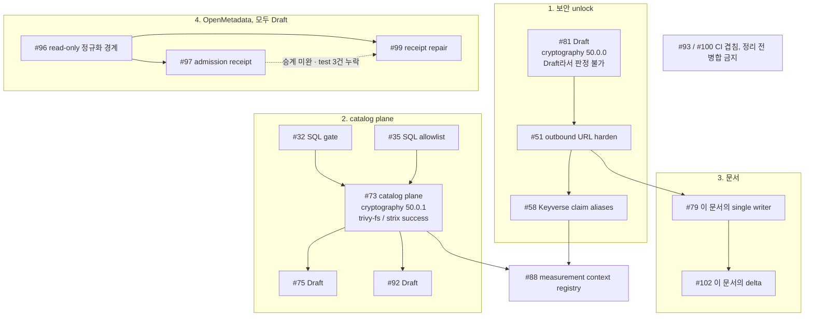
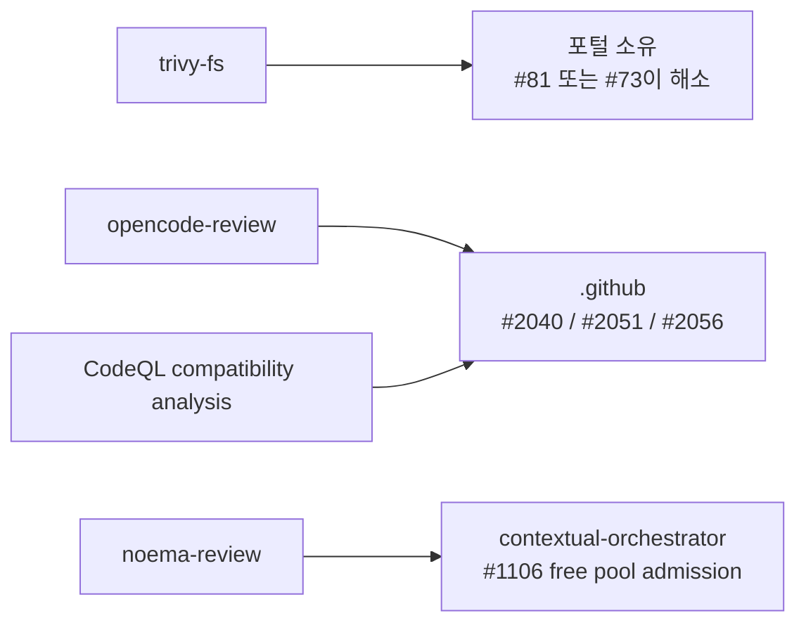

# 제품·기술 격차 기준선 (product-technical gap baseline)

**제품 홈:** ContextualWisdomLab/semantic-data-portal (ontology 기반 semantic catalog).
**독자:** catalog steward / tenant operator.
**다음 행동 (2026-10-05 07:5xZ 갱신):** 이 저장소를 막고 있는 것은 **계정 수준 블로커 두 개**입니다. (가) 2026-10-02 18:44Z~22:30Z 사이에 걸린 **과금 잠금**이 `ubuntu-latest` job을 배정 전에 거절합니다. (나) 최소 2026-10-03 17:38Z부터 **Actions artifact 저장 용량 초과**가 self-hosted 레인의 artifact 업로드를 실패시킵니다 — 그 레인은 실행은 되지만 증거를 남기지 못합니다. 둘은 구간이 겹치지만 원인이 다르고, **둘 다 owner만 풀 수 있습니다.** 순서는 이렇습니다.

1. **`#104`를 main에 들어가는 첫 번째로 병합하십시오.** 현재-head 체크 34건이 이미 끝났고(success 25·skipped 9·실패 0) `behind 0`이라 업데이트가 필요 없습니다. 남은 조건은 **다른 신원의 승인 1건**뿐입니다(`#104`의 작성자는 `seonghobae`이고 이 세션의 리뷰 신원도 같으므로 승인 불가 — 이 차단이 모든 PR에 같게 걸리지는 않습니다. 아래 "그런데 이 차단은 PR마다 같지 않습니다" 절을 보십시오). **다른 것을 먼저 병합하면 `#104`가 `behind ≥ 1`이 되어 스케줄러가 브랜치를 업데이트할 수 있고, 움직인 head의 체크는 잠금 중 재생성되지 않습니다.**
2. **과금 잠금을 해제하고, 함께 Actions artifact 저장 용량도 확보하십시오 — 블로커는 하나가 아니라 둘입니다.** 과금 잠금 전까지 이 저장소의 hosted CI 증거 생산은 0입니다(PR 게이트·주간 Scorecard·야간 fuzz 전부 거절). 그리고 **self-hosted 레인은 실행은 되지만 artifact 업로드에서 실패합니다** — 최소 10-03 17:38Z부터 `Artifact storage quota has been hit`이 연속 관측됩니다. 저장 용량 회복은 즉시가 아니라 6~12시간 뒤에 반영됩니다. 자세한 근거는 아래 "정정 — self-hosted 레인은 \"정상\"이 아닙니다" 절에 있습니다. `cwlab-ci-isolated` 격리 러너 등록은 별개의 대안이며, 살아 있는 특권 풀에 그 라벨을 붙이는 우회는 금지되어 있습니다.
3. **해제 후 조합 G(`#82`·`#107`·`#110`)를 단일 writer로 병합하십시오** — cryptography 50.0.2 / pyjwt 2.15.0으로 main의 미수정 두 항목을 한 번에 닫습니다. `#82`는 실패가 `noema-review` 하나(HTTP 400, vision 모델 배정)이고 `#107`은 product CI가 로컬·CI 양쪽에서 깨끗합니다. **단, 과금 잠금 해제만으로 `noema-review`가 녹색이 된다고 가정하지 마십시오** — artifact 저장 용량이 두 번째 벽이고, 해제 후 가장 먼저 할 일은 `#82`의 `noema-review` 재실행으로 실패 원인이 HTTP 400인지 artifact quota인지 가르는 것입니다.
4. **`#109`는 병합 대상이 아니라 수리 또는 승계 대상입니다** — `trivy-fs`가 실패 중이고 자기 lock 불일치와 상관합니다.
5. **`sso_oidc_adapter`는 2026-10-05에 닫혔습니다** — group-to-role 매핑을 tenant scoped로 만들고 group별 binding을 audit event로 기록해 control을 `implemented`로 올렸습니다(`planned_controls` 1 → 0, manifest `status` `pilot_ready`). 근거와 한계는 아래 "`sso_oidc_adapter`를 닫았습니다" 절에 있습니다. **열린 제품 갭 중 코드 갭은 이제 0건이고**, 남은 하나(`central_workflow_due_diligence`)는 의도적 external이며 그 release criteria가 바로 과금 잠금이 막고 있는 두 조건입니다.

이전 판의 lead 권고였던 "`#81`을 Ready for review로 되돌리는 것"은 **여전히 유효한 개별 조치**이지만 더 이상 1번이 아닙니다 — 근거는 아래 "`#81`은 Draft라서 판정을 받을 수 없고…" 절에 그대로 있습니다. 이 저장소에 local IdP나 policy registry를 만들지 마십시오.
**기준일:** 2026-10-03 (main `e48aa13`, 2026-08-09 `#34` 이후 변동 없음 — 54일). 2026-09-09에 리뷰 판정 증거를 전수 재검증했고, 그 결과 병합 순서 1번·3번의 승인 근거와 "승인만 있으면 풀리는 세 건" 권고를 정정했습니다 — 아래 "정정(2026-09-09)" 절을 먼저 읽으십시오.
**Figma file ID:** `JjYSqr6nWxpARUjaVKhG16` (KRDS 기반 디자인 시스템; `docs/design-tokens.md:3`의 토큰 계약과 동일 파일). 새 Figma 파일을 만들지 말고 이 파일을 소비하십시오.

이 파일은 포털의 살아있는 격차 목록입니다. 열린 PR이 병합되거나 consume-only 계약이 바뀌면 갱신하십시오. GitHub review 대기는 작업 중지로 보지 마십시오.

## 경계 (consume-only vs own)

| 관심사 | Owner | 포털 의무 |
| --- | --- | --- |
| Identity, SCIM, tenant header, purpose-limited authorization | Keyverse | 검증된 OIDC claim으로 tenant identity를 만들고, Keyverse가 발행한 `X-CWL-Tenant-Reference`가 없거나 불일치하면 fail-closed. 포털은 이 헤더를 자체 서명하지 않습니다. Observability용 `X-SDP-Tenant`는 인가 결정에 쓰지 않습니다. local IdP 없음. |
| Policy, control, evidence, audit truth | GRC 홈 | 컨트롤 정의는 GRC에서 소비하고, 포털은 자기 쪽 결정·감사 증거를 생산합니다. `policy.evaluate()`는 모든 로컬 정책 결정을 `record_policy_decision`으로 남기고(`src/sdp/evidence.py:37-48`), browse/catalog 동작은 설정된 evidence store에 감사 이벤트를 기록합니다. local policy registry 없음. |
| Organization security gates | CWL Security | 중앙 워크플로를 상속합니다. 포함: Security Scan, Strix, CodeQL, Semgrep, python-security, osv-scan, diff-scoped dependency-review, repo-wide trivy-fs(fixable CRITICAL/HIGH). 두 번째 gate loop를 포크하지 마십시오. |
| Ontology registry and catalog plane | **this repo** | Glossary, catalog objects, bindings, provenance pointers. |
| Document knowledge graph | **naruon** | naruon이 이메일/파일을 DOM 분해하여 영속 KG를 소유합니다. 포털은 그 KG에 write하지 않고 commons provenance pointer만 저장합니다. sender-ontology는 consume-only. |
| Lineage DAG reconstruction / weekly report | [`ContextualWisdomLab/LineageWeave`](https://github.com/ContextualWisdomLab/LineageWeave) | 산발 레코드에서 lineage thread를 재구성하는 것은 LineageWeave 소관입니다. 포털은 결과를 소비하고 provenance pointer만 저장하며, 어떤 KG write 경로도 호출하지 않습니다. LineageWeave 쪽 작업은 포털 블로커가 아닙니다. **정정(2026-09-07):** 이전 판은 이 lane을 맨 `#74`로 인용했지만, 맨 `#74`는 이 저장소의 issue #74([Product Gap] framework-neutral data management evidence, `#75`가 구현)로 해석되어 다른 대상을 가리켰습니다. 추적 대상을 잃지 않도록 소유 저장소를 직접 링크했습니다. 개별 issue/PR을 인용할 때는 조직 규약대로 `ContextualWisdomLab/LineageWeave#<번호>` 형태로 쓰십시오 — 구체 번호는 이 저장소에 기록된 바 없으므로, 확인한 사람이 이 줄에 채워 넣으십시오. |
| IRT / linking scores | fast-mlsirm | 호출만 하고 재구현하지 마십시오. |
| Employment tree | Orgmetra | affiliation key만 소비. |
| Office authoring | naruon | sender-ontology consumer only. |
| Measurement import | TEPP | Import/REST only. |
| Disk inventory | DiskSage | Catalog ingest/preview adapter only. |
| CEFR / RLD official prose | Council of Europe / licensed language-profile authority | 메타데이터·opaque descriptor 참조만 등록. 공식 descriptor 본문, 번역, 표, RLD 어휘 목록, 매뉴얼 텍스트를 복제하지 마십시오. 계약 소유는 `learning-interoperability-contracts` (`cwl_cefr_language_assessment/v1`). |

PII는 업무에 그대로 필요합니다. **현행 계약을 유지하십시오:** `browse.preview`의 policy-driven `apply_mask`는 PRD P0 통제(`docs/prd-trd.md:402`, `:431`)이며 그대로 둡니다. 카탈로그 plane에 *새로운* masking을 추가하지 마십시오. purpose-limited authorization 계약 주인은 Keyverse, 응답 최소화·redaction·evidence export 계약 주인은 GRC입니다. authorization+audit은 접근 주체와 사후 추적을 제어할 뿐, response 복사본을 제거하지 않으므로, redaction 소유자는 GRC임을 명시해 둡니다.

main `e48aa13`에서 `/browse/{dataset_id}/preview`는 caller-supplied `user` 문자열을 받아 로컬 정적 맵으로 해석합니다(`src/sdp/api.py:804-814`). 즉 Keyverse-bound fail-closed identity는 목표 계약이지 현행 상태가 아닙니다. 이 격차는 아래 operator-facing 격차 표에 열려 있습니다. PR `#80` (`01f9720`)은 인가된 steward preview에서 원문 값을 보여주도록 steward 경로만 바꾸며, policy masking obligation과 GRC evidence export redaction은 그대로 유지합니다. `#51` security-lock과 섞지 말고, squash는 현재 SHA OpenCode APPROVE 뒤에서만 하십시오. 이 PR에 다시 restore를 올리지 마십시오.

## 이미 채택한 표준 (APA 7th)

Albertoni, R., Browning, D., Cox, S., Gonzalez Beltran, A., Perego, A., & Winstanley, P. (Eds.). (2024). *Data Catalog Vocabulary (DCAT) — Version 3*. World Wide Web Consortium. https://www.w3.org/TR/vocab-dcat-3/
포털 계약: catalog object·distribution·dataset 식별은 DCAT 3 resource 모델을 따릅니다.

International Organization for Standardization. (2023). *Information technology — Metadata registries (MDR) — Part 1: Framework* (ISO/IEC 11179-1:2023). https://www.iso.org/standard/78914.html
포털 계약: glossary term과 administered item 식별은 MDR framework의 등록 의미를 따릅니다. 유료 본문은 인용만 하고 전문을 복제하지 않습니다.

Moreau, L., & Missier, P. (Eds.). (2013). *PROV-DM: The PROV data model*. World Wide Web Consortium. https://www.w3.org/TR/prov-dm/
포털 계약: catalog 변경은 provenance pointer(PROV entity/activity)로만 남깁니다. document-KG write owner는 naruon, lineage 재구성은 LineageWeave 소관이며, 포털은 어느 쪽 write 경로도 호출하지 않습니다.

Council of Europe. (2020). *Common European Framework of Reference for Languages: Learning, teaching, assessment — Companion volume*. Council of Europe Publishing. https://www.coe.int/en/web/common-european-framework-reference-languages
포털 계약: CEFR 프레임워크·descriptor·language-profile 참조만 등록합니다. 공식 본문을 복제하지 않고, 점수·연계·인증 권한을 주장하지 않습니다. 구현은 `learning-interoperability-contracts` PR #5가 머지되고 계약이 릴리스된 뒤에만 시작합니다.

이후 커밋이 이 계약과 어긋나면 인용을 바꾸지 말고 코드를 고치십시오.

## 병합 순서 (steward)

1. PR `#81` `ce40bd8` — cryptography 49.0.0 → 50.0.0 (CVE-2026-69247 / GHSA-g6cj-pr64-35w5). trivy-fs는 merge ref를 스캔하므로 이 PR이 main에 올리면 모든 열린 PR이 상속해 풀립니다. **정정(2026-09-09): 이 자리에 있던 “OpenCode exact-head APPROVE 확인(comment 5469292683)” 지시는 틀렸습니다.** comment 5469292683은 승인 receipt가 아니라 seonghobae가 `@opencode-agent`에게 승인을 **요청한** 코멘트입니다(2026-08-30T14:33:54Z, 본문 첫 줄 `Please APPROVE exact current head ce40bd8...`). `GET /repos/ContextualWisdomLab/semantic-data-portal/pulls/81/reviews`는 `opencode-agent[bot]`의 리뷰를 **어느 커밋에서도 0건** 반환합니다. 즉 이 PR에는 승인은 물론 `CHANGES_REQUESTED`조차 없습니다. 요청 코멘트를 승인 증거로 읽지 마십시오 — squash 조건은 여전히 미충족입니다. **그리고 이 PR은 Draft인 한 그 조건을 충족할 수 없습니다** — 스케줄러가 Draft PR을 skip하므로 리뷰 dispatch 자체가 발행되지 않습니다(아래 "`#81`은 Draft라서 판정을 받을 수 없고…" 절). 먼저 필요한 것은 승인이 아니라 **Ready 전환**입니다. 3초 `opencode-review` stub는 receipt가 아닙니다. `#51`과 섞지 마십시오.
   **상태 변경(2026-09-07): 이 PR은 현재 Draft입니다.** head는 `ce40bd8` 그대로지만 본문이 `Draft / source+lock repair present`로 바뀌었습니다. 즉 unlock stack의 1번 항목이 스스로 merge 대기열에서 빠진 상태이며, repo-wide trivy-fs unlock은 이 PR이 Ready로 돌아올 때까지 열리지 않습니다. Draft를 우회하려고 다른 PR에 cryptography bump를 복제하지 마십시오 — single writer는 `#81`입니다. 조치는 `#81`의 repair를 끝내고 Ready 전환하는 것이며, 그 전까지 2번 이하 항목의 trivy-fs 상속 실패는 예상된 상태입니다.
2. PR `#51` `558dd2f` — outbound URL harden + security lock (cryptography 부분은 `#81`이 흡수). Frozen. 이 head를 push하지 마십시오. 이 SHA에 OpenCode APPROVE가 붙은 뒤 Product Manager squash.
3. PR `#58` `0ce6d1f` — bounded Keyverse claim aliases. Frozen (strix fail on this head). extra-push 금지. **정정(2026-09-09): 이 줄의 “이전 APPROVE” 표현은 API 상태와 어긋납니다.** 현재 head `0ce6d1f`에 붙은 `opencode-agent[bot]` 리뷰는 존재하지만 API `state`가 `DISMISSED`입니다. 그 리뷰 **본문** 끝에 `- Result: APPROVE`와 `- Head SHA: 80966ae...`가 적혀 있어 승인처럼 보이지만, 본문이 주장하는 SHA는 그 리뷰 자신의 `commit_id`(`0ce6d1f`)와도 다릅니다. 판정은 리뷰 본문 산문이 아니라 API의 `state` + `commit_id`로만 읽으십시오.
4. PR `#35` `9c12f5d` **그리고** PR `#32` `76fcfb6` (SQL gate). 둘 다 catalog plane SQL 표면의 전제입니다. **`#32`는 non-blocking이 아닙니다. `#73`보다 먼저** 병합하십시오. Frozen heads는 push하지 마십시오.
5. PR `#73` `1681a7f` — catalog/ontology plane (#13). Frozen. **정정(2026-09-09): `trivy-fs`와 `strix`는 현재 head에서 모두 success입니다** — 이 줄의 "trivy-fs inherit + strix fail"은 옛 head 기준이었습니다(아래 전수 측정 절). `#84` corporate-master 구현은 이 PR 뒤; extra-push 금지. **`#75`는 `#73`이 main에 올 때까지 Draft.** **정정(2026-09-09): head가 `311668e` → `1681a7f`로 이동했고(같은 날 203행이 이미 기록), 이 문서의 5번·PR 표는 옛 SHA로 남아 있었습니다.** 새 head `1681a7f`에는 `opencode-agent[bot]`의 `CHANGES_REQUESTED`(review id 5152624078)가 붙어 있습니다. 즉 이 PR은 “승인 대기”가 아니라 **요청된 수정이 남은 상태**입니다.
6. PR `#28` after PR `#37` — trusted document deps 위의 hybrid file ontology.
7. PR `#59` / `#61` — DiskSage ingest and preview boundary.
8. PR `#64` product names after `#51`, then PR `#65` setuptools, then Dependabot.
9. PR `#82` `a797e30` — customer-next-action copy. `#81` 뒤, Dependabot 앞.
10. PR `#88` `8e281de` — Measurement Context Registry. `#81`/`#51`/`#58`/`#73` 뒤. 점수·응답·판정 소유 없음.
11. ~~PR `#90` — public Pages landing source~~ — **2026-09-02에 병합 없이 closed(정상 승계).** `docs/index.md`는 `#72` `10096ce`가 담고 있으므로 landing은 `#72` 순서를 따릅니다. `#72`는 현재 Draft이며, Ready·병합 시 landing이 main에 올라갑니다. Pages-source PR을 새로 만들지 마십시오.
12. PR `#89` `3b59d90` Draft — DatasetDistribution 식별자 의미화 (`distribution_id` / `distribution_format` / `distribution_endpoint`); 와이어 계약 `{id, format, endpoint}` 유지. `#81`/`#51`/`#58`/`#73`보다 앞세우지 말 것. checks가 초록이 될 때까지 Draft 유지. (head가 `0a06e20`에서 `3b59d90`으로 이동했습니다.)
13. PR `#92` `51fb384` Draft — evidence store의 영속 식별자 의미화. `#89`와 같은 명명 규약(두 단어 이상 snake_case) 작업이며, evidence 스키마를 건드리므로 `#73` 뒤에 둡니다. Draft 유지.
14. PR `#93` `1dcca7b` / PR `#100` `5bba1e6` — Actions 검증 워크플로 정리. **두 PR이 서로 겹칩니다(아래 CI 거버넌스 절 참조).** 겹침을 정리하기 전에는 어느 쪽도 병합하지 마십시오.
15. PR `#96` `baa536b` → `#97` `dff4668` / `#99` `c3f0162` (모두 Draft) — OpenMetadata 2.x read-only 정규화 경계와 admission receipt. `#97`과 `#99`는 둘 다 `#96`의 브랜치(`feat/openmetadata-2-read-adapter`)를 base로 하는 stacked PR입니다. `#96`이 먼저입니다. `#99`가 `#97`의 successor라는 점은 추측이 아니라 `#99`의 ADR에 명시돼 있습니다 — `대체 대상: PR #97의 유효 delta를 검증 후 승계`. 즉 승계 관계가 문서화된 정상 lane이므로, `#97`은 delta 승계가 확인된 뒤에 닫으십시오. consume-only 경계(외부 catalog는 read-only)를 넘지 마십시오.

PR `#51` security-lock 파일을 catalog/docs PR에 섞지 마십시오. 이 문서 PR(`#79`)도 보안 unlock stack 뒤에서 squash하십시오. `#80`은 `#51` security-lock과 별개이며 squash는 현재 SHA OpenCode APPROVE 뒤에만 합니다. (`#90`은 closed되어 이 순서에서 빠졌고, 그 landing delta는 `#72`가 잇습니다.)

## 병합 순서 그림 (위 목록과 같은 내용)

위 15개 항목을 그림으로 옮긴 것입니다. 문장이 규범이고 그림은 그 요약입니다 — 둘이 어긋나면 문장을 따르십시오.



`#81`이 root인 이유는 trivy-fs가 merge ref를 스캔하기 때문입니다. 다만 `#73`이 자기 head에서 같은 CVE를 `50.0.1`로 이미 해소했으므로, **root를 어느 PR이 맡을지는 아직 정해지지 않았습니다**(아래 해당 절).

### 실패 check의 소유자



네 종류 중 포털이 자기 저장소에서 고칠 수 있는 것은 `trivy-fs` 하나입니다. 나머지 셋은 상류 제어면 수리를 기다리는 lane이며 포털에서 우회하지 않습니다.

### CVE writer 문제는 `#81`로 정리되었지만 큐는 여전히 안 풀립니다 (2026-09-21 확인)

이 문서는 CVE-2026-69247 수정이 `#81`(50.0.0)·`#57`(50.0.0)·`#73`(50.0.1) 셋에 복제되어 있고 **목표 버전이 두 갈래**라고 적으면서, writer를 하나로 좁히는 것은 owner 결정이라고 남겨 두었습니다(issue #101). **그 결정이 내려졌습니다.**

`#79`의 브랜치가 `21bcc86` → `2181681`로 이동했고, 새로 들어온 여섯 커밋에 `fce7045 fix(deps): bump cryptography 49.0.0 -> 50.0.0 for CVE-2026-69247`과 **`ce40bd8`**(= `#81`의 exact head)이 포함되어 있습니다. 병합 커밋의 제목은 그대로 `merge: inherit canonical cryptography security owner`입니다. `#81`의 본문도 스스로를 "the existing implementation owner … rather than creating another duplicate implementation branch"라고 적고 있습니다. 즉 **canonical writer는 `#81`, 버전은 50.0.0**이며, `#79`는 복제하지 않고 상속하는 쪽을 택했습니다. 추론이 아니라 owner가 커밋 메시지와 PR 본문에 쓴 표현입니다.

**그럼에도 큐는 풀리지 않았습니다.** `main`은 여전히 `e48aa13`이고, 수정은 두 브랜치 위에만 있습니다. 게다가 **둘 다 Draft입니다** — `#81`은 2026-09-07부터, `#79`는 2026-09-19 20:10Z부터. 이 문서가 앞서 적은 대로 스케줄러는 Draft PR을 skip하므로 리뷰 dispatch가 발행되지 않고, 따라서 **CVE가 고쳐진 채로 어느 쪽도 merge 경로에 올라 있지 않습니다.** "수정이 존재한다"와 "수정이 main에 있다"를 섞지 마십시오.

함께 들어온 `tests/test_dependency_locks.py`는 세 lock 파일의 정렬된 hash 목록이 어긋나거나 잘리는 것을 막는 재현성 계약입니다. `#81` 본문은 이 순서가 **의도적으로 비사전식(non-lexical)**이라고 못박고 있으니, 사전순 정렬을 가정하는 검증으로 바꾸지 마십시오.

**2026-09-19 저녁에 다섯 건이 한꺼번에 Draft로 내려갔습니다** — `#64`(19:03Z), `#51`(19:13Z), `#79`(20:10Z), `#93`·`#28`(21:05Z). 현재 열린 PR은 38건, 그중 Draft가 13건입니다. 이 전환이 정리 작업인지 다른 의도인지는 여기서 판별하지 않고, **Draft 비율이 3분의 1을 넘었다는 사실만 기록합니다.**

(이 문서를 담은 `#102`는 base가 움직이면서 여섯 커밋 뒤처져 있었고, 위 커밋들을 merge해 따라붙였습니다. 들어온 변경은 requirements 세 파일과 새 테스트뿐이라 이 문서와 충돌하지 않습니다.)

### CVE가 큐 전체를 막는 것은 아닙니다 — docs-only PR은 게이트를 통과합니다 (2026-09-19 측정)

이 문서는 여러 곳에서 "상속된 CVE-2026-69247이 큐를 막고 있다"고 적었습니다. **그 서술은 너무 넓습니다.** `#104`(`docs/readme-public-package-boundary`, README 한 파일만 변경)의 현재 head `1badc79`에는 check run이 **34건** 붙어 있고, 결과는 전부 `success` 아니면 `skipped`입니다. **실패가 하나도 없습니다.**

핵심은 `trivy-fs`가 **`skipped`**라는 점입니다 — 실패가 아니라 아예 실행되지 않았습니다. 같은 Security Scan 실행(`35289642492`)에서 `osv-scan`·`scorecard`·`dependency-review`도 함께 skip되었고, 앞선 `Detect changed scope` job은 success입니다. 즉 이 게이트들은 **변경 범위에 따라 조건부로 실행**되며, 문서만 바뀐 PR에서는 돌지 않습니다.

그래서 정확한 서술은 이렇습니다. `trivy-fs`는 저장소 전체를 스캔하므로 **실행되기만 하면** 상속된 CVE를 집어 실패합니다(`#80`·`#82`·`#32`·`#64`·`#65`의 census가 그 결과입니다). 하지만 **실행 여부 자체가 변경 범위에 달려 있고, docs-only 변경은 그 조건을 만족하지 않습니다.** 따라서 CVE는 소스·의존성을 건드리는 PR을 막지, 문서 PR을 막지 않습니다.

실무적으로 두 가지가 따라옵니다.

- **문서 작업에는 merge 경로가 있습니다.** CVE 해소를 기다리지 않아도 됩니다. `#104`가 그 첫 사례입니다.
- **`#104`가 여전히 `blocked`인 이유는 checks가 아니라 승인입니다.** 리뷰를 전수 확인하면 `coderabbitai[bot]`의 `COMMENTED` 한 건뿐이고(actionable 2건), `APPROVED`는 없습니다. `opencode-review`는 **check로는 success**지만 승인 리뷰를 남기지 않았습니다 — 이 문서가 다른 곳에 적은 "2026-08-13 이후 어떤 head에도 APPROVED가 없다"와 일치합니다. **check success를 승인으로 읽지 마십시오.**

`#102`와 대조하면 범위 조건이 더 분명합니다. `#102`는 `main`이 아니라 `#79`의 브랜치를 base로 하므로 check가 **2건**(fuzz)뿐이고, `#104`는 `main`을 base로 하므로 **34건**을 받습니다. 위 "stacked PR은 fuzz 말고 아무 게이트도 돌지 않습니다" 절의 측정과 같은 결론입니다.

## 열린 PR과 각 PR이 닫는 격차

Head SHA와 draft 여부는 2026-09-07 GitHub API 응답에서 그대로 옮겼습니다. 열린 PR은 35건입니다.

| PR | Head | 격차 | 포털 소유? | 상태 2026-09-07 |
| --- | --- | --- | --- | --- |
| #81 | `ce40bd8` **Draft** | cryptography 50.0.0 — CVE-2026-69247, repo-wide trivy-fs unlock. 추적 issue #101 | Yes (shared base) | **Draft로 내려감**(본문 `source+lock repair present`). head는 그대로. issue #101은 열려 있으므로 CVE는 미해결 상태입니다. 현재 `opencode-review` 실패. **주의: 같은 bump가 `#57`(50.0.0)과 `#73`(50.0.1)에도 있습니다** — 3자 중복이며 목표 버전이 두 갈래입니다(아래 `#57` 절). |
| #51 | `558dd2f` | Outbound URL allowlist + security lock (cryptography CVE 부분은 `#81`이 선행 흡수) | Yes (security lock) | HOLD. extra-push 금지. |
| #58 | `0ce6d1f` | Keyverse claim aliases fail-closed | Keyverse 소비, adapter는 여기 | HOLD. strix fail. extra-push 금지. |
| #35 | `9c12f5d` | SQL comma-join allowlist bypass | Yes | HOLD. extra-push 금지. |
| #32 | `76fcfb6` | SELECT..INTO / volatile SQL bypass | Yes | #73 전제. #35/#51 뒤. |
| #73 | `1681a7f` | Catalog plane above the document KG (#13). ADR 0002 / stacked #83 already on this branch | Yes | HOLD. **`trivy-fs`·`strix`는 현재 head에서 success**(2026-09-09 측정); 남은 실패 4건은 전부 중앙 제어면. 현재 head에 `opencode-agent` `CHANGES_REQUESTED`. `#84` extra-push 금지. |
| #75 | `6cba648` Draft | Framework-neutral data-management evidence *profiles* (GRC registry 아님). issue #74 구현 | Yes (catalog evidence shape) | Draft. base가 main이 아니라 `#73`의 브랜치(`cursor/ontology-catalog-plane-90aa…`)이므로 `#73` 뒤에서만 의미가 있습니다. dirty. Ready로 돌아가면 다시 Draft. |
| #82 | `a797e30` | customer-next-action copy, hide internal boundaries | Yes (UX copy) | `#81` 뒤. |
| #88 | `8e281de` | Measurement Context Registry (Draft/Published/Superseded) | Yes (catalog aggregate) | Ready. `#81`/`#51`/`#58`/`#73` 뒤. 점수·응답·판정 없음. |
| #59 | `65e4fd7` | DiskSage catalog ingest | Adapter yes | HOLD. extra-push 금지. |
| #61 | `0c248d2` | DiskSage preview boundary | Adapter yes | Open; Analyze flake — extra-push 금지. |
| #28 | `5e4b11c` | Hybrid file ontology | Yes after #37 | Wait #37. |
| #37 | `00ee8af` | Trusted document semantic deps | Yes (build) | Open. |
| #64 | `4b78611` | Current CWL product names | Yes (docs) | After #51. |
| #65 | `19603c3` | setuptools 83 | Yes (build) | After unlock. |
| #72 | `10096ce` Draft | Operator README / draft ADRs **+ public Pages landing `docs/index.md`** (`#90`에서 승계) | Yes (docs) | Draft. head가 `e1fe375`에서 이동했습니다. 이제 landing의 single writer이므로 `#90`을 되살리거나 Pages-source를 복제하지 마십시오. |
| #79 | `21bcc86` | 이 기준선 문서 | Yes (docs) | 보안 unlock stack 뒤에 squash. main에는 아직 없음. |
| #89 | `3b59d90` Draft | DatasetDistribution 식별자 의미화; 와이어 `{id, format, endpoint}` 유지 | Yes (catalog naming) | Draft. `#81`/`#73` 뒤. Ready 전환 금지 until checks green. extra-push 금지. |
| #92 | `51fb384` Draft | evidence 영속 식별자 의미화(두 단어 이상 snake_case) | Yes (evidence naming) | Draft. `#89`와 같은 명명 lane, evidence 스키마를 건드리므로 `#73` 뒤. |
| #80 | `01f9720` | steward preview에서 인가된 steward에게 원문 값 제공 (policy masking obligation·GRC redaction은 유지) | Yes (catalog browse) | Open. restore 재시도 금지. |
| #93 | `1dcca7b` | Scorecard 중앙 reusable 위임 + ghost workflow 11건 비활성 + docs-only fuzz skip(`#94` 흡수) + 동시성 그룹 | Yes (CI) | Open. **`#100`과 겹침** — 아래 CI 거버넌스 절. |
| #100 | `5bba1e6` | PR 동시성 격리 + Draft/closed PR runner job skip | Yes (CI) | Open. **`#93`과 겹침** — 아래 CI 거버넌스 절. |
| #96 | `baa536b` Draft | OpenMetadata 2.x read-only 정규화 경계 | Yes (consume-only adapter) | Draft. `#97`/`#99`의 base. |
| #97 | `dff4668` Draft | 결정적 OpenMetadata admission preview receipt | Yes (adapter) | Draft. base = `#96` 브랜치. `#99`와 같은 base — 승계 관계 확인 필요. |
| #99 | `c3f0162` Draft | admission receipt를 보안 경계 위에서 재구성 | Yes (adapter) | Draft. base = `#96` 브랜치. `#97`의 repair successor로 보임; delta 승계 확인 전 어느 쪽도 닫지 말 것. |
| Dependabot #27 #29 #62 #63 #67 #68 #69 #70 #71 | `8aad3b4` `3205628` `8d1c6c0` `3de2562` `cc1e623` `a0116a0` `b874efd` `4342b06` `e53e921` | Dependency currency | Yes after unlock | `#81` 이전 land 금지. |
| **#57** | `fb48fc9` | **Dependabot 아님 — 아래 "#57" 절 참조.** 제목·본문은 codeql-action bump지만 실제로는 outbound HTTPS 보안 경계 + CI gate + cryptography bump | Yes (security + CI) | Dependabot 묶음에서 분리했습니다. 일반 dependency로 취급하지 마십시오. |

### 2026-09-07에 목록에서 빠진 PR

| PR | 결과 | 조치 |
| --- | --- | --- |
| #90 `3a23f87` | 병합 없이 closed (2026-09-02) | **정상 승계이며 복구 대상이 아닙니다.** PR 본문에 따르면 이 lane의 publication·license 경계 값이 `#72`의 `10096ce`로 흡수되었고, `#72`가 이미 더 강한 `docs/index.md`(48줄 신규)를 담고 있습니다. `#72` 파일 목록에서 확인했습니다. 별도 Pages-source PR을 다시 만들지 마십시오 — landing의 single writer는 `#72`입니다. |
| #94 | 병합 없이 closed | `#93`이 docs-only fuzz skip delta를 본문에서 명시적으로 흡수했습니다("Supersede #94"). 정상적인 승계 후 종료이며 복구 대상이 아닙니다. |

## 아직 PR이 없는 operator-facing 격차

| 격차 | steward가 체감하는 이유 | Lane |
| --- | --- | --- |
| Catalog plane이 main에 없음 | `SDP_DATABASE_DSN`은 graph-store backend만 선택합니다. `e48aa13` 기준 catalog create/patch는 여전히 모듈 전역 `catalog._DATA`를 변경하므로 DSN을 세팅해도 카탈로그 쓰기는 영속되지 않습니다(`src/sdp/catalog.py:25`, `:414`, `:445`). 유료 파일럿 persistence는 #73에만 있음 | Portal — land #73 |
| Keyverse 없이 tenant-bound catalog 없음 | 현행 preview는 caller-supplied `user` 문자열을 받아 로컬 맵으로 해석 — fail-closed identity는 목표 계약. #58 병합 + browse 인증 결선이 필요 | Consume Keyverse |
| DiskSage batch를 main에서 preview 못 함 | inventory metadata를 catalog UI에서 다룰 수 없음 | Portal adapters #59/#61 |
| Hybrid file types | 업로드 office/binary가 file ontology에 매핑되지 않음 | Portal #28 after #37 |
| Storybook scene/edge-case event inventory | 디자인 토큰·Figma file ID(`JjYSqr6nWxpARUjaVKhG16`)는 있으나 Storybook 장면별/Edge case별 event 정의가 미완 | Portal UI — Storybook stories 추가 |
| `CHANGELOG.md`가 main에 없음 | 커밋 100건·버전 `0.3.0`인데 main에 변경 이력 문서가 없습니다. **다만 `#88`이 Keep a Changelog 형식(`[Unreleased]` 절 포함)으로 추가하고 있으므로 PR 없는 격차가 아니라 `#88` 대기입니다.** | Portal docs — land `#88` |
| 태그·릴리즈가 0건 | 버전 문자열만 있고 대응하는 불변 아티팩트가 없어, 어떤 커밋이 `0.3.0`인지 지목할 수 없습니다 | Portal release — CVE 해소 뒤 |
| Public Pages landing이 main에 없음 | `docs/index.md`는 `#72`(Draft, `10096ce`)에만 있고 main에는 없습니다. `#90`은 그 delta를 `#72`로 넘기고 닫혔으므로 PR 없는 격차가 아니라 **`#72` 대기** 상태입니다. 잠재 구매자가 볼 진입점은 `#72`가 Ready·병합될 때 열립니다 | Portal docs — land `#72` |
| Data management evidence console (#78) / persist registry (#76) | 프로필(#75) 뒤에 console·영속 API. #75는 #73 전까지 Draft | Portal after #73/#75 |
| Governed corporate-master unique/miss/tie (#84) | ADR 0002 / `sdp.corporate-master-resolution/v1`은 #73 보드(스택 #83 merged). 실행 엔드포인트는 #73가 main에 온 뒤. extra-push 금지 | Portal after #73 |
| CEFR framework / descriptor / language-profile registry (#86, #87) | 공식 descriptor 정보·권리 메타데이터가 카탈로그에 없음. `cwl_cefr_language_assessment/v1` 구현은 LIC PR #5가 머지되고 계약이 릴리스된 뒤에만 | Portal after released contract; no scoring |

## 자칭 신원은 `preview` 한 곳이 아니라 네 경로입니다 (2026-09-09 확인)

이 문서는 caller-supplied `user` 격차를 `/browse/{dataset_id}/preview` 한 곳으로만 적어 두었습니다(위 경계 절과 격차 표). `main` `e48aa13`에서 같은 패턴을 쓰는 경로를 전수 확인한 결과 **네 개**입니다.

| 경로 | 신원이 오는 곳 | 기본값 |
| --- | --- | --- |
| `GET /browse/{dataset_id}/schema` | **query string** (`user=`) | `anonymous` (조용히) |
| `POST /browse/{dataset_id}/preview` | body | 없음 — 누락 시 400 |
| `POST /browse/query` | body (`QueryExecutionRequest.user`) | `anonymous` |
| `POST /api/v1/browse/query` | 위 함수로 위임 | `anonymous` |

`src/sdp/api.py`에는 `Header`도 `Authorization` 참조도 없습니다. `authz.verify_oidc_jwks_token`과 `resolve_oidc_actor_context`는 실재하지만 호출되는 곳은 OIDC 진단·preview 엔드포인트 네 줄(`:228`, `:237`, `:256`, `:273`)뿐이고, 데이터 경로에는 결선돼 있지 않습니다.

세 가지가 이 표에서 새로 드러납니다.

1. **`schema`가 `preview`보다 노출이 큽니다.** `preview`는 `user` 누락을 400으로 막지만 `schema`는 조용히 `anonymous`로 떨어집니다. 게다가 GET이라 자칭 신원이 URL에 실려 로그·리퍼러·캐시에 남습니다.
2. **`/api/v1/browse/query`도 같은 격차를 가집니다.** 버전이 붙은 공개 표면이므로 외부 구매자가 실제로 통합하는 경로입니다.
3. **`preview`만 고치면 나머지 셋이 남습니다.** 이 문서를 근거로 하드닝하는 사람이 정확히 그렇게 하기 쉬운 상태였습니다.

`#80`과의 관계를 분명히 해 둡니다. `#80`은 인가된 steward에게 원문 값을 보여주는 변경입니다. 신원이 자칭인 동안에는 "인가된 steward"가 `"user": "steward_..."`라고 적는 누구나가 됩니다. **`#80`은 잘못된 PR이 아니라 선행 조건이 있는 PR입니다** — browse 경로에 검증된 토큰 기반 신원이 결선된 뒤에 안전합니다. 순서를 바꾸지 마십시오.

여기서 고치지 않습니다. browse 경로의 writer는 `#80`이고 신원 결선은 `#58`(Keyverse) 뒤의 교차 관심사입니다.

## 명시적 비격차 (여기서 만들지 말 것)

- naruon document-KG write path, LineageWeave weekly-report write path (owner는 각각 naruon / LineageWeave; 포털은 pointer만).
- IRT scoring kernel.
- Keyverse issuance, SCIM, PAT minting.
- GRC control library or audit ledger.
- naruon editor, calendar, HWPX.
- CEFR 공식 descriptor 본문 복제, Council of Europe logo, 점수 kernel, certification claim.
- 카탈로그 plane에 새로운 PII masking (현행 policy-driven `apply_mask`는 PRD P0 통제로 유지; steward 원문 노출 변경만 `#80`에서).
- 분 시각 :17의 두 번째 hourly merge loop.

## ADR 번호 충돌 (repair finding, 2026-09-07) — issue #103

추적 issue는 #103입니다. `main`에는 `docs/adr/` 디렉터리가 아직 없습니다. 그런데 열린 PR 다섯 건이 같은 네 자리 번호를 서로 다른 주제로 각자 추가하고 있습니다.

| 번호 | PR | 파일 | 주제 |
| --- | --- | --- | --- |
| 0001 | #72 | `docs/adr/0001-product-authority-boundary.md` | 제품 권한 경계 |
| 0001 | #73 | `docs/adr/0001-ontology-catalog-plane.md` | ontology/catalog plane |
| 0001 | #88 | `docs/adr/0001-measurement-context-registry.md` | measurement context registry |
| 0001 | #96 | `docs/adr/0001-openmetadata-anti-corruption-boundary.md` | OpenMetadata ACL 경계 |
| 0002 | #72 | `docs/adr/0002-semantic-web-grounding.md` | semantic web grounding |
| 0002 | #73 | `docs/adr/0002-corporate-master-resolution-owner.md` | corporate-master 소유 |
| 0002 | #97 / #99 | `docs/adr/0002-openmetadata-admission-preview-receipts.md` | admission preview receipt |

`#97`과 `#99`가 같은 경로를 쓰는 것은 둘이 같은 lane의 승계 관계이므로 예외입니다. 나머지는 서로 무관한 결정을 같은 번호로 주장합니다.

**왜 문제인가.** 먼저 병합되는 PR이 그 번호를 선점하고, 뒤따르는 PR은 add/add 충돌을 내거나 조용히 같은 번호의 다른 결정을 덮습니다. 결정 기록의 식별자가 흔들리면 "ADR 0002"라는 참조가 시점에 따라 다른 문서를 가리키게 됩니다. 실제로 이 기준선 문서도 `#73`의 corporate-master 결정을 "ADR 0002"로 인용하고 있는데, `#72`가 먼저 병합되면 그 번호는 semantic-web-grounding을 가리키게 됩니다.

**조치는 rename이지 redesign이 아닙니다.** 어떤 PR도 닫지 말고 내용도 바꾸지 마십시오. 번호만 병합 순서대로 재배정하고, 각 PR 안의 상호 참조와 이 문서의 인용을 함께 고칩니다. 위 병합 순서를 그대로 적용하면 다음과 같이 떨어집니다.

| 순서 근거 | PR | 배정 |
| --- | --- | --- |
| 병합 순서 5번 | #73 | `0001` ontology-catalog-plane, `0002` corporate-master-resolution-owner (현행 유지, rename 불필요) |
| 병합 순서 10번 | #88 | `0003` measurement-context-registry |
| 병합 순서 15번 | #96 | `0004` openmetadata-anti-corruption-boundary |
| `#96` 뒤 | #97 / #99 | `0005` openmetadata-admission-preview-receipts (승계된 한쪽만) |
| Draft, 순서 미정 | #72 | `0006`~`0009` (product-authority-boundary, semantic-web-grounding, graph-vector-retrieval, docs-only-scope). Ready 전환 시점에 남은 번호로 확정 |

번호 배정은 owner 결정입니다. 위 표는 현재 문서화된 병합 순서에서 기계적으로 도출한 기본안이며, 순서가 바뀌면 배정도 같이 바뀝니다. 확정 전까지 새 ADR을 `0001`/`0002`로 추가하지 마십시오.

### 성급한 Accepted (같은 lane의 별개 findings)

`main`에 `docs/adr/`가 없는데 `#73`의 ADR 두 건은 이미 `Accepted`를 주장합니다. 나머지 PR은 병합 전 상태를 올바르게 씁니다.

| PR | ADR | 선언된 상태 | 판정 |
| --- | --- | --- | --- |
| #73 | `0001-ontology-catalog-plane.md` | `**Status:** Accepted` (2026-08-18) | **성급함** — PR은 아직 open이고 trivy-fs·strix가 실패 중입니다 |
| #73 | `0002-corporate-master-resolution-owner.md` | `**Status:** Accepted target contract` | **성급함** — 같은 이유 |
| #72 | `0001`~`0004` | `Status: Draft` | 적절 |
| #88 | `0001-measurement-context-registry.md` | `Status: **Proposed**` | 적절 |
| #96 | `0001-openmetadata-anti-corruption-boundary.md` | `**Status:** Proposed` | 적절 |
| #97 / #99 | `0002-openmetadata-admission-preview-receipts.md` | `**상태:** Proposed` | 적절 |

병합되지 않은 PR 안에서만 존재하는 결정이 `Accepted`를 주장하면, 보호 브랜치에 올라간 결정과 제안 단계 결정을 문서만 보고 구분할 수 없습니다. 조직 규약대로 queued·pending·미병합 상태는 수용 근거가 아닙니다. `#73`이 실제로 main에 오르기 전까지는 `Proposed`로 낮추고, 병합과 함께 `Accepted`로 올리십시오. ADR 본문·결정 내용은 바꾸지 마십시오 — 상태 한 줄만 고치는 일입니다.

참고로 `#73`의 ADR은 상호 참조를 `ContextualWisdomLab/semantic-data-portal#13`, `ContextualWisdomLab/naruon#974`처럼 규약대로 쓰고 있습니다. 저장소 밖 참조 형식은 이미 이 저장소에서 지켜지고 있으므로, 위 lineage 행의 맨 `#74`가 예외였습니다.

## `#57`은 Dependabot bump가 아닙니다 (repair finding, 2026-09-07)

`#57`의 제목과 본문은 `github/codeql-action/upload-sarif` 4.36.3 → 4.37.6 bump이고, 본문은 Dependabot 기본 생성 텍스트 그대로입니다. 그런데 실제 내용은 커밋 18개·파일 18개이며 bump와 무관한 변경이 대부분입니다.

| 실제로 들어 있는 것 | 파일 |
| --- | --- |
| outbound HTTPS 보안 경계 (신규 모듈) | `src/sdp/network_security.py` (+128, 신규) |
| OIDC JWKS 목적지 검증 | `src/sdp/authz.py` |
| observability sink 목적지 검증 | `src/sdp/observability.py` |
| **cryptography 49.0.0 → 50.0.0** | `requirements.txt`, `requirements-dev.txt`, `requirements-test.txt` |
| 차등 커버리지 gate (신규 도구) | `tools/check_diff_coverage.py` (+143, 신규), `tests/test_diff_coverage.py` |
| 워크플로 변경 | `.github/workflows/fuzz.yml`, `tests.yml`, `scorecard-analysis.yml` |
| 보안 결정 기록 | `docs/doctoring/outbound-https-security.md` (+159, 신규) |

커밋 이력을 보면 의도된 병합입니다 — `Merge main into fix/security-gates-checkout-7-0-1`, `Merge security gate fix into CodeQL action update`. 보안 게이트 브랜치를 Dependabot 브랜치 위로 합친 것인데, **제목과 본문이 갱신되지 않았습니다.**

### 이것이 만드는 세 가지 문제

1. **분류 오류.** 이 문서도 직전 판까지 `#57`을 Dependabot 묶음에 넣고 "dependency currency, `#81` 이전 land 금지"로 적고 있었습니다. steward가 본문만 읽으면 routine bump로 오판합니다. 위 표에서 분리했습니다.
2. **`#81`의 single-writer 위반 — 2026-09-09 기준 3자, 그리고 목표 버전이 서로 다릅니다.** `#57`은 `requirements.txt`에서 `cryptography==49.0.0` → `50.0.0`을 그대로 바꿉니다. `#81`이 존재하는 이유가 정확히 그 변경입니다. 여기에 `#73`이 2026-09-09에 head를 `311668e`에서 `1681a7f`로 올리면서 같은 줄을 **`50.0.1`로** 바꿨습니다.

   | PR | cryptography 목표 | 상태 |
   | --- | --- | --- |
   | #81 `ce40bd8` | `50.0.0` | Draft |
   | #57 `fb48fc9` | `50.0.0` | 제목 불일치, check 통과 |
   | #73 `1681a7f` | **`50.0.1`** | non-draft. 이 pin으로 `trivy-fs`가 **초록**이 되었습니다. 남은 실패 4건은 전부 중앙 제어면 |

   즉 CVE-2026-69247 수정이 세 PR에 복제돼 있고 **목표 버전이 두 갈래**입니다. 먼저 병합되는 쪽이 나머지 둘에 `requirements.txt` 충돌을 남기며, `50.0.0`이 먼저 오르면 `#73`은 곧바로 다시 bump하는 PR이 됩니다. 이 문서가 `#81` 행에 "bump를 다른 PR로 복제하지 말 것"이라고 적어 둔 상태에서 이미 복제가 셋입니다. **어느 버전을 쓸지부터 정한 뒤 writer를 하나로 좁히십시오** — 버전 선택은 owner 결정이며, 여기서는 세 갈래가 존재한다는 사실만 기록합니다.
3. **동시성 파일 충돌은 2자가 아니라 3자입니다.** `#57`도 `fuzz.yml`의 concurrency group을 바꿉니다. 그런데 세 번째 변형이며 조직 계약을 지키지 않습니다.

| PR | `fuzz.yml` group 식 | `{workflow}-{repository}-{PR번호}` 계약 |
| --- | --- | --- |
| #93 | `${{ github.workflow }}-${{ github.repository }}-${{ github.event.pull_request.number \|\| github.run_id }}` | 준수 |
| #100 | `${{ github.workflow }}-${{ github.repository }}-${{ github.event_name == 'pull_request' && github.event.pull_request.number \|\| github.run_id }}` | 준수 |
| **#57** | `fuzz-${{ github.event.pull_request.number \|\| github.ref }}` | **미준수** — `fuzz-` 하드코딩, repository 성분 없음 |

### 조치

닫지 마십시오. 세 가지를 분리해서 결정해야 합니다.

- **cryptography bump**: single writer를 하나로 정하십시오. `#81`이 그 목적의 PR이므로 `#57`에서 빼는 편이 자연스럽지만, `#81`이 Draft로 내려간 상태이므로 반대로 `#57`을 writer로 삼는 선택도 가능합니다. 어느 쪽이든 **두 PR이 동시에 main에 오르면 안 됩니다.**
- **concurrency group**: `#57`의 식은 계약 미준수이므로 `#93`/`#100` 통합 결과를 따르게 하십시오. `fuzz.yml`을 세 PR이 각자 고치는 상태를 유지하지 마십시오.
- **제목·본문**: 실제 내용에 맞게 고치십시오. 지금 본문으로는 리뷰어가 보안 모듈과 CI gate 추가를 인지할 수 없습니다.

## CI 거버넌스: PR 동시성 그룹과 `#93`/`#100` 겹침

조직 계약상 PR Actions의 `concurrency.group`은 `{workflow명}-{repository}-{PR번호}`입니다. 간접 호출이라 PR 번호를 못 얻으면 그룹을 조립하지 말고 실패시키십시오. 취소는 같은 그룹의 구형 실행에만(`cancel-in-progress: true`) 적용하고, 다른 workflow·repository·PR은 서로 독립입니다. merge·release·deploy·migration은 취소 대상이 아니며 lock·idempotency·exact-head로 직렬화합니다.

`#93` `1dcca7b`와 `#100` `5bba1e6`은 이 계약을 각자 구현하면서 **같은 파일 세 개를 동시에 건드립니다.**

| 파일 | `#93` | `#100` |
| --- | --- | --- |
| `.github/workflows/fuzz.yml` | 수정 | 수정 |
| `.github/workflows/tests.yml` | 수정 | 수정 |
| `tests/test_workflow_concurrency_contract.py` | **신규 추가** | **신규 추가** |
| `.github/workflows/scorecard-analysis.yml` | 수정 | — |

여기에 더해 `#57`도 `fuzz.yml`의 concurrency group을 세 번째 변형으로 바꿉니다(위 `#57` 절). 즉 `fuzz.yml`을 세 PR이 각자 고치고 있습니다.

같은 경로를 양쪽이 `added`로 올리므로 먼저 병합된 쪽이 상대에게 add/add 충돌을 남깁니다. 그룹 식은 사실상 같습니다 — `#93`은 `github.event.pull_request.number || github.run_id`, `#100`은 `github.event_name == 'pull_request' && github.event.pull_request.number || github.run_id`로 event 종류를 명시적으로 검사합니다.

각자 상대에게 없는 delta가 있습니다.

- `#93`만: Scorecard를 중앙 immutable reusable workflow로 위임, ghost workflow 등록 11건 비활성, docs-only fuzz skip(`#94` 흡수).
- `#100`만: Draft·closed PR에서 runner job을 시작하지 않는 `if:` 가드. 이것도 조직 계약에 포함된 요구사항입니다.

**조치: 어느 쪽도 닫지 마십시오.** 단일 writer를 정하고 나머지 delta를 그 PR로 합치는 것이 규약입니다(폐기가 아니라 통합). `#93`이 상위 집합에 가까우므로 `#93`을 동시성 계약 파일의 writer로 두고 `#100`의 Draft/closed 가드를 `#93`으로 옮기는 편이 충돌 표면이 작습니다. 반대로 정하려면 `#93`의 Scorecard·ghost workflow·docs-only skip delta가 통째로 승계되어야 합니다. 어느 쪽이든 `tests/test_workflow_concurrency_contract.py`는 최종적으로 한 PR에서만 추가되어야 합니다.

### 2026-09-14: 워크플로가 아예 실행되지 않고 있습니다

위 절은 stacked PR이 *어떤 게이트를 받는지*를 다룹니다. 2026-09-14에는 그보다 앞단의 문제가 관측되었습니다 — **큐에 들어간 실행이 러너를 못 받고 있습니다.**

| run | event | branch | 생성 | 상태 |
| --- | --- | --- | --- | --- |
| `34821145613` | `schedule` | `main` | 09-14 08:07:58Z | **queued** |
| `34815418142` | `pull_request` | `claude/semantic-portal-pr-merge-e5a48k` | 09-14 06:54:24Z | **queued** |
| `34745806561` | `schedule` | `main` | 09-13 07:40:17Z | success |
| `34680534430` | `schedule` | `main` | 09-12 07:21:49Z | success |

10:52Z 기준으로 PR 실행은 4시간, 스케줄 실행은 2시간 45분째 `queued`이고 **실행 중인 것은 하나도 없습니다.** 직전까지 스케줄 실행은 매일 정상 완료했습니다(09-10~09-13). 즉 정지는 09-13 07:40과 09-14 06:54 사이에 시작되었습니다.

**원인을 PR·봇 작성자 쪽으로 돌리지 마십시오.** 처음에는 `pull_request` 트리거나 bot 작성 PR 특성을 의심했지만, 같은 시간대에 `main`의 `schedule` 실행도 똑같이 멈춰 있어 그 가설은 기각됩니다. 두 트리거가 동일하게 영향을 받으므로 저장소·Actions 레벨의 러너 가용성 문제로 읽는 것이 맞습니다.

이것은 포털이 소유한 결함이 아니며 포털에서 고칠 수 없습니다. 다만 지속되면 결과가 큽니다 — **큐의 어떤 PR도 check를 하나도 받을 수 없습니다.** 위 절이 "stacked PR은 fuzz만 받는다"고 적어 둔 그 fuzz조차 실행되지 않습니다.

기록의 한계 — 이 절은 관측이지 진단이 아닙니다. 러너 부족인지, 조직 단위 사용량 한도인지, GitHub 측 장애인지는 이 저장소에서 판별할 수 없습니다. 해소되면 이 절은 단발성 사건으로 남습니다.

**1차 해소(2026-09-14 15:20Z):** `1702e19`의 실행(`34835418393`)이 10:53:39에 큐에 들어가 **15:14:49에 시작**했고, 두 job 모두 success입니다 — Hypothesis 27초, Atheris 약 5분. 즉 **큐 대기 4시간 21분** 뒤 정상 속도로 실행됐습니다. job이 실패한 것이 아니라 러너를 못 받고 있었다는 위 해석과 일치합니다. 위에 적은 "어떤 PR도 check를 받을 수 없다"는 상태는 종료되었고, 이 절은 진행 중인 결함이 아니라 그날의 기록으로 읽으십시오.

**정정(2026-09-14 21:37Z): "단발성"이 아니었습니다.** 1차가 풀린 직후 같은 현상이 다시 시작됐고, 이번에는 더 길었습니다.

| 실행 | 큐 진입 | 실제 시작 | 대기 |
| --- | --- | --- | --- |
| `34835418393` | 10:53:39Z | 15:14:49Z | **4시간 21분** |
| `34861648311` | 15:21:48Z | 21:22:24Z | **6시간 01분** |
| `34899987649` | 21:39:08Z | 2026-09-15 01:47:28Z | **4시간 08분** |
| `34919145469` | 2026-09-15 01:55:09Z | 2026-09-15 07:15:21Z | **5시간 20분** |
| `34941865676` | 2026-09-15 07:28:21Z | 2026-09-15 10:45:08Z | **3시간 16분** |
| `34960150814` | 2026-09-15 10:51:07Z | 2026-09-15 14:17:40Z | **3시간 26분** |
| `34981333667` | 2026-09-15 14:23:46Z | 2026-09-15 18:03:39Z | **3시간 39분** |
| `35006062420` | 2026-09-15 18:12:51Z | 2026-09-15 21:29:12Z | **3시간 16분** |
| `35026896954` | 2026-09-15 21:40:02Z | 2026-09-16 01:11:29Z | **3시간 31분** |
| `35057397730` | 2026-09-16 04:54:05Z | 2026-09-16 09:58:41Z | **5시간 04분** |
| `35087413648` | 2026-09-16 10:53:39Z | 2026-09-16 16:58:28Z | **6시간 04분** |
| `35125911245` | 2026-09-16 17:04:38Z | 2026-09-16 21:13:04Z | **4시간 08분** |
| `35151710232` | 2026-09-16 21:19:14Z | 2026-09-17 00:50:12Z | **3시간 31분** |
| `35179880015` | 2026-09-17 03:53:45Z | 2026-09-17 09:17:54Z | **5시간 24분** |
| `35570525874` | 2026-09-21 06:55:10Z | 2026-09-21 13:50:58Z | **6시간 55분** |
| `35804075010` | 2026-09-23 00:54:38Z | 2026-09-23 03:21:18Z | **2시간 26분** |
| `36271706689` | 2026-09-26 21:05:00Z | 2026-09-27 04:12:10Z | **7시간 07분** |
| `36519227061` | 2026-09-29 03:54:38Z | 2026-09-29 12:30:24Z | **8시간 35분** |
| `36608278902` | 2026-09-29 17:54:42Z | 2026-09-30 03:02:36Z | **9시간 07분** |
| `36705380821` | 2026-09-30 10:55:39Z | 2026-09-30 11:54:21Z | **58분 42초** |

2차 실행도 두 job 모두 success이고 시작된 뒤에는 정상 속도였습니다(Hypothesis 18초, Atheris 약 5분). 즉 실패가 아니라 대기라는 해석은 두 번 다 맞았지만, **한 번으로 끝난다는 예상은 틀렸습니다.**

두 구간을 이어 보면 2차는 1차가 풀린 지 약 1분 뒤에 큐에 들어갔습니다. 따라서 06:54부터 21:32까지 약 14시간 반 동안 이 저장소의 워크플로는 15:14~15:20의 짧은 창을 빼면 사실상 실행되지 못했습니다. 그 사이 push한 head는 모두 상당 시간 검증되지 않은 상태로 남았습니다.

**16차(2026-09-23 03:26Z)까지 관측했습니다.** 열여섯 번 모두 같은 모양입니다 — 몇 시간 대기한 뒤 스스로 풀리고, 시작된 뒤에는 정상 속도로 돌고, 결과는 green입니다. 대기 시간은 2시간 26분에서 6시간 55분 사이에 흩어져 **일정하지 않습니다.** 개별 값은 위 표에 있습니다.

**이 표는 여기서 멈춥니다.** 열네 건이면 "대기가 길고, 불규칙하고, 스스로 풀리고, 결과는 green"이라는 결론에 필요한 증거는 충분하며, 앞 문단들이 보여 주듯 여기서 더 얻어낼 분포적 주장은 없습니다(세 번 시도해 세 번 틀렸습니다). 앞으로는 **경계가 움직이거나(2시간 26분 미만, 6시간 55분 초과) 현상 자체가 끝날 때만** 행을 추가하십시오. 같은 범위 안의 관측을 계속 적는 것은 문서를 길게 만들 뿐 읽는 사람에게 새로 알려 주는 것이 없습니다. 따라서 "약 N시간이면 풀린다"는 식의 예측은 세우지 마십시오 — 이 문서도 한 번 그렇게 읽었다가 2차에서 틀렸습니다.

**표본이 늘수록 범위는 좁아지지 않고 넓어졌습니다.** 네 번까지는 4시간 08분~6시간 01분이었는데, 5차가 3시간 16분으로 그 하한 아래로 내려가 지금은 3시간 16분~6시간 01분입니다. 즉 관측을 더 해도 수렴하는 것이 아니라 양쪽으로 벌어지고 있으므로, **여기서 배운 어떤 임계값도 근거로 쓸 수 없습니다.** 11차가 6시간 04분으로 상한마저 밀어 올렸고, 15차가 6시간 55분으로 다시 밀어 올렸습니다. 16차는 반대쪽에서 2시간 26분으로 하한을 내렸습니다. 지금 범위는 2시간 26분~6시간 55분입니다. **열여섯 번을 관측하는 동안 범위는 한 번도 좁아지지 않았습니다.**

6차부터 10차까지는 경계가 움직이지 않았지만, 11차가 상한을 6시간 04분으로 새로 썼습니다. 12차부터 14차까지는 다시 경계 안이었고, 15차(`35570525874`, 6시간 55분)가 상한을 한 번 더 밀어 올렸습니다.

**표의 행은 연속하지 않습니다.** 14차와 15차 사이에도 같은 현상이 세 번 더 있었지만 모두 3시간 16분~6시간 04분 범위 안이어서, 위에 적은 멈춤 규칙에 따라 행을 만들지 않았습니다. 즉 이 표는 **경계가 움직인 순간만 남긴 기록**이지 모든 관측의 목록이 아닙니다. 행 사이의 간격을 발생 빈도로 읽지 마십시오.

15차에 대해 말할 수 있는 것은 **상한이 다시 움직였다**는 사실 하나뿐입니다. 상한이 세 번(6시간 01분 → 6시간 04분 → 6시간 55분) 갱신되었다는 것을 "상한이 올라가는 중"으로 읽지 마십시오 — 이 절은 적은 점에서 방향을 읽어 이미 세 번 틀렸고, 그 사이 범위 안에 머문 관측이 훨씬 많습니다. 실무적으로 달라지는 것은 **대기가 7시간에 가까울 수 있다**는 상한 감각뿐이고, 그것도 예측이 아니라 관측된 최댓값입니다.

**여기서 이 문서가 또 한 번 성급했습니다.** 7차까지 보고 "하한 쪽 세 번이 3시간 16분 → 3시간 26분 → 3시간 39분으로 조금씩 길어졌다"고 적었는데, 8차가 정확히 3시간 16분으로 돌아왔습니다. 세 점을 방향으로 읽은 것이고, 바로 앞 문단에서 "두 점으로 추세를 말하지 말라"고 경고해 놓고 저지른 같은 종류의 잘못입니다. 그 문장은 철회합니다.

여기서 한때 **하한이 반복된다**고 적었습니다 — 3시간 16분이 두 번 정확히 재현되었고 다섯 번이 약 23분 폭 안에 모여 있었기 때문입니다. **16차가 2시간 26분으로 그 아래로 내려가 이 서술도 철회합니다.** 3시간 16분은 반복되는 하한이 아니라 그때까지 본 가장 작은 값이었을 뿐입니다.

이것으로 이 절이 데이터에서 읽어낸 규칙성은 **네 번 모두 다음 관측에 깨졌습니다**(대기 시간 드리프트, `#27` dispatch 드리프트, 검열 편향, 그리고 반복되는 하한). 네 번이면 우연이 아니라 방법의 문제입니다 — 열몇 개의 점에서 규칙성을 찾으려는 시도 자체를 그만두십시오. 남는 것은 "대기가 길고, 불규칙하고, 스스로 풀리고, 결과는 green"뿐이며, 이 문장에는 숫자가 들어가지 않습니다.

4차도 3차가 시작된 지 약 8분 뒤에 큐에 들어갔습니다. 2차·3차·4차가 모두 직전 실행이 풀린 직후 다시 대기로 들어갔다는 뜻이고, 이 저장소에서는 **연속 대기가 기본 상태**라고 읽는 편이 실제에 가깝습니다.

**이 표는 "살아남은 실행"만 담고 있습니다 (2026-09-16 확인).** `fuzz.yml`에는

```yaml
concurrency:
  group: fuzz-${{ github.ref }}
  cancel-in-progress: true
```

가 걸려 있어서, 같은 ref에 새 커밋을 push하면 **아직 큐에 있던 직전 실행이 취소됩니다.** 실제로 `35043486426`(head `eac988c`)은 01:17:24에 큐에 들어갔다가 러너를 한 번도 받지 못한 채 03:53:23에 취소되었습니다 — 이 세션이 그 시각에 `78cb173`을 push했기 때문입니다. 대기 2시간 36분이 기록 없이 사라진 것입니다.

따라서 위 표는 **"다음 push 전에 러너를 받은 실행"만 모인 편향 표본**입니다. 대기가 길수록 다음 push에 잘리기 쉬우므로 편향의 방향은 분명합니다 — **짧은 쪽으로 치우칩니다.** 범위와 하한 부근 군집도 그만큼 할인해서 읽어야 하며, 실제 분포의 꼬리는 여기 적힌 것보다 길 수 있습니다.

측정을 깨끗하게 하려면 큐에 실행이 떠 있는 동안 push하지 않아야 하지만, 이 문서는 취소를 피하려고 다른 작업을 미루지는 않았습니다. **편향이 있다는 사실을 적어 두는 쪽을 택합니다.**

**검열되지 않은 관측은 지금 열하나이고, 편향에 대한 경험적 주장은 기각합니다 (10·11·12·13·15·16·17·18·19·20·21차).** `35057397730`·`35087413648`·`35125911245`·`35151710232`·`35570525874`·`35804075010`·`36250188163`·`36271706689`·`36519227061`·`36608278902`·`36705380821`은 큐에 떠 있는 동안 한 번도 push하지 않은 실행이고, 결과는 **5시간 04분 / 6시간 04분 / 4시간 08분 / 3시간 31분 / 6시간 55분 / 2시간 26분 / 6시간 00분 / 7시간 07분 / 8시간 35분 / 9시간 07분 / 58분 42초**입니다. 전체 최댓값과 최솟값이 **둘 다 검열되지 않은 쪽에 있습니다.** 검열이 짧은 쪽으로 치우치게 만든다는 주장과 정반대 방향의 관측입니다.

13차가 3시간 31분으로 **하한 군집(3시간 16분~3시간 39분) 안에** 들어왔습니다. 바로 앞 문단에서 지켜냈던 "검열되지 않은 관측은 전부 하한 군집보다 위"라는 서술이 이것으로 깨집니다. 검열되지 않은 열하나는 58분 42초~9시간 07분으로 **전체 범위와 정확히 같은 폭**이고, 검열된 쪽과 **구분되는 차이를 보여 주지 못합니다.**

남는 것과 버리는 것을 분명히 해 둡니다. **메커니즘은 사실입니다** — `cancel-in-progress`로 대기 중 실행이 실제로 취소되고(`35043486426`이 그 예), 잘린 실행은 표에 기여하지 않으므로 표가 완전한 표본이 아니라는 점은 변하지 않습니다. **기각되는 것은 그 편향이 이 데이터에서 관측된다는 주장입니다.** 열 번의 검열되지 않은 관측으로는 짧은 쪽 치우침이 나타나지 않습니다(앞서 이 문장에 남아 있던 "다섯 번"은 위 census 갱신과 어긋난 낡은 수였습니다).

이 절이 적은 점에서 방향을 읽어 틀린 것은 이번이 **세 번째**입니다(대기 시간 드리프트, `#27` dispatch 드리프트, 그리고 이 편향). 그러니 이 데이터로 분포에 관한 주장을 더 세우지 마십시오. 확실한 것은 "대기가 길고, 불규칙하고, 스스로 풀리고, 표본이 불완전하다"까지입니다.

**17차 (2026-09-26): 이 세션이 검열을 기록하면서 스스로 한 건 만들었습니다.** `#102`에 `42a06df`를 push해 14:00:22/23Z에 큐에 들어간 job 두 건이, 55분 46초 뒤 **14:56:08Z에 취소**되었습니다 — 취소 시각이 같은 세션의 다음 push(`16dde2a`) 시각과 초 단위로 같습니다. 위 절이 서술한 `cancel-in-progress` 메커니즘을 이 문서를 쓰는 쪽이 직접 실행한 것입니다. **census 유지 목적으로만 적습니다** — 이것으로 편향 주장을 되살리지 마십시오. 같은 절이 이미 그 주장을 기각했고, 17차는 오히려 6시간 00분 33초로 상한(6시간 55분)을 넘지 못했습니다.

17차 본체는 `36250188163`으로, 큐 진입 14:56:08Z → 실제 시작 20:56:41Z = **6시간 00분 33초**입니다. 경계 안이므로 위 표에는 행을 추가하지 않았습니다(상한·하한 모두 그대로). 시작된 뒤 실행은 여전히 빠릅니다 — Hypothesis 22초, Atheris 4분 40초, 두 job 모두 success. 대기가 전부이고 실행이 아니라는 이 절의 기존 관측이 한 번 더 같게 나옵니다.

**18차 (2026-09-27): 상한이 또 움직여 7시간 07분입니다.** `36271706689`은 큐 진입 2026-09-26 21:05:00Z → 실제 시작 2026-09-27 04:12:10Z = **7시간 07분 10초**로, 직전 상한 6시간 55분을 넘었습니다. 두 job 모두 success이고 실행은 여전히 빠릅니다(Hypothesis 24초, Atheris 4분 47초). 큐에 떠 있는 7시간 동안 이 세션은 한 번도 push하지 않았으므로 검열되지 않은 관측입니다.

이것으로 이 절에서 **경계가 움직인 것이 다섯 번째**입니다. 상한은 6시간 01분 → 6시간 04분 → 6시간 55분 → 7시간 07분으로 계속 밀렸고, 그때마다 "이제 상한을 봤다"는 서술이 다음 관측에 깨졌습니다. 같은 결론을 반복합니다 — 이 데이터로 분포의 상한을 주장하지 마십시오. 표는 "여기까지 본 값"의 목록이며 최댓값은 관측의 한계일 뿐입니다.

**2026-09-29: 큐에서 24시간을 넘긴 check는 완료되지 않고 취소됩니다 — `#81`의 판정이 이렇게 사라졌습니다.**

`#81` head `e4291e89`에서 이틀 동안 `queued`였던 check 8건이 이 날 사라졌습니다. 완료된 것이 아니라 **취소**되었고, 소요 시간이 초 단위로 정확히 24시간입니다.

| check | 큐 진입 | 취소 | 소요 |
| --- | --- | --- | --- |
| `trivy-fs` | 2026-09-28 03:17:01Z | 2026-09-29 03:17:02Z | **24시간 00분** |
| `osv-scan` | 2026-09-28 03:17:01Z | 2026-09-29 03:17:02Z | **24시간 00분** |
| `dependency-review` | 2026-09-28 03:17:01Z | 2026-09-29 03:17:02Z | **24시간 00분** |
| `scorecard` | 2026-09-28 03:17:01Z | 2026-09-29 03:17:02Z | **24시간 00분** |
| `opencode-review` | 2026-09-28 03:17:54Z | 2026-09-29 03:17:55Z | **24시간 00분** |
| `coverage-source-tree` | 2026-09-28 03:17:54Z | 2026-09-29 03:17:54Z | **24시간 00분** |
| `coverage-evidence` | 2026-09-28 03:17:54Z | 2026-09-29 03:17:54Z | **24시간 00분** |
| `Detect CodeQL languages` 외 5건 | 2026-09-27 03:18:2xZ | 2026-09-28 03:18:2xZ | **24시간 00분** |

13건이 두 코호트로 나뉘어 각각 정확히 24시간에 끊겼습니다. 이것은 이 절이 이미 기록한 `cancel-in-progress`(같은 ref에 새 push가 들어오면 대기 중 실행을 취소)와 **다른 메커니즘**입니다 — push가 없었고, 시각이 진입 시각 + 24시간에 초 단위로 맞습니다. GitHub가 큐에 24시간 이상 머무른 job을 자동 취소하는 한계입니다.

**결과가 이 문서의 핵심 결론을 바꿉니다.** 지금까지 이 문서는 `#81`의 수리에 대해 "수리는 존재하고 판정은 아직 없다"고 적었습니다. 정확히 말하면 **판정은 앞으로도 생기지 않습니다** — `trivy-fs`는 이 head에서 한 번도 실행되지 않고 취소되었고, 큐 지연이 24시간을 넘는 동안에는 재실행해도 같은 24시간 시계가 다시 돌기 시작할 뿐입니다. 포털이 자기 저장소에서 고칠 수 있는 유일한 실패 check가, 고친 head에서 판정 불가 상태입니다.

**취소된 required check는 pending이 아닙니다.** 병합 게이트에서 `cancelled`는 통과가 아니며 스스로 풀리지도 않습니다. 누군가 재실행해야 하고, 재실행은 위 시계를 리셋합니다.

**위 대기 표에 구조적 상한이 있다는 뜻도 됩니다.** 표는 `큐 진입 → 실제 시작`을 기록하므로, 시작하지 못한 실행은 표에 한 행도 남기지 못합니다. 24시간을 넘긴 대기는 시작 대신 취소되므로 **표의 값은 24시간 미만일 수밖에 없습니다.** 즉 18차의 7시간 07분은 관측 가능한 범위의 상한 후보일 뿐이고, 실제 지연이 그보다 얼마나 큰지는 이 표로 알 수 없습니다. 이것은 데이터에서 읽은 규칙성이 아니라 메커니즘에서 따라 나오는 제약입니다.

**위 예측은 틀렸습니다 (2026-09-29 확인).** "`#107`과 `#102`의 코호트도 24시간 뒤 취소되어야 한다"고 적었는데, 둘 다 취소되지 않고 **서비스되었습니다.** `#102`는 새 head `365e4cd`에서 8시간 35분 46초 대기 후 시작해 두 job 모두 success, `#107`은 같은 시점에 success 21건입니다.

**따라서 24시간 취소는 queued check의 일반적 운명이 아닙니다.** `#81`에서 13건이 정확히 24시간에 끊긴 것은 사실이고 메커니즘도 사실이지만, 그것은 **큐가 끝까지 그 job을 서비스하지 않았을 때** 도달하는 상한입니다. 같은 저장소의 다른 head들은 8~9시간 대기 후 정상 실행되었습니다. `#81`이 왜 서비스되지 않았는지는 이 문서가 측정하지 못했습니다 — required workflow 집합이 더 크다는 점(30건 이상)과 head가 오래되었다는 점이 후보지만 확인하지 않았으므로 원인으로 적지 않습니다.

**19차·20차가 상한을 연달아 밀었습니다 — 8시간 35분, 그리고 9시간 07분.** `36519227061`(큐 진입 2026-09-29 03:54:38Z → 시작 12:30:24Z)과 `36608278902`(큐 진입 2026-09-29 17:54:42Z → 시작 2026-09-30 03:02:36Z)이며 둘 다 대기 중 push가 없었습니다. 경계가 움직인 것이 이제 **일곱 번째**입니다(그리고 아래 21차가 여덟 번째입니다). 이 절의 결론을 다시 확인합니다 — 상한을 주장하지 마십시오. 참고로 현재 값은 위 절의 24시간 취소 한계에 아직 한참 못 미칩니다 — 다만 이 여유를 저장소 전체의 여유로 읽으면 안 됩니다(바로 아래 정정).


**표본의 범위를 잘못 적어 두었습니다 (2026-09-30 정정).** 위 표의 19행은 전부 **이 문서 브랜치의 `fuzz` 워크플로 한 레인**입니다. 그런데도 이 절은 그 범위(2시간 26분~9시간 07분)를 저장소 전체의 대기 감각처럼 읽었습니다. 같은 저장소의 다른 레인을 한 번 읽어 보니 그 서술이 유지되지 않습니다. `#107` head `6ace6aff`의 Strix required workflow(run `36444353689`, 큐 진입 2026-09-28 15:32:27Z)입니다.

| job | 큐 진입 | 실제 시작 | 대기 |
| --- | --- | --- | --- |
| `109002667108` admit-head | 2026-09-28 15:32:28Z | 2026-09-29 09:49:34Z | **18시간 17분** |
| `109002667532` changed-scope | 2026-09-28 15:32:28Z | 2026-09-29 09:49:34Z | **18시간 17분** |
| `109351047899` strix | 2026-09-29 09:49:40Z | 2026-09-29 16:54:55Z | **7시간 05분** |

**18시간 17분 06초는 위 표 최댓값의 두 배입니다.** 이 행들을 위 표에 섞지 않았습니다 — 위 표는 한 워크플로·한 브랜치의 동질 표본이고 census도 그 표본을 셉니다. 대신 결론을 고칩니다. **위 표의 범위는 저장소의 대기 범위가 아니라 그 레인의 대기 범위입니다.** 상한이 일곱 번 움직인 것을 "경계가 조금씩 밀린다"로 읽었지만 레인을 하나 바꾸자 경계가 두 배로 뛰었습니다. 결함은 산술이 아니라 **표본 선택**이며, 이 값은 `#107`의 실패를 세던 그 run 안에 처음부터 있었는데 그때 대기를 읽지 않았습니다.

**24시간 취소는 run이 아니라 job 단위입니다.** 이 run은 큐 진입 2026-09-28 15:32:27Z에서 `strix` job 실행 시작 2026-09-29 16:54:55Z까지 **25시간 22분 28초**가 걸렸는데 취소되지 않았습니다. 단계마다 시계가 새로 돌기 때문입니다 — 18시간 17분도 7시간 05분도 각각 24시간 미만입니다. 따라서 위 `#81` 절의 "정확히 24시간에 끊겼다"는 관측은 **한 job이 혼자 24시간을 넘겼다**는 뜻이고, 다단계 required workflow가 하루를 넘겨 끝나는 것은 그 한계와 별개로 정상 경로입니다.

**21차가 하한을 절반 아래로 내렸습니다 — 58분 42초 (2026-09-30).** `36705380821`은 큐 진입 10:55:39Z → 시작 11:54:21Z이고 대기 중 push가 없었으며 두 job 모두 success입니다(Hypothesis 10초, Atheris 4분 26초). 종전 하한 2시간 26분의 **40%**입니다. 경계가 움직인 것이 이로써 여덟 번째이고, 이번에는 아래쪽입니다.

같은 날 다른 레인도 빨라졌습니다 — `#28` `103c9eb`의 Security Scan gate job은 1시간 04분에 러너를 받았는데, 같은 레인이 아침에는 2시간 22분이었습니다. **그래도 "큐가 빨라지고 있다"고 적지 않습니다.** 이 절은 적은 점에서 방향을 읽어 네 번 틀렸고, 두 점은 다섯 번째 시도를 정당화하지 않습니다. 남는 사실은 하나입니다 — 범위가 **58분 42초~9시간 07분**으로 또 넓어졌고, 열아홉 번을 관측하는 동안 한 번도 좁아지지 않았습니다.

실무적으로 달라지는 것이 하나 있습니다. **head를 새로 밀 때 잃는 현재-head 증거의 비용이 측정으로 내려갔습니다.** 직전까지 그 비용은 "다음 판정까지 3~9시간"이었는데 이번 관측에서는 한 시간 남짓입니다. 비용이 작아졌다고 push를 늘릴 이유는 없지만, 기록할 가치가 있는 변경을 비용 때문에 미룰 이유도 그만큼 줄었습니다. 다만 이것도 한 점이므로 다음 push의 대기가 다시 아홉 시간일 수 있다고 보고 계획하십시오.

**정지 규칙을 조입니다.** 두 시간 뒤 `85ee6d3`의 실행(`36712068507`)이 큐 진입 12:00:48Z → 시작 12:48:34Z = **47분 46초**로 하한을 또 내렸습니다. 규칙이 "2시간 26분 미만이면 행 추가"였으므로 이것도 행 자격이 있지만 **넣지 않았습니다.** 넣기 시작하면 한 시간마다 같은 사실("하한이 또 내려갔다")로 행이 붙고, 그것은 이 규칙이 애초에 막으려던 문서 팽창입니다. 따라서 규칙을 다음과 같이 바꿉니다 — **한 시간 미만 값은 더 이상 행을 만들지 않습니다.** 대신 한 문장으로 기록합니다: 2026-09-30에 이 레인의 하한이 2시간 26분에서 **58분 42초 → 47분 46초**로 두 시간 안에 두 번 무너졌습니다. 상한 쪽(9시간 07분 초과)과 "현상 자체가 끝날 때"는 그대로 행 자격을 유지합니다.


**대기를 읽을 때 `started_at`의 의미가 상태에 따라 바뀝니다.** job이 `queued`인 동안 job-level `started_at`은 **큐 진입 시각**이고, 실행이 시작되면 같은 필드가 **실제 시작 시각**으로 교체됩니다. 그래서 큐에 떠 있는 동안 읽은 값은 "지금까지의 대기"이고 완료 후 읽은 값은 위 표의 `실제 시작`입니다. 두 상태에서 읽은 값을 한 번의 뺄셈에 섞지 마십시오. 참고로 run-level `created_at`·`run_started_at`은 둘 다 트리거 시각(14:56:08Z)이어서 실제 시작을 알려 주지 않습니다 — 대기는 run이 아니라 job에서 읽어야 합니다.

다만 **한 점입니다.** 이 문서는 적은 점에서 방향을 읽어내 두 번 틀렸으므로, 이것도 "예측대로 나왔다" 이상으로 말하지 않습니다. 검열되지 않은 관측이 몇 번 더 쌓이기 전까지는 확증이 아니라 정합성입니다.

실무적으로 남는 것은 하나입니다. **이 저장소에서 push한 head는 몇 시간 동안 검증되지 않은 채로 있을 수 있습니다.** 그 시간 동안 checks가 비어 있는 것은 실패가 아니라 대기이며, 그것을 실패로 읽거나 재실행으로 대응하지 마십시오.

진단은 여전히 하지 않습니다. 다만 "그날의 단발성 기록"이 아니라 **2026-09-14 06:54Z부터 2026-09-21 13:50Z까지 여드레째 이어진 조건**으로 읽으십시오. 다시 관측되면 이 표에 행을 더하십시오.

**이 현상에는 조직 차원의 주인이 있습니다 (2026-09-15 확인).** `ContextualWisdomLab/.github`에 Actions 큐 적체를 전담하는 owner lane([`.github#1150`](https://github.com/ContextualWisdomLab/.github/pull/1150), "read-only Actions queue health evidence")이 열려 있고, 여기서 분류하는 사건 유형 중 하나가 **job은 만들어졌는데 러너가 배정되지 않는 상태**입니다. 위 네 건이 정확히 그 유형입니다. 따라서 이 절은 포털만의 기이한 현상이 아니라 **조직 전반에서 재현되는 알려진 유형**으로 읽으십시오.

다만 **포털은 그 lane의 allowlist에 없습니다.** `config/actions_queue_health_repositories.json`에 등재된 것은 `.github`·`ConceptWeave`·`ELUNVERA`·`TEPP`·`contextual-orchestrator`·`fast-mlsirm`·`naruon` 일곱 곳뿐입니다. 등재는 `.github` 쪽에서 allowlist 한 줄과 대응 contract test만 담은 bounded child PR로 진행하는 것이 그 lane의 관례이며(disksage·Pingora가 그렇게 처리되었습니다), **포털에서 폴링·분류 로직을 자체 구현하지 마십시오.** 등재되더라도 관측일 뿐이고 포털의 막힌 PR에 GREEN을 옮겨 주지 않습니다.

위 네 건의 측정값은 [해당 lane에 보고했습니다](https://github.com/ContextualWisdomLab/.github/pull/1150#issuecomment-5676434919). 보고에 담긴 요지는 측정 그 자체보다 **판정 기준에 대한 것**입니다. 그 lane의 RED 정의는 "러너 배정·checkout 신원·step이 없는 materialized job"인데, 위 네 건은 대기 중에 정확히 그렇게 보였다가 스스로 러너를 받아 SUCCESS로 끝났습니다. 즉 **어느 한 시점의 관측만으로는 RED와 "길지만 회복할 대기"를 구분할 수 없습니다.** 대기 시간으로도 구분되지 않습니다 — 2시간 26분에서 6시간 55분 사이로 흩어져 임계값을 세울 수 없기 때문입니다. 판정은 종료 결과를 보거나 그 외의 판별자를 써야 합니다.

포털 입장에서 실무적으로 달라지는 것은 없습니다. 여기서 고칠 것은 여전히 없고, checks가 비어 있는 동안은 여전히 대기로 읽으면 됩니다. 달라지는 것은 **이 절을 원인 미상의 관측으로 남겨 두지 않아도 된다는 점**입니다.

### stacked PR은 fuzz 말고 아무 게이트도 돌지 않습니다 (2026-09-09 측정)

이 저장소의 두 워크플로는 PR 트리거 범위가 다릅니다.

| 워크플로 | PR 트리거 | 결과 |
| --- | --- | --- |
| `tests.yml` | `pull_request: branches: [main]` | base가 `main`인 PR에서만 실행 |
| `fuzz.yml` | `pull_request:` (필터 없음) | 모든 PR에서 실행 |

따라서 **base가 feature 브랜치인 PR은 API integration suite도, coverage 게이트도 돌지 않습니다.** 측정으로 확인했습니다.

| PR | base | check run 총계 | 내역 |
| --- | --- | --- | --- |
| `#99` | `feat/openmetadata-2-read-adapter` | **2** | Atheris, Hypothesis뿐 |
| `#75` | `cursor/ontology-catalog-plane-90aa` | **2** | Atheris, Hypothesis뿐 |
| `#97` | `feat/openmetadata-2-read-adapter` | 같은 규칙 적용 | 위 규칙에서 따름 |
| `#102` | `docs/product-technical-gap-baseline` | **2** | 문서 전용이라 영향 작음 |

`#99`는 파일 21건에 신규 소스 모듈 5개와 신규 test 파일 7개를 담고 있습니다. **그 test들은 자기 PR에서 한 번도 실행되지 않습니다.** 그런데 checks 목록에는 초록 2건만 보이므로, 리뷰어에게는 "CI 통과"로 읽힙니다.

정확히 적어 둡니다 — 이것이 "검증 안 된 코드가 main에 오른다"는 뜻은 **아닙니다.** 부모 PR(`#96`, `#73`)의 base는 `main`이므로, 자식이 부모 브랜치에 병합되면 부모 PR의 checks가 `synchronize`로 다시 돌아 그 코드를 덮습니다. 실제 문제는 다른 데 있습니다.

1. **자식 PR의 승인 근거가 비어 있습니다.** 자기 diff의 test를 한 번도 돌리지 않은 초록 2건 위에서 리뷰·병합 판단이 이뤄집니다.
2. **저장소가 하드 게이트라고 선언한 것들이 자식 PR에서 실행되지 않습니다** — 100% coverage와 docstring 게이트가 그렇습니다.
3. **결함 발견이 부모로 밀립니다.** 부모에서 잡히면 diff가 훨씬 크고 어느 자식이 원인인지 귀속하기 어렵습니다.

조치는 `tests.yml`의 `branches: [main]` 제한을 푸는 것이지만, 그 파일은 이미 `#93`/`#100`/`#57` 세 PR이 동시에 고치고 있는 대상입니다(위 절). **새 writer를 더하지 마십시오** — 동시성 정리를 하는 쪽에서 base 필터까지 함께 정하는 것이 맞습니다.

### autofix dispatch가 `#27`에서 같은 head로 헛돌고 있습니다 (2026-09-09 확인, 09-15 갱신)

`opencode-agent[bot]`이 `#27`에 **완전히 같은 코멘트를 4일 연속** 남겼습니다. 본문·head SHA가 모두 동일하고 `epoch`만 다릅니다.

| 게시 시각 (UTC) | `epoch` | 본문이 명시한 head |
| --- | --- | --- |
| 2026-09-06 20:05:47 | `1788725147` | `8aad3b47...` |
| 2026-09-07 20:23:21 | `1788812600` | `8aad3b47...` |
| 2026-09-08 19:46:31 | `1788896791` | `8aad3b47...` |
| 2026-09-09 19:37:57 | `1788982677` | `8aad3b47...` |
| 2026-09-10 19:28:49 | `1789068529` | `8aad3b47...` |
| 2026-09-11 19:29:44 | `1789154984` | `8aad3b47...` |
| 2026-09-12 19:00:02 | `1789239602` | `8aad3b47...` |
| 2026-09-13 22:52:13 | `1789339933` | `8aad3b47...` |
| 2026-09-14 — 게시 없음 | — | — |
| 2026-09-15 04:55:29 | `1789448129` | `8aad3b47...` |
| 2026-09-16 03:30:26 | `1789529426` | `8aad3b47...` |
| 2026-09-17 03:52:12 | `1789617132` | `8aad3b47...` |
| 2026-09-18 05:26:50 | `1789709210` | `8aad3b47...` |
| 2026-09-21 10:03:57 | `1789985036` | `8aad3b47...` |
| 2026-09-22 03:55:26 | `1790049326` | `8aad3b47...` |
| 2026-09-23 00:00:06 | `1790121605` | `8aad3b47...` |
| 2026-09-25 07:59:41 | `1790323180` | `8aad3b47...` |
| 2026-09-26 00:54:30 | `1790384070` | `8aad3b47...` |

```text
<!-- pr-review-fix-scheduler autofix-dispatch head_sha=8aad3b47... epoch=... -->
Scheduled review-feedback autofix for this PR head.
```

**열두 번 모두 head는 `8aad3b4` 그대로입니다.** 즉 autofix가 dispatch되고, 아무것도 바꾸지 못하고, 얼마 뒤 같은 head로 다시 dispatch됩니다. 수렴하지 않는 루프이며 매 회차가 코멘트 하나를 남깁니다.

**갱신(2026-09-14): 관측 창을 4일에서 8일로 늘렸습니다.** 2026-09-06부터 09-13까지 하루도 빠짐없이 같은 내용이 게시되었고, head는 여드레 내내 한 번도 움직이지 않았습니다. 처음 나흘로 내린 "수렴하지 않는다"는 판단이 두 배의 창에서도 그대로입니다. 게시 시각은 대체로 19:00~20:23 UTC였고 09-13만 22:52로 밀렸습니다.

**정정(2026-09-15): "매일"이 아닙니다.** 09-14에는 한 건도 게시되지 않았고, 다음 dispatch는 09-15 04:55:29(`epoch=1789448129`)로 직전 회차에서 **30시간 3분** 뒤였습니다. 즉 이 루프의 주기는 24시간 고정이 아니며, 하루를 통째로 건너뛸 수 있습니다. 위 표와 제목에 쓴 "매일"은 처음 여드레의 우연한 규칙성을 일반화한 것이었으니 그대로 믿지 마십시오.

게시 시각이 계속 뒤로 밀린다고 적었던 부분은 **10차에서 틀렸습니다.** 19:00~20:23 → 22:52 → (건너뜀) → 04:55까지는 계속 늦어졌지만, 10차는 03:30으로 **오히려 앞당겨졌습니다.** 간격도 30시간 03분 → 22시간 35분 → 24시간 22분 → 25시간 35분으로 들쭉날쭉합니다. 즉 한 방향으로 밀리는 드리프트가 아니라 그냥 **불규칙**합니다. 이 문서가 몇 개의 점에서 방향을 읽어낸 잘못이 위 Actions 대기 절에 이어 여기서도 반복된 것이니, 남은 것은 방향이 아니라 "주기가 24시간이 아니고 예측되지 않는다"는 사실뿐입니다.

바뀌지 않은 것이 더 중요합니다. 열두 번째 회차에도 head는 여전히 `8aad3b4`이고, 관측 창은 이제 09-06부터 09-18까지 열사흘입니다.

**이 표도 여기서 멈춥니다.** 열두 건이면 "같은 head로 반복 dispatch되고, 주기는 22~30시간 사이로 불규칙하고, 아무것도 바뀌지 않는다"는 결론에 충분합니다. 위 Actions 대기 표와 같은 이유로, 앞으로는 **head가 움직이거나, 루프가 멈추거나, 주기가 이 범위를 크게 벗어날 때만** 행을 추가하십시오. 루프가 수렴하지 않는다는 판단은 세 배로 넓힌 창에서도 그대로입니다. **주기가 흔들린 것이지 결과가 달라진 것이 아닙니다.**

범위도 확인했습니다. 2026-09-07 이후 이 저장소 열린 PR 36건 중 **활동이 있는 것은 `#27` 하나뿐**입니다(나머지는 이 세션이 건드린 `#102`·`#80`·`#99`와 maintainer가 건드린 `#73`뿐). 코멘트는 예외 없이 `updated_at`을 올리므로, 다른 PR은 같은 dispatch를 받지 않았다고 말할 수 있습니다. `#27`은 열린 PR 중 가장 오래된 것입니다(2026-07-20 생성).

**갱신(2026-09-23): 주기가 22~30시간 범위를 아래로 벗어났습니다.** 위 멈춤 규칙이 요구하는 조건이므로 행을 더했습니다. 09-19(25시간 42분)와 09-20(25시간 49분)은 범위 안이라 행을 만들지 않았고, 범위 밖 두 건을 읽을 수 있도록 직전 회차인 09-21만 기준점으로 함께 적었습니다. 간격은 `epoch` 차이로 계산했습니다.

- 09-21 10:03:57 → 09-22 03:55:26 = **17시간 51분** (`1790049326 - 1789985036 = 64290`초)
- 09-22 03:55:26 → 09-23 00:00:06 = **20시간 05분** (`1790121605 - 1790049326 = 72279`초)

즉 이 루프의 주기는 22시간 아래로도 내려갑니다. 앞 절과 같은 이유로 여기서 방향이나 새 주기를 읽어내지 마십시오 — 이 문서는 바로 이 표에서 한 번 드리프트를 잘못 읽었습니다. 달라진 것은 폭이지 결론이 아닙니다.

**갱신(2026-09-26): 하한이 다시 내려가 16시간 54분입니다.** 09-25 07:59:41 → 09-26 00:54:30 = **16시간 54분**(`1790384070 - 1790323180 = 60890`초)로, 위 17시간 51분 아래입니다. 멈춤 규칙이 요구하는 조건이라 두 행을 더했습니다 — 범위 밖인 09-26과, 그 간격을 읽을 수 있게 하는 직전 회차 09-25입니다. 그 사이의 09-24 03:49:18(직전 간격 27시간 49분)과 09-25(28시간 10분)는 범위 안이라 행을 만들지 않았고 여기 산문으로만 적습니다.

**이제까지 관측된 폭은 16시간 54분~30시간 03분입니다.** 하한이 두 번(22시간 → 17시간 51분 → 16시간 54분), 상한이 한 번 갱신되었습니다. 스무 번째 dispatch에서도 head는 `8aad3b4`이고, 관측 창은 2026-09-06부터 09-26까지 스무하루입니다. **주기는 계속 넓어지고 결론은 계속 같습니다** — 이 표에서 주기를 예측하려는 시도는 그만두십시오.

**결론은 그대로입니다.** 열일곱 번째 dispatch에서도 head는 `8aad3b4`이고, 관측 창은 2026-09-06부터 09-23까지 열여드레입니다. 주기가 넓어졌을 뿐 루프는 여전히 수렴하지 않습니다.

**이 갱신이 늦은 이유를 적어 둡니다 — 관측 방법의 결함입니다.** 이 세션은 `search_pull_requests`의 `updated:>=` 질의로 매시간 저장소 활동을 확인했는데, 09-22 04:52Z부터 23:52Z까지 스무 번 가까이 **결과 0건**을 받았습니다. 그러나 09-22 03:55:26Z의 dispatch 코멘트는 그 내내 존재했습니다. 원인은 단정하지 않습니다(색인 지연인지 질의 의미 차이인지 확인하지 않았습니다). 확인된 사실만 적으면 **검색 질의의 0건은 "활동이 없었다"의 증거가 되지 못합니다.** 활동의 부재를 주장하려면 검색이 아니라 API 직접 조회(코멘트 목록, `updated_at` 정렬 목록)로 확인하십시오. 위 열두 건까지의 표는 API 직접 조회로 만든 것이라 영향을 받지 않지만, 그 사이 이 세션이 "변화 없음"이라고 보고한 구간에는 실제로 변화가 있었습니다.

**같은 결함이 두 번째 API 표면에서, 그것도 처방된 우회책 쪽에서 재현되었습니다 (2026-10-05 10:53Z).** 중앙 `.github`의 CLAUDE.md는
`actions/runs?status=completed`가 큐가 요동칠 때 오해를 부르는 표본이라고 적고, 그 대책으로 **`status=success`와 `status=failure`를 직접
질의하라**고 처방합니다. 이 세션은 그 처방을 그대로 따라 왔습니다. 그런데 10:53Z 조회에서 `status=failure&per_page=3`이 돌려준 "가장 새로운
실패"는 **2026-10-04 11:08:13Z** — 하루 가까이 지난 실행이었습니다. 같은 순간 필터 없는 `actions/runs?per_page=8`은 그보다 새로운
10-05 실패를 **다섯 건** 보여 줍니다(`37299110002` 10:50:20Z Secret Scan, `37298070538` 10:40:26Z SAST Semgrep,
`37296265519` 10:23:24Z Python Security, `37295909054` 10:20:04Z PR Review Autofix, `37295069246` 10:12:21Z Strix).

**누락은 삭제나 결론 변경 때문이 아닙니다.** 직전 사이클에 annotation까지 읽은 `37286873608`(10-05 08:57:18Z)을 id로 직접 조회하면
`status=completed conclusion=failure`로 그대로 존재합니다. 즉 레코드는 살아 있고 **필터 질의의 정렬·색인만 뒤쳐져 있습니다.**

그래서 이 문서의 관측 규칙을 하나 고칩니다 — **`status=` 필터 결과를 "가장 새로운 것"으로 읽지 마십시오.** 활동의 최신 상태를 알아야 할 때는
필터 없는 `actions/runs?per_page=N`으로 조회하고, `status=` 필터는 "이 결론을 가진 사례가 과거에 존재했다"는 용도로만 쓰십시오. 중앙
CLAUDE.md의 처방은 churn 구간에서 `status=completed`보다 나은 선택이라는 점에서는 여전히 맞지만, **그것이 최신성을 보장한다는 뜻은 아닙니다.**

**제 직전 보고에 대해서도 적어 둡니다.** 09:53Z에 저는 "`.github`는 08:57Z 이후 약 한 시간 조용하다"고 보고했습니다. 필터 없는 조회로
확인한 결과 08:57Z 다음 실행은 10:12:21Z이므로 **그 문장 자체는 사실이었습니다** — 그러나 근거로 쓴 질의는 지금 신뢰할 수 없다고 판명된
바로 그 질의입니다. 결론이 맞았던 것은 운이고, 방법은 틀렸습니다. 이 구분을 남기는 이유는, 같은 방법으로 만든 "조용하다"는 보고가 다음에는
틀릴 수 있기 때문입니다.

**과금 잠금의 마지막 확인 시각은 2026-10-05 10:50:25Z입니다** — 위 세 건(`111727326817` gitleaks, `111716946817` autofix,
`111714314615` strix) 전부 `steps: 0`·러너 없음이고 annotation이 동일한 billing 문구입니다. 개시 이후 약 64시간 연속입니다.

원인은 여기서 단정하지 않습니다. 다만 조직 거버넌스 문서상 autofix 편집 흐름은 **승인된 same-repository-head PR**에 대해서만 동작합니다. 이 저장소에는 2026-08-13 이후 어떤 head에도 `APPROVED`가 없으므로(위 절), `#27`도 그 전제를 만족할 수 없습니다. 그렇다면 매일의 dispatch는 **구조적으로 no-op**이며, 남는 것은 코멘트 노이즈뿐입니다.

확인의 한계 — autofix 워크플로는 이 저장소에 caller가 없습니다. 로컬 워크플로는 `tests.yml`·`fuzz.yml`·`scorecard-analysis.yml` 셋뿐이고 `pr-review-autofix.yml` 실행 이력 조회는 404입니다. 실제 job이 "전제 미충족으로 정상 종료"인지 "실패"인지는 `.github` 쪽 실행 이력에서만 판별할 수 있습니다.

포털에서 고칠 것은 없습니다. 다만 이 노이즈가 `updated_at`을 매일 올리므로, **`#27`의 갱신 시각을 실제 진전으로 읽지 마십시오.**

**그리고 autofix는 애초에 `#27`을 고칠 수 없습니다.** `#27`의 리뷰를 전수 확인하면 3건이고 전부 `opencode-agent[bot]`입니다. 현재 head `8aad3b4`에 붙은 최신 판정(review `4935228502`, 2026-08-14)이 지목하는 실패는 다음 하나입니다.

```text
Failed checks:
- Security Scan/trivy-fs: FAILURE
```

즉 `#27`의 blocker는 **리뷰 피드백이 아니라 상속된 CVE-2026-69247**입니다. autofix는 리뷰 피드백을 반영하는 흐름이므로 고칠 대상이 존재하지 않습니다. `#27`은 다른 PR과 같은 뿌리에서 막혀 있고, CVE가 main에 올라오면 함께 풀립니다. 매일의 dispatch는 그 사실을 바꾸지 않습니다.

(참고로 `#27`의 옛 head `a45ab73`에서는 실패가 `Semgrep (multi-language SAST)`였습니다. 즉 이 PR은 blocker가 한 번 바뀌었고, 지금 것은 CVE입니다.)

#### owner가 같은 결론을 job id로 확인했습니다 (2026-09-24)

**이 절의 판단은 owner 확인으로 뒷받침됩니다.** seonghobae가 `#27`의 exact head `8aad3b4`에 fleet review를 남겼습니다([comment 5811276019](https://github.com/ContextualWisdomLab/semantic-data-portal/pull/27#issuecomment-5811276019), 2026-09-24 09:12:11Z). 요지는 이 절이 적은 것과 같고, 근거가 더 구체적입니다.

- exact-head Security Scan `31738229231`이 GREEN이 아니고, **`trivy-fs` job `94574949718`이 `requirements.txt:125`에서 실패**합니다. 원인은 protected/base가 여전히 `cryptography==49.0.0`을 고르기 때문이며 CVE-2026-69247로 보고됩니다.
- 같은 head에서 Tests·fuzz·Semgrep은 GREEN입니다. 즉 **setup-python v7 delta 자체에는 결함이 없습니다.** 실패를 setup-python 탓으로 돌리거나 waive하지 마십시오.
- `#27`은 이 리뷰와 함께 **Draft로 전환되었습니다**(이 문서가 2026-09-21에 Ready로 기록한 상태에서 바뀌었습니다). head는 여전히 `8aad3b4`입니다.

**`#27`의 수락 조건이 owner 표현으로 고정되었습니다.** `#81`(또는 검증된 successor)이 coherent lock security repair를 protected `main`에 올리고, 그 뒤 `#27` 브랜치를 **force·destructive rebase 없이** 일반 Dependabot 경로로 refresh해 새 descendant에서 exact-head 필수 check를 자연히 재실행하는 것입니다. 금지 사항도 명시되었습니다 — **Trivy 억제, finding 무시, `#81`/`#106` receipt를 이 SHA로 옮기는 것**은 모두 안 됩니다.

#### `#106`이 새로 열렸습니다 — CVE 수리가 실제로 trivy-fs를 통과한다는 첫 증거

**[`#106`](https://github.com/ContextualWisdomLab/semantic-data-portal/pull/106) `fix(deps): patch cryptography CVE-2026-69247`** (2026-09-23 09:18:52Z 생성, **Draft**, head `8bcf9b2`, base `main@e48aa13`, `requirements.txt` 한 파일 50+/50−). 이 문서의 PR 표에 없던 PR이므로 여기 기록합니다.

**중요한 것은 그 exact head의 check 결과입니다.** PR 본문이 적은 바로는 `8bcf9b2`에서 **Tests·SAST Semgrep·Security Scan·fuzz가 terminal SUCCESS**이고, CodeQL PR은 nonterminal, 독립 리뷰는 0건입니다. 즉 **이 계보에서 Security Scan이 GREEN으로 끝난 head가 처음 존재합니다.** 이 문서가 여러 곳에서 "CVE가 main에 오르면 풀린다"고 적어 온 것이 이제 추론이 아니라 관측입니다. 다만 그 receipt는 `8bcf9b2`의 것이고, 아래 이유로 **다른 head에 옮겨 쓸 수 없습니다.**

**`#106`은 부분 수리입니다.** `requirements.txt`만 재생성했고, `requirements-dev.txt`와 `requirements-test.txt`는 그 head에서 여전히 `cryptography==49.0.0`·`anyio==4.14.1`입니다. PR 본문이 스스로 이전 서술을 두 군데 정정하고 있습니다 — "모든 무관한 pin을 유지했다"와 "repository-wide Trivy repair"는 둘 다 과했다는 것입니다. 따라서 `#106`을 두 번째 dependency owner로 병합하지 말고 **canonical lane(`#81`)을 수리하십시오.**

**CVE가 하나가 아닙니다 — anyio 축이 추가됩니다.** 이 문서는 지금까지 cryptography/CVE-2026-69247만 적었습니다. `#106`의 재생성은 `anyio 4.14.1 → 4.14.2`도 함께 옮기며, 그것은 무관한 pin이 아니라 **현재 보안 수리**입니다(4.14.2가 CVE-2026-64847·CVE-2026-63349 등을 고칩니다). 열린 PR 중 [`#105`](https://github.com/ContextualWisdomLab/semantic-data-portal/pull/105) `chore(deps): bump anyio from 4.14.1 to 4.14.2`가 정확히 그 축의 Dependabot lane입니다. 즉 lock 수리는 **두 floor를 동시에** 만족해야 합니다.

**다음 canonical descendant가 만족해야 할 floor**(owner가 `#106` 본문에 적은 것):

- `cryptography >= 50.0.0` (현재 생성 후보는 `50.0.1`을 선택합니다 — 이 문서가 "목표 버전이 두 갈래(50.0.0 / 50.0.1)"라고 적어 둔 분기가 여기서 `50.0.1` 쪽으로 수렴합니다)
- resolver가 AnyIO를 고르는 곳에서 `anyio >= 4.14.2`
- 세 lock projection을 **같은 source graph에서 함께 재생성**하고, 완전한 generated hash set과 기존 lock-order/duplicate 계약을 유지

**hash를 손으로 맞추지 마십시오.** 저장소의 `uv pip compile ... --generate-hashes` 명령을 쓰고, 결과 exact head에서 install·test·security 동작을 증명해야 합니다. 이 문서의 CLAUDE.md 요약("의존성을 바꾸면 두 파일을 재생성")과 같은 규칙이며, 대상이 세 파일로 늘어난 것입니다.

### `#107`이 종료 상태에 도달했고, 실패 7건 중 이 PR의 diff에서 온 것은 0건입니다 (2026-09-30)

owner가 2026-09-28에 연 `#107`(SQL 키워드 토큰 경계 수정)의 모든 check가 끝났습니다. **success 23 / failure 7 / skipped 8 / neutral 1, pending 0.** 실패 7건을 이 head의 잡 로그로 각각 확인한 결과입니다 — 상속받은 판단을 그대로 쓰지 않고 이 head에서 다시 읽었습니다.

| 실패 check | 이 head의 로그가 말하는 원인 | owner |
| --- | --- | --- |
| `trivy-fs` | `main`의 CVE 4건(`requirements.txt`) — 위 절 | **이 저장소의 `main`** |
| `opencode-review` | `No APPROVED or CHANGES_REQUESTED ... on the current head` | `.github` |
| `CodeQL compatibility analysis (python)` | `VERDICT_STATE: pending` | `.github` |
| `CodeQL compatibility analysis (actions)` | 같은 패턴 | `.github` |
| `noema-review` | job 출력이 `transport_capacity_unavailable` | 게이트웨이 |
| `continue-noema-transport` | `TRANSPORT_HTTP_STATUS: 502` 뒤 재시도가 403 — 아래 | `.github` 토큰 범위 |
| `strix` | step 25 `Run Strix (quick)`가 25분 27초 뒤 실패 — 앞선 24 step은 전부 green, 워크플로 자체의 `Classify all-429 Strix sidecar failure`는 skipped | Strix 실행 (오류 줄 미확인) |

**즉 `#107`의 diff에서 비롯한 실패는 한 건도 없습니다.** `trivy-fs`조차 이 PR이 건드리지 않은 `main`의 `requirements.txt`를 보고 실패합니다. 올바른 소규모 보안 수정이 check 23건을 통과하고도 병합되지 못하는 상태이며, 그 이유가 전부 PR 밖에 있습니다.

**새로 확인한 결함 — noema transport의 재시도 경로 자체가 막혀 있습니다.** `continue-noema-transport`(job `109528649786`)는 502를 받은 뒤 68초 대기하고 `ContextualWisdomLab/.github`로 `repository_dispatch`를 POST하는데, 그 호출이 403으로 끊깁니다.

```
TRANSPORT_HTTP_STATUS: 502
##[notice]Noema provider capacity unavailable (http_status=502, provider_attempt_count=unknown);
         waiting 68s before same-head continuation re-dispatch 1.
gh: Resource not accessible by integration (HTTP 403)
{"message":"Resource not accessible by integration",
 "documentation_url":".../repos#create-a-repository-dispatch-event","status":"403"}
```

**502는 용량 문제이고 403은 설계 문제입니다.** 용량은 기다리면 회복될 수 있지만, 재시도를 발사할 권한이 없다면 자동 복구 경로는 한 번도 작동하지 못합니다. 포털이 고칠 수 있는 것이 아니며(중앙 `.github`의 dispatch 권한), 이 문서는 원인을 여기까지만 적습니다 — 어느 토큰에 어떤 권한을 더해야 하는지는 확인하지 않았습니다.

**`strix`는 한 칸 좁혔습니다 (2026-09-30).** 위 표에서 "확인하지 않았습니다"로 남겨 둔 칸을 job `109351047899`의 step 목록으로 다시 읽었습니다. 준비 단계 24개는 전부 success이고 — trusted source checkout, 토큰 교환, 워크스페이스 구성, `Self-test Strix required workflow contract`, 시크릿 게이트, contextual-orchestrator sidecar 프로비저닝(2분 41초), `Install Strix`까지 — 실패는 step 25 `Run Strix (quick)` 한 곳입니다(16:58:24Z → 17:23:51Z, **25분 27초**). 워크플로가 자체적으로 가진 `Classify all-429 Strix sidecar failure` 분류 step은 **skipped**이므로, 이 실패는 워크플로 자신의 판정으로도 sidecar 레이트리밋이 아닙니다. 이후 `Collect`/`Upload Strix reports`는 success이고 종료 시 python 프로세스 3개가 orphan으로 정리되었습니다.

따라서 **실패 지점은 중앙 워크플로의 설정도 게이트웨이 프로비저닝도 아니라 Strix 스캐너 자신의 실행 안**이며, 이 점에서 같은 head의 다른 실패 6건과 성질이 다릅니다. 다만 **원인 줄은 읽지 못했습니다** — 이 환경에서 로그 blob 직접 다운로드가 egress 정책으로 차단되고(`productionresultssa4.blob.core.windows.net` CONNECT 403), MCP 경유 tail은 harden-runner의 DNS 주석 덤프가 끝을 전부 차지해 step 25의 오류 줄까지 닿지 않습니다. 그러므로 owner 칸은 "Strix 실행"까지만 적고 원인은 비워 둡니다. 이 한 칸이 `#107`의 실패 7건 중 유일하게 남은 미확인입니다.


### `main`의 취약점은 넷이고, 그중 하나는 이 문서가 기록하지 않은 CRITICAL입니다 (2026-09-29)

`#107`의 `trivy-fs`(job `109353653399`)가 실패하며 찍은 목록입니다. `#107`은 `src/`와 `tests/`만 건드리는 PR이고 의존성 파일을 전혀 수정하지 않았는데도 `requirements.txt`에서 넷이 나왔습니다 — 즉 **`main`의 파일이 그대로 스캔된 것**입니다.

| 심각도 | CVE | 위치 | 패키지 |
| --- | --- | --- | --- |
| **CRITICAL (9.5)** | `CVE-2026-63374` | `requirements.txt:11` | anyio |
| HIGH (8.0) | `CVE-2026-63349` | `requirements.txt:11` | anyio |
| MEDIUM (5.5) | `CVE-2026-64847` | `requirements.txt:11` | anyio |
| HIGH (8.0) | `CVE-2026-69247` | `requirements.txt:125` | cryptography |

**이 문서를 정정합니다.** 지금까지 차단 요인을 `CVE-2026-69247`(cryptography, HIGH) 하나로 서술하고 anyio는 "`>= 4.14.2`가 필요한 축" 정도로만 적었습니다. 실제로 **가장 높은 심각도는 anyio의 `CVE-2026-63374`(CRITICAL, security-severity 9.5)이며 이 CVE 번호는 이 문서에 단 한 번도 등장하지 않았습니다.** anyio 한 pin에 CVE 세 건이 걸려 있습니다.

**상속은 추론이 아니라 워크플로 자신의 지시입니다.** 잡이 실패하며 출력한 마지막 줄이 이것입니다.

```
Remediate each finding at the shared base branch so open PRs inherit the fix.
```

스캔 설정은 `TRIVY_IGNORE_UNFIXED: true`, 심각도 `CRITICAL,HIGH,MEDIUM`입니다. 즉 **네 건 모두 수정 버전이 존재하는 findings**이고, 무시 정책으로 가려진 것이 아닙니다.

**`#81`의 수리가 이 CRITICAL까지 덮는지는 확인하지 못했습니다.** `#81`은 세 lock 모두 `anyio==4.15.1`로 올렸고 `4.14.1`보다 한참 위이므로 덮을 가능성이 높지만, 이 문서는 `4.15.1`이 `CVE-2026-63374`를 해소한다는 증거를 갖고 있지 않습니다. 확인하는 방법은 `#81` head에서 `trivy-fs`를 돌려 보는 것 하나인데, **그 check가 정확히 24시간 큐 대기 후 취소된 그 check입니다.** 저장소 최고 심각도 취약점의 해소 여부가, 판정을 낼 수 없는 것과 같은 이유로 미확인입니다.


### 위 수리가 실제로 올라왔습니다 (2026-09-27, `#81` head `e4291e89`) — 단, 판정은 아직입니다

이 절이 요구한 수리가 `#81`의 새 head로 들어왔습니다. 파일 목록과 diff를 직접 확인한 내용입니다.

| 확인 항목 | 이 절의 요구 | `e4291e89`의 실제 |
| --- | --- | --- |
| lock projection 수 | 세 파일을 같은 source graph에서 함께 재생성 | `requirements.txt`·`requirements-dev.txt`·`requirements-test.txt` 세 파일 모두 변경 |
| cryptography 하한 | `>= 50.0.0` | 세 파일 모두 `49.0.0` → **`50.0.0`** |
| AnyIO 하한 | `>= 4.14.2` | 세 파일 모두 **`4.15.1`** |
| hash 처리 | 손으로 맞추지 말 것 | generated hash 블록이 파일마다 함께 갱신됨 |
| 계약의 실행 가능성 | (요구하지 않았음) | `tests/test_dependency_locks.py` 91줄 신규 — 세 파일의 pin과 generated hash 순서를 검사 |

**세 projection이 이전에 실제로 어긋나 있었다는 점이 여기서 확인됩니다.** 변경 전 `requirements-test.txt`는 `anyio==4.14.2`(하한 위)였고 나머지 두 파일은 `anyio==4.14.1`(하한 아래)였습니다. 이 문서가 "세 파일을 함께 재생성해야 한다"고 적은 이유가 추측이 아니라 실재하는 불일치였음이 diff로 드러났습니다. 이제 세 파일이 `4.15.1`로 통일되었습니다.

**버전 분기는 `50.0.1`이 아니라 `50.0.0`으로 닫혔습니다.** 위 항목에 "생성 후보는 `50.0.1`을 선택합니다"라고 적어 두었는데, 실제로 올라온 head는 세 파일 모두 `50.0.0`입니다. 그 서술은 당시 후보 생성 결과였고 최종 선택이 아니었습니다.

**그러나 이것을 "해소됨"으로 읽지 마십시오.** `#81`은 여전히 Draft이고 `mergeable_state`는 `blocked`이며, 결정적인 check가 아직 끝나지 않았습니다 — 2026-09-28 06:5x Z 조회 시점에 `trivy-fs`·`osv-scan`·`dependency-review`·`opencode-review`·`coverage-source-tree`·`coverage-evidence`·`strix`가 모두 `queued`입니다. 실패한 check는 아직 하나도 없고, 끝난 것 중에는 Semgrep 두 건·Hypothesis·Atheris·API integration suite·CodeQL `Analyze (python)`가 success입니다. 즉 **수리는 존재하고 판정은 없습니다.** 이 문서의 "판정을 읽는 규칙" 4·6번이 그대로 적용됩니다 — queued는 통과가 아니고, 다른 check의 초록은 `trivy-fs`의 판정을 대신하지 못합니다.

**이 문서의 관측 방법이 또 한 번 새는 것을 여기서 발견했습니다.** 위 두 항목(`#106` 생성 2026-09-23, owner fleet review 2026-09-24 09:12Z)은 하루 넘게 이 세션에 보이지 않았습니다. `#27`의 코멘트 목록을 **고정된 페이지 번호**(`page=30, perPage=1`)로 폴링했기 때문입니다 — 새 코멘트가 들어오면 꼬리가 다음 페이지로 밀리므로 고정 페이지는 조용히 꼬리 추적을 멈춥니다. 앞서 기록한 검색 색인 문제에 이어 **두 번째 폴링 결함**입니다. 교훈은 같습니다: **"변화 없음"은 관측 방법이 꼬리를 실제로 보고 있을 때만 의미가 있습니다.** 페이지를 고정하지 말고 마지막 페이지를 매번 다시 찾으십시오.

**두 결함의 공통 원인을 제거하는 방법을 찾았으므로 여기에 함께 적습니다.** 둘 다 "페이지나 색인을 거쳐 목록을 읽는다"는 같은 구조에서 나왔습니다. `git ls-remote origin 'refs/pull/*/head'` 한 번이면 이 저장소의 PR head SHA 91개가 페이지네이션도 검색 색인도 거치지 않고 한 응답에 들어옵니다(2026-09-26 측정, 최대 번호 `#106`). 스냅샷을 파일로 남겨 매 주기 diff하면 새 PR 생성과 head 이동은 빠짐없이 잡힙니다. **다만 이 방법이 대체하는 것은 "무엇이 움직였는가"까지입니다.** 열린 PR과 닫힌 PR을 구분하지 않고, 코멘트·리뷰·check 결론도 여기에는 나타나지 않으므로 상태 판정에는 여전히 API 직접 조회가 필요합니다. 즉 순서를 뒤집으라는 뜻입니다 — 전수 폴링으로 변화를 찾지 말고, 값싼 전수 스냅샷으로 변화 지점을 좁힌 뒤 그 지점만 비싸게 읽으십시오. **한 가지 더 — `refs/pull/N/head`는 push를 약간 늦게 따라옵니다.** 2026-09-26 14:56Z에 `git push`가 `42a06df..16dde2a`를 보고한 직후에도 이 ref는 `42a06df`를 돌려주었고 다음 시간 조회에서 `16dde2a`로 바뀌었습니다. 자기 push의 근거는 브랜치 ref이며, 이 mirror의 낡은 값은 실패가 아니라 지연입니다.


리뷰어 구성에도 비대칭이 있습니다 — bot이 작성한 PR은 CodeRabbit이 건너뜁니다(`#102`에 `Review skipped / Bot user detected`가 그대로 게시되었습니다). 그래서 `#27` 같은 Dependabot PR과 `#102`의 리뷰어 집합은 `opencode-agent` 중심으로 좁습니다. 위 census 표의 `review 총계`를 PR 간에 그대로 비교하지 마십시오 — 작성자 종류에 따라 리뷰어 수가 구조적으로 다릅니다.

## 무엇이 실제로 막고 있는가 (2026-09-07 측정)

열린 PR 16건을 표본으로 head SHA 기준 check run과 review를 전수 대조했습니다. 승인 부재는 예외가 없고, 그와 별개로 실패 중인 check가 다수 존재합니다.

| PR | check run 총계 | 리뷰 게이트 check | review 총계 | **현재 head의 APPROVED** | mergeable_state |
| --- | --- | --- | --- | --- | --- |
| #51 | 60 | 7 | 28 | **0** | blocked |
| #82 | 32 | 3 | 3 | **0** | blocked |
| #88 | 4 | **0** | 7 | **0** | blocked |
| #80 | 32 | 3 | 14 | **0** | blocked |
| #73 | 32 | 3 | 28 | **0** | blocked |
| #58 | 32 | 3 | 8 | **0** | blocked |
| #35 | 32 | 3 | 14 | **0** | blocked |
| #32 | 32 | 3 | 9 | **0** | blocked |
| #64 | 32 | 3 | 2 | **0** | blocked |
| #65 | 32 | 3 | 2 | **0** | blocked |
| #93 | 37 | 4 | 4 | **0** | blocked |
| #100 | 37 | 4 | 3 | **0** | blocked |

표본을 16건으로 넓혀 실패 중인 check까지 전수 대조한 결과입니다.

| PR | check 총계 | 실패 중인 check | 현재 head APPROVED |
| --- | --- | --- | --- |
| #51 | 60 | — | 0 |
| #35 | 32 | — | 0 |
| #59 | 32 | — | 0 |
| #88 | 4 | — (필수 검사 자체가 안 붙음) | 0 |
| #82 | 32 | `trivy-fs` | 0 |
| #80 | 32 | `trivy-fs` | 0 |
| #32 | 32 | `trivy-fs` | 0 |
| #64 | 32 | `trivy-fs` | 0 |
| #65 | 32 | `trivy-fs` | 0 |
| #58 | 32 | `strix` | 0 |
| #73 | 32 | `strix`, `trivy-fs` | 0 |
| #37 | 32 | `dependency-review`, `osv-scan`, `trivy-fs` | 0 |
| #28 | 56 | `dependency-review`, `osv-scan`, `strix`, `trivy-fs` 외 | 0 |
| #61 | 55 | `Analyze (actions)`, `Analyze (python)` | 0 |
| #93 | 37 | `Scorecard`, `noema-review`, `opencode-review` 외 | 0 |
| #100 | 37 | `CodeQL compatibility analysis` 외 | 0 |

두 가지 서로 다른 원인이 겹쳐 있습니다.

1. **승인 부재는 예외 없이 전부에 해당합니다 — 16/16이 현재 head에 `APPROVED` 0건입니다.** `#51`은 리뷰가 28건 쌓였는데 27건이 `COMMENTED`, 1건이 `DISMISSED`이고 승인은 없습니다. 승인은 기다린다고 생기지 않으며, 어떤 agent도 승인하거나 branch protection을 우회할 수 없으므로 이 축은 사람 결정입니다.
2. **실패 중인 check는 16건 중 12건에 있습니다.** 최다는 `trivy-fs`(7건)이며, 이는 main의 `cryptography==49.0.0` 상속 그대로입니다. 즉 이 문서가 줄곧 말해 온 "`#81`이 올라가면 상속이 풀린다"는 예측이 실측으로 확인됩니다.

**승인만 있으면 바로 풀리는 PR은 `#51`, `#35`, `#59` 세 건입니다.** 실패 중인 check가 하나도 없고 오직 승인만 없습니다. 우선순위를 하나만 고른다면 이 세 건입니다 — 다른 어떤 수리도 필요 없고 판정만 남기면 됩니다.

나머지는 승인 전에 check 수리가 먼저입니다. 대부분은 cryptography single writer를 main에 올리는 것으로 `trivy-fs` 7건이 한 번에 정리됩니다.

### 정정(2026-09-09): 위 두 표의 "실패 중인 check 없음"은 그대로 읽으면 안 됩니다

위 권고 — **"승인만 있으면 바로 풀리는 PR은 `#51`, `#35`, `#59` 세 건"** — 은 철회합니다. 근거로 삼은 초록이 두 가지 이유로 증거가 되지 못합니다.

**첫째, `opencode-review` check에는 세대가 둘 있고 셋 다 옛 세대입니다.**

2026-08-18까지의 세대는 아무것도 검증하지 않는 `echo` 한 줄입니다. 잡 본문 전체가 이렇습니다.

```
Run echo "Review approval remains a separate current-head PR review requirement produced by the authenticated dispatch workflow."
```

`gh api`도, `/pulls/N/reviews` 조회도, `jq`도, `opencode-agent` 문자열도 로그에 없습니다. 실패할 수 있는 경로 자체가 없으므로 이 check의 초록은 판정이 아니라 상수입니다.

2026-08-30 세대는 다릅니다. reviews API를 실제로 조회해 head SHA와 `opencode-agent` 판정을 맞춰 보고, 없으면 fail-closed합니다.

```
##[error]No APPROVED or CHANGES_REQUESTED from opencode-agent on the current head.
This required check is not a review and must not succeed until the authenticated dispatch posts a current-head verdict.
```

세대 판별 결과입니다. 실행 시간 자체가 지표입니다 — 3~4초는 `echo`, 10초는 API 조회입니다.

| PR | job id | 결론 | 실행 시각 | 소요 | 세대 |
| --- | --- | --- | --- | --- | --- |
| #59 | `95467498879` | success | 2026-08-17T18:46:42Z | 3초 | **no-op stub** |
| #51 | `95715500577` | success | 2026-08-18T12:49:36Z | 4초 | **no-op stub** |
| #35 | `95568388849` | success | 2026-08-18T01:45:56Z | 4초 | **no-op stub** |
| #81 | `99291035386` | **failure** | 2026-08-30T17:01:50Z | 10초 | fail-closed 게이트 |

`#51`은 stub 실행이 3건 있고 그중 가장 최근 것이 그 PR 전체에서 가장 새로운 check run입니다(2026-08-18T12:49:36Z). 즉 이후에 새 세대가 덮어쓴 적이 없습니다.

**둘째, 초록 자체가 3주 지난 것입니다.** `#51`의 최신 check run은 2026-08-18, `#59`는 2026-08-17입니다. 이 문서의 측정일(2026-09-07)보다 3주 앞섭니다. 그 사이에 취약점 DB도, 게이트 세대도 바뀌었습니다. 실측 근거는 `#79`에 있습니다 — 같은 main 계보인데 2026-09-01 스캔에서 `trivy-fs`가 이렇게 떨어졌습니다(job `99954799788`).

```
Trivy filesystem scan reported 1 finding(s):
  [HIGH (security-severity=8.0)] CVE-2026-69247 requirements.txt:125 - Package: cryptography
Remediate each finding at the shared base branch so open PRs inherit the fix.
```

`#35`·`#59`는 `requirements.txt`를 건드리지 않으므로 지금 다시 돌리면 같은 finding을 상속할 것으로 예상됩니다. 옛 초록은 "통과"가 아니라 "그때는 통과했다"입니다.

**따라서 우선순위 판단이 뒤집힙니다.** 이 문서는 `#81`을 가장 막힌 PR로, `#35`를 가장 풀기 쉬운 PR로 적어 왔습니다. 실제로는 반대입니다. `#81`은 리뷰 게이트가 **실제로 돌아서** 빠진 판정을 정확히 보고하는 유일한 PR이고, `#35`·`#51`·`#59`는 게이트가 **돈 적이 없는** PR입니다. 검증되지 않은 초록을 검증된 빨강보다 앞세우지 마십시오.

### 판정을 읽는 규칙 (2026-09-09)

이 문서가 과거에 승인을 잘못 기록한 경로가 셋 있었습니다. 같은 실수를 막기 위해 규칙으로 고정합니다.

1. **요청 코멘트는 판정이 아닙니다.** `@opencode-agent Please APPROVE ...`는 issue comment이며 리뷰가 아닙니다. `#81`의 comment 5469292683이 이 경우입니다.
2. **리뷰 본문 산문은 판정이 아닙니다.** `#58`의 head-matching 리뷰는 본문에 `- Result: APPROVE`가 적혀 있으나 API `state`는 `DISMISSED`입니다. 판정은 `state`로만 읽습니다.
3. **`commit_id`가 현재 head와 같아야 합니다.** 본문이 주장하는 SHA와 리뷰 자신의 `commit_id`가 다른 사례가 실재합니다(`#58`).
4. **초록 check에는 실행 시각과 잡 세대를 함께 확인합니다.** 3~4초 `opencode-review`는 no-op입니다.
5. **초록의 *이유*를 읽습니다 — 과금·자격 상태로 얻은 초록이 있습니다.** 2026-09-26 `#102` head `42a06df`의 commit status 두 건은 모두 `success`인데, `description`이 각각 `Full review skipped: trial expired and no credits remaining`(Devin Review)과 `Review skipped: bot user not eligible for review`(CodeRabbit)입니다. 앞의 것은 **체험판 만료와 크레딧 소진이 초록의 이유**입니다 — 코드에 대해 아무것도 말하지 않습니다. `state`만 읽으면 둘 다 통과로 보입니다. 이런 context가 required로 지정되면 결제 상태가 게이트를 만족시키게 됩니다.
6. **commit status 집계는 check run 결과가 아닙니다.** 같은 head에서 status 집계는 `state: success`, `total_count: 2`를 돌려주는데, 같은 시점 check run 두 건(`Hypothesis property tests`, `Atheris coverage-guided (bounded)`)은 **모두 `queued`**였습니다. 두 API는 별개 목록이므로 한쪽의 초록을 전체 CI 통과로 읽지 말고 양쪽을 따로 조회하십시오.

확인 명령은 이것 하나입니다. 표시(라벨·본문·코멘트)가 아니라 이 응답이 근거입니다.

```
gh api repos/ContextualWisdomLab/semantic-data-portal/pulls/<번호>/reviews \
  --jq '.[] | select(.user.login|test("opencode-agent")) | {state, commit_id, submitted_at}'
```

2026-09-09 기준 `#51`·`#58`·`#35`·`#32`·`#73`·`#79`·`#102` 일곱 건 전수 대조 결과, **어떤 리뷰어의 `APPROVED`도 0건**입니다. `opencode-agent`가 남긴 상태는 `DISMISSED`와 `CHANGES_REQUESTED`뿐입니다. 그중 현재 head에 붙은 `CHANGES_REQUESTED`는 `#32` `76fcfb6`와 `#73` `1681a7f` 두 건이며, 이 둘은 "승인 대기"가 아니라 **요청된 수정이 남은 상태**입니다.

### `#81`은 Draft라서 판정을 받을 수 없고, 판정이 없어서 Draft를 벗어날 수 없습니다

`#81`만 유독 `opencode-agent` 판정이 0건인 이유를 중앙 워크플로 소스에서 확인했습니다. 교착입니다.

판정을 만들어 내는 dispatch를 보내는 주체는 PR Review Merge Scheduler입니다 — `ContextualWisdomLab/.github`의 `scripts/ci/pr_review_merge_scheduler.py:2205`가 `"event_type": "opencode-review"`로 `repository_dispatch`를 발행하고, 그것을 `opencode-review-dispatch.yml`이 받아 리뷰를 실행·게시합니다. 저장소 쪽 `opencode-review` check는 그 결과를 조회하는 검증 절반일 뿐입니다.

그런데 같은 스크립트의 PR 단위 판단 함수는 **첫 동작으로 Draft를 걸러냅니다.**

```python
if pr.get("isDraft"):
    return Decision(number, "skip", "draft PR")
```

이 `return`은 `cancel_stale_pr_runs`보다, base_ref 분기보다, 그리고 dispatch에 닿는 모든 경로보다 앞섭니다. 즉 **Draft PR에는 리뷰 dispatch가 발행되지 않습니다.**

여기에 `#81` 본문의 Promotion acceptance 4번이 겹칩니다 — "a qualifying independent non-author approval is current". 정리하면 이렇습니다.

1. `#81`이 Draft다 → 2. 스케줄러가 skip한다 → 3. dispatch가 발행되지 않는다 → 4. `opencode-agent` 판정이 생기지 않는다 → 5. 승격 조건 4번이 충족되지 않는다 → 6. Draft로 남는다 → 1로 돌아갑니다.

관측된 비대칭이 이것으로 설명됩니다. `#73`은 Draft가 아니고 2026-09-09에 판정(`CHANGES_REQUESTED`)을 받았습니다. `#81`은 Draft이고 판정이 0건입니다. 리뷰 기구 자체는 이 저장소에서 살아 있습니다 — `#81`에만 닿지 않을 뿐입니다.

**mention 경로는 현재 대안이 못 됩니다.** `agent-mention-opencode-dispatch.yml`에는 Draft 필터가 없으므로 원리상 `@opencode-agent` 멘션으로 우회할 수 있어야 합니다. 그러나 `#81`에는 2026-08-25·08-26·08-30·08-31 네 번의 승인 요청 멘션이 있고 어느 것도 판정을 만들지 못했습니다. 그 경로 자체가 수리 중입니다 — `ContextualWisdomLab/.github#2058`(review-agent mention을 native로 라우팅)이 2026-09-09 현재 열려 있습니다.

**조치는 사람 몫이며 한 가지입니다.** `#81`을 Ready for review로 되돌리면 `opencode-review.yml`의 `ready_for_review` 트리거가 걸리고 스케줄러가 더 이상 skip하지 않으므로, 판정을 받을 수 있는 상태가 됩니다. 그 판정이 `APPROVED`일지 `CHANGES_REQUESTED`일지는 별개이며, 어느 쪽이든 지금처럼 무한정 대기하는 것보다 낫습니다.

owner lane은 `ContextualWisdomLab/.github` issue `#2045`(Ready 전환 뒤 exact-head 리뷰 job 재생성)입니다. 다만 그 issue의 canary 두 건(html4tree#600, wardnet#130)은 Draft→Ready를 **건넌 뒤** 옛 GREEN이 남는 반대 방향입니다. `#81`은 전환 자체를 못 건너는 쪽이라 세 번째 canary로 [코멘트](https://github.com/ContextualWisdomLab/.github/issues/2045#issuecomment-5601146614)에 기록했습니다. issue의 수리 계약 2번이 "Ready 전환 **또는** 중앙 reconciliation"으로 쓰여 있는데, 전환이 막힌 PR에는 앞쪽 절반이 도움이 되지 않으므로 뒤쪽 절반이 Draft 상태의 PR에도 닿거나, 판정이 Draft 탈출의 선행조건이 아님을 계약에 명시해야 한다는 점을 덧붙였습니다.

**agent가 이 전환을 대신 하지 않습니다.** Draft 전환은 `#81` 저자가 본문에 승격 조건을 명시하며 의도적으로 내린 결정이고, 그 결정을 제3자가 뒤집는 것은 이 문서의 다른 모든 절이 금지하는 종류의 행위입니다. 여기서는 교착의 존재와 해제 지점만 기록합니다.

부수적으로 같은 함수의 non-draft 경로에 이런 주석이 있습니다 — "Stacked/cascade PR (base is another feature branch). Org required workflows are only injected for default-branch-target PRs, so these PRs never receive an OpenCode review on their own — dispatch one here." 이 문서를 담은 `#102`도 base가 `#79`의 브랜치인 stacked PR이므로 같은 경로에 해당합니다. `#102`에 check가 2건(fuzz)만 붙어 있는 것은 이 구조 때문이며 결함이 아닙니다.

### `opencode-review` dispatch의 owner는 이 저장소가 아닙니다

`#81`에서 실패한 것은 검증 쪽 절반입니다. 판정을 실제로 생성해 게시하는 dispatch 절반은 `ContextualWisdomLab/.github`의 중앙 워크플로에 있고, 그쪽에 수리 PR이 이미 떠 있습니다 — `ContextualWisdomLab/.github#2040`(exchanged target app token으로 required job 깨우기), `#2051`(실패 job wake 1회 조정), `#2056`(exact dispatch wakeup 직렬화).

포털에서 우회하지 마십시오. 게이트를 약화하거나, stub 세대로 되돌리거나, 판정 없이 승인 라벨을 붙이는 조치는 모두 금지입니다.

### 현재 head `CHANGES_REQUESTED`에는 코드 지적이 없습니다

`#32`와 `#73`이 받은 현재-head `CHANGES_REQUESTED`를 "요청된 수정"으로 읽으면 안 됩니다. 본문을 열어 보면 둘 다 같은 한 문장입니다.

```
OpenCode could not approve from deterministic current-head evidence
because GitHub Checks have failed.
```

지적 항목은 `1. HIGH Current-head GitHub Checks - Fix failed required checks before approval` 하나뿐이고, 조치는 "실패한 check를 고치고 재실행하라"입니다. 코드 findings는 없습니다. 실제로 미해결 리뷰 스레드도 0건입니다 — `#73`은 스레드 31건 전부 resolved, `#32`는 3건 전부 resolved입니다. 즉 **구현할 리뷰 지적이 남아 있지 않습니다.**

`#32`의 두 `CHANGES_REQUESTED`(4940679912 / 4941269691)는 같은 head·같은 본문·같은 실패 check로 87분 간격을 두고 중복 게시된 것입니다. 한 건을 고치면 둘 다 풀립니다.

**2026-09-28 갱신 — Draft 전환 sweep이 `#62`·`#63`에서 멈추지 않았습니다.** `#82`는 2026-09-26 조회에서 `ready`였고 2026-09-28 06:41:48Z 갱신 시점에는 **Draft**입니다. 같은 기간 `#37`(head `1868e89b` → `9c2f2867`)과 `#81`(`ce40bd89` → `e4291e89`)의 head도 움직였습니다. sweep의 전체 범위는 이 문서가 측정하지 않았으므로 건수를 주장하지 않습니다 — 확인된 것은 `#62`·`#63`·`#82` 세 건이 Draft로 전환되었다는 사실입니다.

**2026-09-26 갱신 — 표본 밖 PR 두 건에서 같은 구조가 확인되고, 위 서술 하나는 좁혀야 합니다.** 저장소 owner가 `#62`·`#63`에 exact-head admission 감사를 게시하고 두 PR을 Draft로 전환했습니다(blocker로 `terminal Security Scan failure + active CHANGES_REQUESTED`를 적고, open 상태와 유효 delta·review·thread는 보존하며 Close·bypass·Force Push·synthetic evidence·review dismissal은 하지 않는다고 명시). 감사가 인용한 head는 로컬 ref 스냅샷과 일치합니다 — `#62` `8d1c6c07`, `#63` `3de25626`.

`#62`의 리뷰를 직접 열어 확인한 내용은 이 절의 결론을 표본 밖에서 재확인합니다. `CHANGES_REQUESTED` 두 건이 **같은 head(`8d1c6c07`)·같은 본문**으로 2시간 21분 간격(11:43:46Z → 14:04:47Z, 2026-08-18) 중복 게시되어 있고, 지적 항목은 역시 `1. HIGH Current-head GitHub Checks` 하나이며, 이름이 적힌 실패 check는 `Security Scan/trivy-fs`(job `94689091343`)입니다. 즉 이 문서가 "포털이 자기 저장소에서 고칠 수 있는 실패 check는 `trivy-fs` 하나"라고 적은 판단이, 당시 표본에 없던 PR에서도 같게 나옵니다.

**다만 "둘 다 같은 한 문장입니다"는 일반화하지 마십시오.** `#62`의 본문은 한 문장이 아니라 `## Findings` 절과 mermaid evidence map을 갖춘 구조적 본문입니다. 실질은 같습니다 — diff에 대한 지적은 0건이고 유일한 finding이 "실패한 required check"입니다. 정확한 일반화는 분량이 아니라 **판정의 출처**입니다: 이 `CHANGES_REQUESTED`들은 diff에서 유도된 것이 아니라 check 상태에서 유도된 것입니다. 한 문장 형태는 그 변종 중 하나일 뿐입니다.

### 실패 check의 원인을 끝까지 따라가면 포털이 소유한 것은 하나뿐입니다

각 실패 check의 잡 로그를 직접 읽은 결과입니다.

| 실패 check | 나타나는 PR | 로그가 말하는 원인 | 수리 owner |
| --- | --- | --- | --- |
| `opencode-review` | `#81` | `No APPROVED or CHANGES_REQUESTED from opencode-agent on the current head` — 검증 절반이 dispatch 절반의 판정을 기다리다 fail-closed | `.github` `#2040`/`#2051`/`#2056` |
| `CodeQL compatibility analysis` (actions·python) | `#73` | `VERDICT_STATE: pending` → `CodeQL scan dispatched. The dispatch workflow will rerun this exact failed CodeQL job after publishing its terminal verdict.` dispatch는 성공했는데 되돌아와 job을 재실행하는 wake가 오지 않습니다 | `.github` `#2040`/`#2051`/`#2056` |
| `noema-review` | `#73`, `#79` | 게이트웨이 라우팅 결함 — 아래 참조 | `contextual-orchestrator` issue `#1106` (PR `#971`은 넓은 라우팅 lane) |
| `trivy-fs` | `#32`, `#79` 외 | `[HIGH] CVE-2026-69247 requirements.txt:125 - Package: cryptography` | **이 저장소** — 단, `#73`은 자체 `50.0.1` pin으로 이미 초록입니다(아래 절). 나머지는 취약한 main을 상속 |

**2026-09-28 재확인 — 두 상류 패턴이 그날 만들어진 PR에서 그대로 재현됩니다.** owner가 2026-09-28 15:32Z에 `#107`(`fix(sdp): match forbidden SQL keywords as tokens, not substrings`)을 열었고, 네 시간 뒤 head `6ace6aff`에서 실패 세 건이 나왔습니다. 세 건 모두 이 PR의 diff와 무관하며, 잡 로그를 직접 읽어 확인했습니다.

| 실패 check | job id | 로그가 말하는 원인 | owner |
| --- | --- | --- | --- |
| `opencode-review` | `109053356706` | `No APPROVED or CHANGES_REQUESTED from opencode-agent on the current head. The dispatch workflow will rerun this failed job after publishing an authenticated exact-head verdict.` | `.github` |
| `CodeQL compatibility analysis (python)` | `109052935410` | `DISPATCH_OUTCOME: success` / `VERDICT_STATE: pending` → `CodeQL scan dispatched. The dispatch workflow will rerun this exact failed CodeQL job after publishing its terminal verdict.` | `.github` |
| `CodeQL compatibility analysis (actions)` | `109052935298` | 같은 패턴(같은 run `36444353130`) | `.github` |

**즉 2026-09-09에 기록한 두 패턴이 19일 뒤에도 살아 있습니다.** 그때는 `#81`·`#73`처럼 오래 열려 있던 PR에서 관측했으므로 "낡은 head라서 그렇다"는 설명이 가능했지만, `#107`은 당일 생성된 새 PR의 첫 head입니다. head의 나이가 원인이 아님이 이것으로 드러납니다.

`#107` 자체는 검토했고 문제를 찾지 못했습니다. `_FORBIDDEN_KEYWORD_RE`(`(?<![a-z_])(...)(?![a-z0-9_])`)를 옛 `\b...\b` 술어와 무작위 문자열 20만 건으로 대조한 결과 **옛 술어가 잡던 것을 새 술어가 놓치는 사례는 0건**이었습니다 — `validate_sql_query`에서는 같거나 더 엄격합니다. 나머지 두 호출 지점(`draft_sql`·`audit`)은 순수 substring에서 완화된 것이 맞지만, 그 완화가 허용하는 것은 `updated_at`·`union1`처럼 실제 식별자입니다. 한 가지만 적어 둡니다 — `tests/fuzz/invariants.py`가 `\b...\b`로 갱신되어 production보다 약한 술어가 되었습니다. 그래서 거짓 실패는 나지 않지만(위 20만 건이 그 증거), 이 PR이 새로 잡기로 한 `1union` 부류를 property lane이 더는 누르지 않습니다. 단위 테스트가 그 부류를 덮고 있습니다.

**`#82`에 대한 직전 기록을 좁힙니다.** 2026-09-28 06:41Z에 Draft였던 `#82`는 같은 날 15:5x Z 조회에서 head `53805c8d`로 움직이며 다시 `ready`가 되었습니다. 즉 그 Draft는 `#62`·`#63`처럼 판정을 기다리는 보류가 아니라 작업 중 표시였습니다. Draft 상태만으로 두 종류를 구분하지 마십시오.

`noema-review`(job `102406024468`, 2026-09-09)는 특히 분명한 상류 결함입니다. 같은 잡의 preflight가 후보 24건 중 16건을 probe해 `ready` 4건과 `deferred` 4건을 이미 구분해 두었습니다.

```
"ready_count": 4, "deferred_count": 4, "rejected_count": 8, "target_ready": 8
...
{ "agent_id": "openrouter_dots_studio_dots_3_note_preview_free",
  "http_status": 429, "status": "deferred" }
```

그런데 실제 호출은 `ready` 4건을 두고 방금 `deferred`로 표시한 그 429 라우트를 골랐고, 366.4초를 쓴 뒤 같은 429로 죽었습니다.

```
##[error]Noema gateway transport failed: HTTPError: HTTP Error 429: Too Many Requests;
caller attempts=1, duration=366.4s, phase=response_error,
served_model=dots-studio/dots-3-note-preview:free
##[warning]... caller attempts=1 (gateway owns repair/failover).
```

경고문이 스스로 밝히듯 failover 책임은 게이트웨이에 있습니다. 호출자(포털·noema)가 재시도로 덮을 문제가 아닙니다.

owner lane은 `ContextualWisdomLab/contextual-orchestrator` issue `#1106`(free-pool admission을 게이트웨이가 소유하고 leaf heuristic preflight를 제거)입니다. 그 issue는 2026-09-08자 실패 3건을 이미 기록하고 있고, 위 2026-09-09 건을 네 번째 사례로 [코멘트](https://github.com/ContextualWisdomLab/contextual-orchestrator/issues/1106#issuecomment-5601096976)에 붙였습니다. 이번 건이 더한 사실은 **preflight가 `deferred`로 표시한 라우트를 같은 실행이 그대로 서빙했다**는 점입니다 — issue에 적힌 `REVIEW_PREFLIGHT_DEFERRED_PRIORITY_PENALTY = 1000`이 배제가 아니라 순위 감점이라서 deferred 라우트가 계속 후보로 남습니다. PR `#971`은 같은 저장소의 넓은 라우팅/선택 lane이며, 이 결함의 추적 대상은 `#1106`입니다. 포털에서는 재시도·우회를 넣지 않습니다.

**정리하면, 포털이 자기 저장소에서 고칠 수 있는 실패 check는 `trivy-fs` 하나입니다.** **정정(2026-09-09): 그 writer가 `#81`이라는 전제는 측정과 어긋납니다** — `#73`이 `50.0.1`로 같은 CVE를 고쳐 자기 head에서 `trivy-fs`를 초록으로 만든 것이 관측되었습니다(아래 절). `#81`은 Draft이고 `50.0.0`입니다. 나머지 세 종류는 전부 `.github`와 `contextual-orchestrator`의 제어면 결함입니다. 따라서 "포털에서 할 수 있는 독립 작업"으로 `#32`·`#73`의 리뷰 지적을 해소한다는 계획은 성립하지 않습니다 — 해소할 지적이 없습니다. 큐 전체가 상류 수리에 걸려 있다는 사실을 그대로 기록해 두는 편이, 없는 포털 작업을 만들어 내는 것보다 정확합니다.

### `#73`의 포털 소유 실패는 사라졌습니다 (2026-09-09 09:2x 전수 측정)

`#73` head `1681a7f`의 check run 38건을 전부 확인했습니다. 실패는 4건이고 **`trivy-fs`는 그 안에 없습니다.**

| check | 결론 | 시각 |
| --- | --- | --- |
| `trivy-fs` | **success** | 09:15:18 |
| `strix` | **success** | 09:28:23 |
| `osv-scan`·`dependency-review`·`Semgrep`·`CodeQL Analyze`·`coverage-evidence`·fuzz 2건 | success | — |
| `opencode-review` | failure | 09:26:46 |
| `CodeQL compatibility analysis (actions)` | failure | 09:18:10 |
| `CodeQL compatibility analysis (python)` | failure | 09:20:24 |
| `noema-review` | failure | 09:27:36 |

원인은 이 PR이 스스로 CVE를 고쳤기 때문입니다. maintainer가 같은 날 [09:11 코멘트](https://github.com/ContextualWisdomLab/semantic-data-portal/pull/73#issuecomment-5599388802)에서 밝힌 대로 `1681a7f`는 `cryptography==50.0.1`을 고정하고 hash-locked 산출물 3건을 재생성했습니다.

이것이 바꾸는 것:

- 이 문서의 병합 순서 5번과 PR 표는 `#73`을 "trivy-fs inherit + strix fail"로 적어 두었습니다. **둘 다 현재 head에서 초록입니다.** 정정했습니다.
- 위 owner 표의 "포털이 고칠 수 있는 실패 check는 `trivy-fs` 하나"는 저장소 전체로는 여전히 맞습니다. `#32`·`#79` 등은 아직 취약한 main을 상속합니다. 그러나 **`#73`에서는 이미 해소되었습니다.**
- single writer 지정을 다시 봐야 합니다. `#81`은 Draft이고 `50.0.0`이며 자기 승격에 필요한 판정을 받을 수 없습니다(위 절). `#73`은 non-draft이고 `50.0.1`이며, **그 pin이 check를 실제로 초록으로 만든 것이 관측되었습니다.** 어느 PR을 CVE 수리의 writer로 삼을지는 owner 결정이지만, "`#81`이 올라야 trivy-fs가 풀린다"는 전제는 더 이상 측정과 맞지 않습니다.
- `#73`에 남은 실패 4건은 전부 `.github`·`contextual-orchestrator` 제어면 lane입니다. 포털에서 고칠 것이 없습니다.

### `#99`는 `#97`을 완전히 승계하지 않습니다 (2026-09-09 확인)

이 문서는 `#97`/`#99`를 두고 "`#99`가 `#97`의 repair successor로 보임; delta 승계 확인 전 어느 쪽도 닫지 말 것"이라고만 적어 두었습니다. 확인했습니다. **완전 승계가 아닙니다.**

두 PR의 변경 파일을 대조하면 `#99`에 없는 `#97` 파일이 정확히 하나 있습니다.

| 항목 | 값 |
| --- | --- |
| `#97`에만 있는 파일 | `tests/test_openmetadata_admission_evidence_verification.py` (+90) |
| 그 파일이 정의하는 test | `test_receipt_verification_recomputes_source_and_projection_evidence`, `test_receipt_verification_rejects_another_source_snapshot`, `test_receipt_verification_rejects_another_safe_projection` |
| `#99` 전체 diff에서 세 이름의 등장 | **3건 모두 없음** |

`#99`가 새로 더한 것도 있습니다 — `README.md`, `docs/implementation-compliance.md`, `src/sdp/openmetadata/admission_identity.py`, `tests/test_openmetadata_admission_receipt_repair.py`, `tests/test_openmetadata_receipt_assurance.py`. 즉 두 PR은 포함 관계가 아니라 **양방향으로 서로에게 없는 delta를 가집니다.**

따라서 `#97`을 superseded로 닫으면 receipt 검증 test 3건이 사라집니다. 이 저장소의 close 기준은 완전 승계이므로 **지금 상태에서 `#97`을 닫으면 안 됩니다.** 먼저 그 3건을 `#99`로 옮기거나, 다른 이름의 test가 같은 보장을 이미 덮는다는 것을 successor 쪽에서 입증해야 합니다.

한계도 적어 둡니다 — 확인한 것은 **함수 이름의 부재**입니다. 다른 이름으로 동일한 보장을 덮고 있을 가능성까지 배제하지는 못했습니다. 입증 책임은 승계를 주장하는 쪽에 있습니다.

### 이 문서의 single writer가 네 명이 되었습니다 (repair finding, 2026-09-09)

`docs/product-technical-gap-baseline.md`는 `#79`를 single writer로 두고 `#102`가 그 브랜치 위에 delta를 쌓는 구조입니다. 그런데 OpenMetadata lane의 두 PR도 같은 파일을 고칩니다.

| PR | 이 파일 변경량 |
| --- | --- |
| `#79` | single writer (원본) |
| `#102` | `#79` 브랜치 위 delta |
| `#97` | +28 / -8 |
| `#99` | **+154 / -134** |

`#99`의 변경은 절 단위 재작성 규모입니다. `#79`·`#102`와 같은 파일을 동시에 다시 쓰고 있으므로, 어느 쪽이 먼저 main에 오르든 나머지에 충돌이 남습니다. 이것은 close 사유가 아니라 **repair finding**입니다 — adapter lane의 PR이 기준선 문서를 함께 고쳐야 할 이유가 있다면 그 delta를 `#79` 쪽으로 옮기고, adapter PR은 자기 경계(`src/sdp/openmetadata/`, `docs/integrations/`)만 건드리게 하십시오.

### 상류 수리 lane은 살아 있습니다 (2026-09-09 14:52Z 확인)

이 문서가 지목한 `.github` 세 lane은 **전부 열려 있고 같은 시간대에 갱신되고 있습니다.**

| lane | 제목 | 최종 갱신 |
| --- | --- | --- |
| `.github` `#2056` | `fix(codeql): serialize exact dispatch wakeups` | 2026-09-09 14:52Z |
| `.github` `#2051` | `fix(codeql): coordinate failed-job wake once` | 2026-09-09 14:29Z |
| `.github` `#2040` | `fix(codeql): wake required jobs with the exchanged target app token` | 2026-09-09 14:09Z |

즉 "상류가 방치되어 있다"고 읽으면 안 됩니다. `.github`는 이 lane에서 계속 병합도 하고 있습니다 — `#2008`·`#2009`(2026-09-07), `#2028`(2026-09-08, `status publish 403` 시 dispatch scan을 깨끗하게 유지)까지 이미 main에 올라 있습니다.

그런데 **그 병합들이 이 저장소의 증상을 아직 없애지 못했습니다.** `#73`의 `CodeQL compatibility analysis`는 `#2028` 병합(09-08 03:07Z) 이후인 **2026-09-09 09:18Z에도 실패**했고, 같은 실행에서 `Dispatch current-head CodeQL scan`은 success였습니다. dispatch는 나가는데 실패한 job을 되돌아와 깨우는 절반이 아직 닫히지 않았다는 뜻이며, 그것이 정확히 `#2040`/`#2051`/`#2056`이 다루는 부분입니다.

포털에서 할 일은 여전히 없습니다. 이 절은 대기의 성격을 기록하기 위한 것입니다 — 이것은 방치가 아니라 진행 중인 수리이고, 우회하거나 재촉해서 해결할 대상이 아닙니다.

### `opencode-review`가 코드 지적을 내지 못한 이유가 자기 로그에 있습니다

`opencode-agent[bot]`이 `#73`에 남긴 현재-head overview(2026-09-09 09:52 갱신)는 다음을 함께 적고 있습니다.

```text
- Head SHA: 1681a7f28adc86b4aa6db48d05b20535fa5dc499
- Gate result: REQUEST_CHANGES
- Coverage gate: success
- Model pool: exhausted
- Verdict: REQUEST_CHANGES
```

`Model pool: exhausted`는 리뷰어가 **모델을 하나도 얻지 못했다**는 뜻입니다. 위에서 "현재 head `CHANGES_REQUESTED`에는 코드 지적이 없습니다"라고 기록한 현상의 원인이 이것입니다 — 지적을 생성할 모델이 없었고, 남은 결정론적 경로(실패 check 유무)만으로 판정이 나왔습니다.

조직 규칙상 이 상황의 옳은 동작은 유료 우회 없이 fail closed 하는 것이고, 실제로 그렇게 동작했습니다. 따라서 이것은 포털이 고칠 결함이 아니라 free pool 용량 lane의 증거 한 건입니다. noema의 429 deferred-route 사례(`contextual-orchestrator` `#1106`)와 같은 뿌리를 가리킵니다.

순서도 함께 기록해 둡니다. `opencode-review` job은 **09:26:46에 실패**했고, 그 판정(review `5152624078`)을 담은 overview는 **09:52에 갱신**되었습니다. 즉 현재 head에는 판정이 존재하는데, 그것을 읽어야 할 check는 판정이 도착하기 전에 이미 fail-closed로 끝나 있습니다. maintainer의 [09:28 코멘트](https://github.com/ContextualWisdomLab/semantic-data-portal/pull/73#issuecomment-5599598492)도 같은 시점을 "판정이 아직 없어 fail closed"로 기록하고 있습니다. 이 job을 다시 깨우는 것이 `.github` `#2040`/`#2051`/`#2056` lane이며, 포털에서 재실행하거나 우회하지 않습니다.

### 승인은 "오지 않는" 것이 아니라 2026-08-13에 멈췄습니다

병합된 PR의 리뷰 이력을 보면 승인 기구는 정상 작동한 적이 있습니다. `opencode-agent[bot]`이 2026-07-11부터 2026-08-13까지 승인을 냈고(병합된 PR 10건에 18건), 그 뒤로 **어떤 PR에도 `APPROVED`가 붙지 않았습니다.**

| 기간 | `opencode-agent`의 `APPROVED` |
| --- | --- |
| 2026-07-11 ~ 2026-08-13 | 18건 (병합 PR 10건) |
| 2026-08-13 이후 현재까지 | **0건** |

리뷰 자체가 끊긴 것은 아닙니다. 열린 PR 36건 중 20건에 `opencode-agent` 리뷰가 있고, 최신 판정은 대부분 `CHANGES_REQUESTED`(일부 `DISMISSED`)이며 2026-08-24까지 이어집니다. 즉 **리뷰어는 계속 판정하되 8-13 이후로는 승인을 내지 않는 상태**입니다. 이것이 대기로 풀리지 않는 이유입니다.

### 그래서 PR마다 필요한 조치가 다릅니다

`CHANGES_REQUESTED`가 현재 head에 붙어 있으면 승인이 아니라 **요청된 수정**이 먼저입니다. 반면 판정이 과거 head에 남은 stale 상태면 성격이 다릅니다.

| PR | 최신 `opencode` 판정 | 현재 head 기준 | 실패 check | 필요한 것 |
| --- | --- | --- | --- | --- |
| #51 | `DISMISSED` | stale (`9e06c45`) | 없음 | 승인만 |
| #59 | 리뷰 이력 없음 | — | 없음 | 승인만 |
| #35 | `CHANGES_REQUESTED` | stale (`4c12f25`) | 없음 | dismiss-stale 설정에 따라 다름 |
| #32 | `CHANGES_REQUESTED` | **현재 head** | `trivy-fs` | 수정 후 재판정 |
| #27 | `CHANGES_REQUESTED` | **현재 head** | `trivy-fs` | 수정 후 재판정 |
| #64 | `CHANGES_REQUESTED` | **현재 head** | `trivy-fs` | 수정 후 재판정 |
| #58 | `DISMISSED` | 현재 head | `strix` | check 수리 먼저 |
| #73 | `CHANGES_REQUESTED` | stale (`bfa409f`) | `strix`, `trivy-fs` | check 수리 먼저 |

`#35`의 stale `CHANGES_REQUESTED`가 병합을 막는지 여부는 branch protection의 stale review dismissal 설정에 달려 있는데, 이 설정은 현재 토큰 권한으로 읽을 수 없습니다(`Resource not accessible by integration`). 설정을 볼 수 있는 사람이 확인해야 합니다.

### `#88`의 원인은 규명되었습니다 — 워크플로가 실행 승인을 기다립니다

`#88`은 실패도 아니고 미부착도 아닙니다. 현재 head `8e281de`에서 워크플로 실행 4건이 **`action_required` 상태로 멈춰 있습니다.**

| 워크플로 | head `8e281de` (현재) | head `39efbb8` (직전) |
| --- | --- | --- |
| Tests | `action_required`, check run 0건 | `success` |
| fuzz | `action_required`, check run 0건 | `success` |
| SAST Semgrep | `action_required`, check run 0건 | `success` |
| Security Scan | `action_required`, check run 0건 | `failure` |

직전 head에서는 같은 워크플로가 정상 실행됐습니다. 즉 설정이나 path filter 문제가 아닙니다(`tests.yml`은 `pull_request: branches: [main]`만 걸고 path filter가 없습니다). `action_required`는 GitHub가 **maintainer의 "Approve and run" 클릭을 기다리는** 상태입니다.

따라서 `#88`에 필요한 조치는 리뷰 승인이 아니라 **워크플로 실행 승인**입니다. 검사가 돌아야 통과 여부를 알 수 있고, 그 다음에야 리뷰 승인 단계로 갑니다. 이 PR을 "검사 통과" 목록에 넣지 마십시오 — 검사는 아직 시작조차 하지 않았습니다.

## 이 저장소만 유독 멈춰 있습니다 (2026-09-09 측정)

병합 순서를 다시 쓰기 전에, 이 저장소의 대기가 조직 표준과 같은 것인지 확인했습니다. 같지 않았습니다.

**이 저장소의 protected main은 2026-08-09 이후 병합이 없습니다.** **정정(2026-10-01): 이 문장은 날짜와 PR을 둘 다 틀리게 적고 있었습니다.** `main`의 tip은 `e48aa13`이고 그 커밋은 **`#34`**(`fix(sdp): unblock CI — fuzz OOM + crash-log visibility + base SAST remediation`, committer 2026-08-09T17:52:09Z)이며, 그 직전 커밋은 2026-07-13의 `#12`입니다. 즉 **`#66`은 `main`에 없습니다** — squash든 merge commit이든 `main`에 올랐다면 `main`의 로그에 나타나야 하는데 없습니다(`#83`이 `main`이 아니라 `#73`의 브랜치로 병합된 것과 같은 패턴일 수 있습니다). 그 뒤 `#83`이 2026-08-26에 병합됐지만 대상은 main이 아니라 `#73`의 브랜치였습니다. 즉 main 기준 **53일**(2026-08-09 → 2026-10-01), 열린 PR 35건, 저장소 역사 전체의 병합이 22건입니다.

**재측정(2026-09-14): 아직도 같은 커밋입니다.** `main`은 여전히 `e48aa13`이고, 2026-09-09 이후 닷새 동안 어떤 PR의 head도 움직이지 않았습니다. 유일한 변화는 `#27`이 매일 받는 autofix 코멘트뿐이며, 그것은 위 절에 적은 대로 진전이 아닙니다. 따라서 위 문장의 "23일"은 2026-09-14 기준 **28일**이었고(2026-10-01 기준으로는 **53일**이며, 기준일 자체가 2026-08-17이 아니라 2026-08-09로 정정되었습니다), 아래 절들이 23일 기준으로 적어 둔 대기 비용도 같은 비율로 읽으십시오. 열린 PR 수(36건)와 CVE 노출 기간도 함께 늘어났습니다.

같은 기간 조직 전체는 멈춰 있지 않습니다. 병합 누계 7,454건이고, 2026-09-09 당일에도 여러 저장소가 병합했습니다. **정지는 조직 현상이 아니라 이 저장소 현상입니다.**

그래서 조직이 실제로 무엇을 기다리고 병합하는지 표본으로 확인했습니다. 세션 범위 안의 6개 저장소에서 가장 최근 병합된 PR을 하나씩 골라 리뷰를 전수 조회했습니다.

| 저장소 | 최근 병합 PR | 병합 시각 | 리뷰 수 | `APPROVED` | `opencode-agent` 판정 |
| --- | --- | --- | --- | --- | --- |
| contextual-orchestrator | `#1081` | 2026-09-06T01:35:46Z | 0 | 없음 | 없음 |
| naruon | `#1616` | 2026-09-08T19:47:51Z | 2 (모두 `COMMENTED`) | 없음 | 없음 |
| fast-mlsirm | `#1760` | 2026-09-05T09:20:42Z | 0 | 없음 | 없음 |
| bandscope | `#1165` | 2026-09-04T09:48:51Z | 0 | 없음 | 없음 |
| wardnet | `#206` | 2026-09-08T13:55:20Z | 0 | 없음 | 없음 |
| `.github` | `#2028` | 2026-09-08T03:07:12Z | 6 | 없음 | `CHANGES_REQUESTED` @ `1d9c70b` |

**6건 중 0건이 병합된 head에 `opencode-agent` `APPROVED`를 달고 있었습니다.** 4건은 리뷰 자체가 0건이었습니다. 가장 분명한 사례는 거버넌스 owner인 `.github` `#2028`입니다 — 병합 head는 `af7c6e3`인데 유일한 `opencode-agent` 판정은 `1d9c70b`에 붙은 `CHANGES_REQUESTED`였습니다. 리뷰된 head와 병합된 head가 다릅니다.

**표본의 한계를 함께 적어 둡니다.** 각 PR의 base ref를 확인하지 않았으므로 일부(예: wardnet `#206` "adopt current #199 into #200")는 protected main이 아니라 다른 PR의 브랜치로 병합된 stack 수렴일 수 있고, 그 경우 보호 규칙이 적용되지 않습니다. 저장소당 1건 표본이며 6개 저장소입니다. 이 한계 안에서도 `.github` `#2028`은 protected main 사례로서 유효합니다.

### 이것이 뜻하는 바

이 문서의 병합 순서는 전 항목이 "현재 head `opencode-agent` APPROVE 수령"을 전제로 서 있습니다. 그런데 조직에서 실제로 병합되는 PR들은 그 receipt 없이 병합되고 있습니다. 즉 **이 저장소는 조직이 실무로 지키는 기준보다 엄격한 기준을 스스로에게 적용하며 53일째 대기 중**입니다.

두 가지 중 하나가 참입니다. 조직의 나머지가 게이트를 충분히 적용하지 않고 있거나, 이 저장소가 오지 않을 receipt를 기다리고 있거나. **어느 쪽이든 agent가 판단할 사안이 아닙니다.** 게이트를 낮추거나, 스스로 승인하거나, 보호 규칙을 우회하는 조치는 이 문서의 다른 모든 절과 마찬가지로 금지입니다.

사람 유지보수자에게 필요한 결정은 이것입니다.

1. `opencode-review` 현재-head 판정을 이 저장소의 실제 필수 게이트로 유지할 것인가. 유지한다면 dispatch 수리(`.github` `#2040`/`#2051`/`#2056`)가 선행 조건이며, 그때까지 큐가 멈춰 있는 것은 정상 동작입니다.
2. 유지하지 않는다면, 조직 공통 계약을 `.github`에서 명시적으로 고쳐야 합니다 — 저장소별로 다르게 적용되는 현재 상태가 아니라.
3. 그와 별개로 **`main`에 HIGH 등급 CVE-2026-69247이 53일째 남아 있다는 사실**은 위 결정과 무관하게 그 자체로 시급합니다. single writer는 `#81`입니다.

3번은 이 문서가 계속 1번 항목으로 적어 온 것과 같지만, 이제 대기 비용이 측정됩니다 — 취약한 main으로 **53일**, 그 뒤에 35건이 줄 서 있습니다. **그리고 비용의 성격이 바뀌었습니다 (2026-10-01 12:53Z).** 2026-09-30 16:52Z부터 2026-10-01 12:52Z까지 루프가 21회 발화하는 동안 `main`도 92개 PR head도 **하나도 움직이지 않았습니다.** `#28`은 여전히 `draft: true` / `mergeable_state: blocked` / head `103c9eb`이고 `updated_at`은 2026-09-30T10:42:44Z입니다. 즉 위 절의 green(trivy-fs 포함, 2026-09-30 12:43Z)은 **하루 동안 그대로 유효하면서 병합되지 않은 상태**입니다. 증거가 없어서 막힌 것이 아니라 증거가 완비된 채 멈춰 있습니다. 왜 멈춰 있는지는 단정하지 않습니다 — owner의 순서가 `#81`을 먼저 두고 있고 `#81` 자기 head의 required check 결과는 이 세션이 아직 읽지 못했습니다.

### 정정 — 깨진 runtime lock은 PR 게이트에 보이지 않습니다 (2026-09-30 07:52Z)

바로 위에서 "깨진 lock은 설치 단계에서 fail closed로 막히므로 병합 위험은 낮다"고 적었습니다. **실행 증거가 그 반대입니다.**

`#28`의 `Tests`(run `36671696817`, job `109747873606`)가 `8aefd06`에서 **success**로 끝났습니다. step 4 `Install dependencies`가 12초에 green입니다. 이유는 설치 대상이 다르기 때문입니다.

| 레인 | 설치하는 파일 | `8aefd06`의 annotated-types pin |
| --- | --- | --- |
| `tests.yml` → `Tests` | `requirements-test.txt` | `0.7.0` (정상) |
| `Dockerfile` (CI 아님) | `requirements.txt` | **`0.7.1` (존재하지 않음)** |

그리고 `main`의 저장소 로컬 워크플로는 `fuzz.yml`·`scorecard-analysis.yml`·`tests.yml` **셋뿐이며 이미지를 빌드하는 것은 하나도 없습니다.** `requirements.txt`를 `--require-hashes`로 설치하는 곳은 `Dockerfile` 19행뿐입니다.

**따라서 이 저장소의 어떤 PR check도 `requirements.txt`를 설치하지 않습니다.** 깨진 runtime lock은 게이트 전체에 보이지 않고, 깨끗해 보이는 병합을 지나 **이미지 빌드 시점에야** 드러납니다. 위의 "fail closed" 서술은 설치가 어딘가에서 일어난다는 가정 위에 있었고 그 가정이 틀렸습니다.

중앙 check가 알아챌지는 **확인하지 못했습니다.** `Security Scan`의 trivy는 `requirements.txt`를 읽지만 manifest를 파싱할 뿐 PyPI에 해석을 요청하지 않으므로, 존재하지 않는 버전은 오류가 아니라 **취약점 데이터 없음**으로 지나갈 가능성이 큽니다. 그 job은 아직 queued여서 결과를 보지 못했으므로 추정으로만 남깁니다.

부수적으로 레인 간 대기 관측이 하나 더 나왔습니다 — 이 `Tests` job은 큐 진입 05:04:01Z → 실제 시작 07:28:15Z로 **2시간 24분 14초**입니다. 위 대기 표(fuzz 레인)에는 넣지 않았습니다. 같은 저장소에서 Strix 레인 18시간 17분과 이 레인 2시간 24분이 같은 날 관측된다는 점만 적어 둡니다.

## 이 문서를 싣고 있는 `#102`가 docs-only PR이 아닙니다 (repair finding, 2026-09-30)

2026-09-30 06:08Z에 `#102`가 Draft로 내려갔고, 근거는 exact-head 감사 코멘트입니다 — head `03241c46`, 판정은 `stack depends on predecessor #79`. Close도 force push도 없었고 delta는 보존되었습니다. **이 판정은 맞습니다.** 그리고 이 문서와 이 세션이 `#102`를 여러 차례 "docs PR"이라고 적어 온 것이 틀렸습니다.

`main`(`e48aa13`) 기준 three-dot diff입니다.

| 경로 | 변화 | 출처 |
| --- | --- | --- |
| `docs/product-technical-gap-baseline.md` | +1216 (main에 없는 새 파일) | `#79` 120행 + 이 브랜치 71커밋 |
| `requirements.txt` | 94행 | **`#79`** |
| `requirements-dev.txt` | 94행 | **`#79`** |
| `requirements-test.txt` | 94행 | **`#79`** |
| `tests/test_dependency_locks.py` | +62 (새 파일) | **`#79`** |

`#79`의 head `2181681`은 이 브랜치의 **조상**이고(확인: `merge-base --is-ancestor`), 이 브랜치는 그 위에 71커밋을 더 얹어 문서를 120행에서 1216행으로 키운 것입니다. `#81`의 head `e4291e89`는 조상이 아닙니다. 즉 **`#102`를 병합하면 문서만 들어오는 것이 아니라 `#79`의 lock delta가 문서 PR의 부수효과로 함께 들어옵니다.** 감사가 막은 것이 정확히 이것입니다.

**동시에 lock의 single writer 서술도 고쳐야 합니다.** 이 문서는 cryptography lock 수리의 single writer를 `#81`이라고 반복해 적었습니다. 실제 pin은 이렇습니다.

| | cryptography | anyio |
| --- | --- | --- |
| `main` | 49.0.0 | 4.14.1 |
| `#79` | **50.0.0** | 4.14.1 |
| `#81` | **50.0.0** | **4.15.1** |
| `#102` head | 50.0.0 | 4.14.1 (`#79`에서 상속) |

`#79`가 cryptography 49 → 50의 writer이고(head 커밋 메시지도 `merge: inherit canonical cryptography security owner`), `#81`은 그 위에 anyio 4.14.1 → 4.15.1을 더한 상위집합입니다. anyio 3건 — CRITICAL `CVE-2026-63374` 포함 — 을 겨냥하는 부분은 `#81`에만 있습니다. **열린 PR 두 개가 같은 hash-pinned lock 세 파일을 쓰고 있고**, 그중 하나가 이 문서 PR 아래에 깔려 있습니다. `#81` 하나만 single writer로 적은 것은 부정확했습니다.

**이 세션은 base를 고치지 못합니다.** 처방은 `main`에서 바로 갈라져 문서 delta만 싣는 successor exact head이고, 검증은 successor와 원본의 diff로 문서 delta가 빠짐없이 옮겨졌음을 보이는 것입니다(narrowing은 delta를 자동으로 옮기지 않습니다). 그런데 successor는 **다른 브랜치로의 push**이고, 이 브랜치를 `main`으로 리셋해 문서만 다시 얹는 방법은 **force push**입니다. 두 경로 모두 이 세션의 권한 밖입니다 — 지정 브랜치는 `claude/semantic-portal-pr-merge-e5a48k`이며 다른 브랜치 push에는 명시적 허가가 필요하고, force push는 금지되어 있습니다. 그래서 `#102`는 Draft로 두고 Ready로 되돌리지 않았습니다.

**이 결함의 성질을 분명히 해 둡니다.** 이 문서는 "stale PR의 충돌 범위는 스냅샷"이나 "narrowing은 delta를 자동으로 옮기지 않는다" 같은 교훈을 남 얘기로 적어 왔는데, 이번 것은 같은 계열의 자기 결함입니다 — **자기 PR을 `main`과 한 번도 three-dot로 대조하지 않았습니다.** 위 대기 표의 표본 범위 오류와 같은 종류이고, 두 번 모두 "이미 열어 본 자리에 답이 있었는데 읽지 않았다"입니다.

## owner가 의존성 보안 스택을 세 단으로 수리했습니다 (2026-09-30 10:52Z 확인)

head 세 개가 동시에 움직였고, 확인해 보니 owner의 계획된 스택 수리입니다. 순서는 **`#81` → `#37` → `#28`**이며 세 head는 엄격한 조상 관계입니다(`merge-base --is-ancestor` 양쪽 확인).

| PR | 새 head | 커밋 | 시각(KST) |
| --- | --- | --- | --- |
| `#81` | `4f83feb` | `fix(security): complete generated dependency lock repair` | 19:26:41 |
| `#37` | `3384004` | `merge: integrate dependency security owner #81` | 19:33:40 |
| `#28` | `103c9eb` | `merge: integrate dependency security stack #37` | 19:42:13 |

### `#28`의 autofix 결함은 수리되었습니다 — 제 제안보다 낫습니다

위 절에 적은 존재하지 않는 `annotated-types==0.7.1`이 사라졌습니다. 새 head `103c9eb`는 세 공용 lock 모두 `annotated-types==0.8.0`이고, hash도 PyPI와 대조해 정확합니다 — sdist `13b2beaa…`, wheel `f072f4d8…`로 PyPI의 0.8.0 digest와 한 글자도 다르지 않습니다. **이 문서가 제안한 "0.7.0으로 한 줄 되돌리기"보다 나은 수리입니다** — 실재하는 상위 버전으로 올리면서 세 projection에 일관되게 적용했습니다. 따라서 그 조치 요청은 종결하고, 위 절은 발생한 사실의 기록으로만 남깁니다.

### `#81`의 lock 수리는 완결되었고 hash까지 맞습니다

| 패키지 | `main` | `#81` `4f83feb` |
| --- | --- | --- |
| anyio | 4.14.1 / 4.14.1 / **4.14.2** / 4.14.1 | **4.15.1** (네 projection 전부) |
| cryptography | 49.0.0 | **50.0.0** |
| pyjwt | **2.13.0** | **2.14.0** |
| annotated-types | 0.7.0 | 0.7.0 (변화 없음) |

`anyio==4.15.1`의 hash도 대조했습니다 — wheel `6152fdbb…`, sdist `9f283060…`로 PyPI와 일치합니다. `main`의 `requirements-test.txt`만 `anyio==4.14.2`였던 불일치도 여기서 해소됩니다.

### 이 문서가 lock 개수를 잘못 세고 PyJWT를 빠뜨렸습니다

이 문서는 lock projection을 **세 개**로 다뤄 왔지만 실제로는 **네 개**입니다 — `requirements.txt`, `requirements-dev.txt`, `requirements-test.txt`, 그리고 **`requirements-graph.txt`**. 넷 다 `--require-hashes`이고, `Dockerfile`은 그중 runtime과 graph 둘을 설치합니다(19–20행). `main`의 graph lock은 `anyio==4.14.1`을 그대로 들고 있었습니다.

그리고 **`main`의 세 공용 lock에 `pyjwt==2.13.0`이 있는데 이 문서는 한 번도 적지 않았습니다.** 위 CVE 4건(anyio 3건 + cryptography 1건)은 `#107`의 `trivy-fs` 출력에서 읽은 것이고, 그 출력이 취약점의 전체 목록이라고 가정한 것이 잘못이었습니다. `#81`의 문서가 PyJWT와 graph lock을 함께 적고 있고 양쪽 다 트리에서 확인됩니다. `#37`이 소유한 `pypdf==6.16.1` delta도 같은 맥락이며 `main`의 lock에는 pypdf가 없습니다.

### `docs/product-technical-gap-baseline.md`의 writer가 둘입니다 (repair finding)

**`#81`은 이 파일을 새 파일로 만듭니다** — 16행, `## Dependency security admission` 한 절입니다. 그런데 `#79`(그리고 그 위의 `#102`)도 같은 경로를 새 파일로 만듭니다 — 현재 1267행입니다. 즉 **어느 쪽이 먼저 병합되든 나머지는 add/add 충돌**입니다. 두 문서는 중복이 아닙니다: `#81`의 것이 훨씬 좁고 최신이며, 위에 적은 PyJWT·graph lock·pypdf 순서·네 lock의 hash-required dry-run 같은 사실은 **이 문서에 없던 것들**입니다.

`#81`의 acceptance evidence가 순서를 이미 정해 두었습니다 — `#81`을 먼저 넣고, `#37`·`#28`은 갱신된 head가 required Checks를 통과할 때까지 Draft로 둡니다. 그러면 `#102`는 `#81` 위로 rebase해 두 문서를 합쳐야 합니다. **이 세션은 그것을 하지 못합니다** — 다른 브랜치 push이거나 force push이기 때문입니다. 이 충돌은 `#102`의 base 의존성(`#79`)과는 별개의 두 번째 정리 항목입니다.

### 덧붙임 — 이 세션의 push 간격이 `#102`의 현재-head 증거를 지우고 있었습니다

`#102`의 fuzz 실행 세 건(`a33d563`·`b42532f` 및 그 앞)이 연달아 다음 push에 취소되었습니다. 두 사이클 push를 멈추자 `c8e083f`에서 **처음으로 완료**됐고 두 job 모두 success입니다(Hypothesis 9초, Atheris 4분 38초). 대기는 큐 진입 07:54:36Z → 시작 10:32:22Z = 2시간 37분 46초로 위 표 범위 안이므로 **행은 추가하지 않았습니다.** 남는 교훈은 분포가 아니라 운영입니다 — 매 시간 push하면 어떤 head도 현재-head 판정을 모으지 못하고, 그것은 큐가 아니라 간격이 만든 차단입니다.

## 중앙 autofix가 `#28`에 존재하지 않는 버전을 적었습니다 (repair finding, 2026-09-30)

이 세션이 이 저장소에서 처음으로 관측한 **외부 head 이동**이고, 내용이 좋지 않습니다. 2026-09-30 05:03:53Z에 `github-actions[bot]`이 `#28`(branch `codex/standards-file-ontology`)에 `8aefd06`을 push했습니다 — 메시지는 `fix(pr-28): address review feedback`, 변경은 `requirements.txt` 한 줄입니다.

```
-annotated-types==0.7.0 \
+annotated-types==0.7.1 \
     --hash=sha256:1f02e8b43a8fbbc3f3e0d4f0f4bfc8131bcb4eebe8849b8e5c773f3a1c582a53 \
     --hash=sha256:aff07c09a53a08bc8cfccb9c85b05f1aa9a2a6f23728d790723543408344ce89
```

세 가지를 확인했습니다.

| 확인 | 결과 |
| --- | --- |
| PyPI에 `annotated-types 0.7.1`이 있는가 | **없습니다.** 공개된 릴리즈는 `0.1.0`·`0.2.0`·`0.3.0`·`0.3.1`·`0.4.0`·`0.5.0`·`0.6.0`·`0.7.0`·`0.8.0` — `0.7.1`은 그 사이에 없습니다 |
| 남겨진 두 hash는 어느 버전의 것인가 | **`0.7.0`의 것입니다.** PyPI JSON의 `0.7.0` wheel `1f02e8b4…`, sdist `aff07c09…`와 한 글자도 다르지 않습니다 |
| 다른 lock projection도 같이 바뀌었는가 | **아닙니다.** 같은 head의 `requirements-dev.txt`와 `main`의 `requirements.txt`는 둘 다 `0.7.0` + 같은 hash 그대로입니다 |

그래서 결함이 둘 겹쳐 있습니다. **버전이 존재하지 않으므로** `pip install --require-hashes -r requirements.txt`는 hash 검증에 닿기도 전에 resolution에서 멈춥니다. 설령 존재했더라도 **hash가 옛 버전의 것이므로** `--require-hashes`가 다시 막습니다. 그리고 세 projection 중 하나만 손으로 고쳐졌으므로, `#81`이 수리 중인 것과 **같은 종류의 lock 불일치**가 하나 더 생겼습니다. 이 저장소의 절차는 `pyproject.toml`을 고치고 `uv pip compile --generate-hashes`로 두 파일을 **함께** 재생성하는 것인데(CLAUDE.md), 이 커밋은 한 파일의 한 줄을 직접 편집했습니다.

설치를 실제로 실행해 보지는 않았습니다 — 위 판단의 근거는 PyPI 인덱스에 그 버전이 없다는 사실과 hash 대조이며, 그 둘로 실패는 확정됩니다. **실행 증거가 아직 없는 이유도 적어 둡니다 (06:52Z 확인).** `8aefd06`의 check는 05:04:00Z에 큐에 들어간 뒤 1시간 48분째 전부 `queued`입니다 — `Tests`·`fuzz`·`Security Scan`·`SAST Semgrep`·OpenCode·Noema 모두이며, `CodeQL PR`과 merge scheduler만 skipped입니다. 즉 **아직 어떤 run도 설치를 시도하지 않았습니다.** 위 대기 절의 조건이 그대로 적용되는 상태이고, check가 비어 있는 것을 통과로도 실패로도 읽지 마십시오.

**이 bump가 무엇을 고치려던 것인지는 알 수 없습니다.** 위 절의 CVE 4건은 anyio 3건과 cryptography 1건이고 annotated-types는 거기 없습니다. 즉 보안 수리로 보기도 어렵습니다.

**조치는 한 줄 되돌리기입니다** — `0.7.1` → `0.7.0`. 그러면 파일에 이미 들어 있는 hash, 같은 head의 `requirements-dev.txt`, 그리고 `main`과 모두 바이트 단위로 맞습니다. 다만 **이 세션은 그 push를 하지 않았습니다.** 지정 브랜치가 `claude/semantic-portal-pr-merge-e5a48k`이고 다른 브랜치로의 push는 명시적 허가가 있어야 하기 때문입니다. `#28`의 head는 같은 저장소 브랜치이므로 기술적으로는 가능하지만, 권한 경계를 루프 편의로 넘기지 않습니다.

**"병합 위험은 낮다"고 적은 것은 틀렸습니다 (2026-09-30 07:52Z 정정).** 아래 절이 실행 증거로 이를 뒤집습니다. 이 결함의 비용은 지연이 아니라 **PR 게이트를 그대로 통과한다는 것**이고, 더 중요한 것은 **편집 권한이 있는 자동 수리가 존재하지 않는 의존성 버전을 만들어 냈다**는 사실 자체입니다. `.github`의 governance 서술은 결정론적 코드가 "관측 결과를 발명하지 않는다"고 적고 있는데, 이 커밋은 그 경계 밖에 있습니다. 소관은 중앙에 있습니다 — 커밋 author는 `github-actions[bot]`이고 그 head의 check를 띄운 triggering actor는 `opencode-agent[bot]`입니다. 다만 **어느 워크플로 파일이 이 커밋을 만들었는지는 확인하지 않았으므로** `pr-review-autofix.yml`이나 `scripts/ci/pr_review_fix_scheduler.py`를 범인으로 지목하지 않습니다(둘은 후보입니다). 포털이 고칠 수 있는 것은 자기 파일의 한 줄뿐입니다.

## 수리된 스택에서 `trivy-fs`가 통과했습니다 (2026-09-30 12:43Z)

이 문서가 하루 종일 열어 둔 질문 — "`#81`의 lock 수리가 실제로 취약점을 지우는가" — 에 **exact-head 증거가 나왔습니다.** `#28`의 수리된 head `103c9eb`에서 Security Scan run `36704039282`이 **success**로 끝났습니다.

| job | 결과 | 비고 |
| --- | --- | --- |
| `trivy-fs` | **success** | 스캔 12초, `Print Trivy findings that failed the gate` success, SARIF 업로드됨 |
| `osv-scan` | **success** | `Mark clean OSV SARIF as comprehensive`가 실행됨 |
| `dependency-review` | **success** | — |
| `scorecard` | **success** | — |
| `Detect changed scope` | success | gate job |
| `gitleaks` | skipped | — |

같은 head의 다른 required check도 함께 green입니다 — `Tests` success, `SAST Semgrep` success, `fuzz` success, `CodeQL PR` skipped, 그리고 **`Required Noema Review` success**입니다. `#107`에서 `transport_capacity_unavailable`로 실패했던 그 check가 여기서는 통과했다는 사실만 적고, 이유는 확인하지 않았으므로 적지 않습니다.

**주장의 범위를 정확히 해 둡니다.** 이 게이트는 `TRIVY_SEVERITY: CRITICAL,HIGH,MEDIUM` + `TRIVY_IGNORE_UNFIXED: true`로 돌므로, 통과가 뜻하는 것은 **그 head에 그 세 등급의 수정 가능한 findings가 남아 있지 않다**는 것입니다. "`CVE-2026-63374`이 anyio 4.15.1로 해소되었다"는 CVE 단위 서술로 바꾸지 마십시오 — 이 문서가 가진 것은 게이트 결과이고, pin에서 CVE 해소를 추론한 것이 아닙니다. 또한 이 green은 `#81`과 `#37`을 상속한 **`#28`의 결합 내용**에 대한 것이며, `#81`·`#37` 각자의 head에서 같은 스캔이 어떻게 나왔는지는 읽지 않았습니다.

**그래서 남은 것은 병합뿐입니다.** `main`은 여전히 `anyio==4.14.1`/`cryptography==49.0.0`/`pyjwt==2.13.0`을 들고 있고, 그것을 고치는 내용은 이제 required check를 통과한 head 위에 있습니다. 이 문서가 1번 항목으로 적어 온 "취약한 main"의 해소 경로에서 **증거 부족은 더 이상 장애물이 아닙니다.** 순서는 `#81` → `#37` → `#28`이며 `#81`의 acceptance evidence가 그렇게 정해 두었습니다.

대기도 한 줄 적어 둡니다 — `trivy-fs` job은 큐 진입 11:47:00Z → 시작 12:42:51Z로 **55분 51초**입니다. fuzz 레인이 아니므로 위 표에는 넣지 않았고, 같은 날 세 번째 한 시간 미만 관측입니다.

## `#81`의 본문이 자기 head보다 낡았습니다 (2026-09-30 13:52Z)

`#81`은 owner가 정한 병합 순서의 첫 번째이므로 그 PR 본문을 읽었습니다. 본문은 스스로를 "Current authority — 2026-09-24"로 선언하고 이렇게 적고 있습니다.

| 본문이 말하는 것 | 실제 head `4f83feb` |
| --- | --- |
| exact head `ce40bd89…` | `4f83feb959cb85a2ab61869202095cade9714644` |
| 영향 범위 = lock 3개 + `tests/test_dependency_locks.py` | **11개 파일** (lock 4개, `requirements-test.in`, `pyproject.toml`, `constraints-graph.txt`, `CHANGELOG.md`, 문서 2개, 테스트) |
| anyio 보안 하한 = **4.14.2** (CVE-2026-64847, CVE-2026-63349 인용) | **4.15.1** (하한보다 위) |
| lock projection 3개 | **4개** (graph lock 포함) |

즉 2026-09-30의 재생성이 본문에 반영되지 않았습니다. 본문 자체가 "lifecycle: Draft / needs current regeneration"이라고 적고 있으니 그 재생성이 이미 일어났다는 사실만 뒤늦은 것이고, 내용이 틀린 것은 아닙니다. **다만 이 PR의 authority 블록을 현재 상태로 읽으면 안 됩니다.**

한 가지는 방향이 다릅니다. 본문은 anyio 하한을 **4.14.2**로 잡고 그 근거로 CVE-2026-64847과 CVE-2026-63349를 듭니다. 그런데 이 문서가 `#107`의 `trivy-fs`에서 읽은 anyio 관련 findings에는 **CRITICAL `CVE-2026-63374`**도 있었고 본문은 그것을 언급하지 않습니다. 적용된 pin이 4.15.1이라 실무적으로는 덮였지만, **본문이 선언한 하한(4.14.2)만 지켰다면 그 CRITICAL이 남았을지 이 문서는 알지 못합니다.** 어느 쪽도 단정하지 않고, 하한 선언과 관측된 findings 목록이 어긋난다는 사실만 적습니다.

**`#28`의 green은 `#81`의 수락 조건을 대신하지 못합니다.** 본문의 required repair 5번은 "하나의 변하지 않은 exact head에서 frozen/hash-checked 설치, 전체 테스트, 현재 Trivy/Security, SAST, CodeQL, 저장소 required gate 전부"를 요구합니다. 위 절에 적은 green은 `#28` head `103c9eb`의 것이고 `#81` head `4f83feb`의 것이 아닙니다. `4f83feb`의 required check 결과는 이 세션이 읽지 못했습니다 — 최근 실행 목록에 나타나지 않지만, **그것을 "없다"는 증거로 쓰지 않습니다.** 같은 착오를 `#107`의 `trivy-fs`에서 한 번 했고(생성 전이었을 뿐), 영 결과는 부재의 증거가 아닙니다.

덧붙여 `103c9eb`에서 **`Strix Security Scan`도 success**입니다. `#107` `6ace6aff`에서 실패했던 그 check인데, head가 다르므로 이것이 `#107`의 실패를 설명하거나 닫지는 않습니다 — 수리된 head에서 통과한다는 사실만 추가합니다.

## dependabot `#109`은 조용한 부분 수리이고, lock의 다섯 번째 writer입니다 (repair finding, 2026-10-01)

2026-10-01 16:13:07Z에 `dependabot[bot]`이 `#109` `409ae68`을 열었습니다 — `chore(deps): bump pyjwt from 2.13.0 to 2.15.0`, base는 `main`(`e48aa13`) 직접, 4개 파일입니다.

| 파일 | `#109` | `#81` |
| --- | --- | --- |
| `pyproject.toml` | `PyJWT[crypto]==2.15.0` | — |
| `requirements-test.in` | `PyJWT[crypto]==2.15.0` | `PyJWT[crypto]==2.14.0` |
| `requirements.txt` | `pyjwt==2.15.0` | `pyjwt==2.14.0` |
| `requirements-dev.txt` | `pyjwt==2.15.0` | `pyjwt==2.14.0` |
| **`requirements-test.txt`** | **`pyjwt==2.13.0` — 손대지 않았습니다** | `pyjwt==2.14.0` |
| `requirements-graph.txt` | pyjwt 없음(`main`과 같음) | `pyjwt[crypto]==2.14.0` |

**입력은 올리고 컴파일된 lock은 올리지 않았습니다.** `requirements-test.in`은 2.15.0인데 거기서 생성되는 `requirements-test.txt`는 2.13.0 그대로입니다. 그리고 `requirements-test.txt`는 **`tests.yml`이 `--require-hashes`로 설치하는 바로 그 파일**입니다(위 절). 즉 manifest는 2.15.0을 주장하는데 테스트 레인은 취약한 2.13.0을 계속 설치합니다.

**실패하지 않는다는 점이 더 나쁩니다.** `#28`의 autofix 결함은 존재하지 않는 버전이어서 resolution에서 멈췄지만, 이쪽은 lock 내부가 정합합니다(2.13.0 + 2.13.0 hash). 그래서 설치는 성공하고 **수리가 되지 않은 사실만 조용히 남습니다.**

**그 tree에는 drift를 잡을 장치도 없습니다.** `tests/test_dependency_locks.py`는 `main`에도 `#109`에도 **없습니다** — `#79`/`#81` 계열 브랜치에만 있습니다. 즉 prod/dev/test 불일치를 deterministic RED로 만드는 가드가 정확히 그것이 필요한 PR에는 빠져 있습니다.

**그리고 같은 파일의 writer가 하나 더 늘었습니다.** `#81`은 pyjwt를 네 projection 전부 **2.14.0**으로 올리고(그 과정에서 `main`에는 없는 pyjwt를 graph lock에 추가), `#109`는 같은 파일들을 **2.15.0**으로 올립니다. 목표 버전이 다르고 범위도 다릅니다. `#28`·`#37`이 `#81`을 상속하므로 이 lock 세트를 건드리는 열린 PR은 이제 `#79`·`#81`·`#37`·`#28`·`#109`입니다.

**조치는 포털 소관이지만 이 세션 소관은 아닙니다.** 올바른 수리는 `requirements-test.txt`를 자기 `.in`에서 재생성해 네 projection을 한 버전으로 맞추는 것이고, 순서상 `#81`이 먼저 들어간 뒤 dependabot이 그 위에서 다시 열리는 편이 깔끔합니다. `#109`의 head는 dependabot 브랜치이므로 이 세션은 push하지 않았습니다.

## 같은 lock 네 파일을 쓰는 열린 PR이 일곱이 되었고 목표 버전이 서로 다릅니다 (repair finding, 2026-10-01)

2026-10-01 18:44~18:51Z에 owner가 `#82`와 `#107`의 head를 옮겼습니다 — `#82` `69a73bc`(`fix(policy): give authorized next actions in denial guidance`), `#107` `147d00d`(`fix(deps): repair advisory floors and portable hash locks`). 둘 다 lock을 건드립니다. 현재 pin을 전부 읽은 결과입니다.

| 대상 | cryptography | anyio | pyjwt |
| --- | --- | --- | --- |
| `main` | 49.0.0 | 4.14.1 (test만 4.14.2) | 2.13.0 |
| `#79` | 50.0.0 | 4.14.1 | 2.13.0 |
| `#81` | 50.0.0 | **4.15.1** (네 projection) | 2.14.0 |
| `#37`·`#28` | `#81` 상속 | `#81` 상속 | `#81` 상속 |
| `#82` | **50.0.1** | 4.14.2 | **2.13.0** (그대로) |
| `#107` | **50.0.2** | 4.15.1 — **단 test만 4.14.2** | **2.15.0** |
| `#109` | — | — | 2.15.0 — **단 test만 2.13.0** |

**cryptography 목표가 네 가지(49.0.0·50.0.0·50.0.1·50.0.2), pyjwt 목표가 세 가지(2.13.0·2.14.0·2.15.0)입니다.** 그리고 `#107`·`#109` 두 PR은 자기 안에서도 `requirements-test.txt`만 뒤처져 있습니다 — `#107`의 커밋 메시지가 `repair ... portable hash locks`인데 test lock의 anyio는 4.14.2로 남아 있고, `#109`는 pyjwt를 test lock에서만 2.13.0으로 남겨 둡니다.

**`#82`는 pyjwt를 건드리지 않습니다.** cryptography를 50.0.1로, anyio를 4.14.2로 올리면서 pyjwt는 `main`의 2.13.0 그대로입니다. 즉 세 패키지 중 하나만 미해결로 남는 조합이 또 하나 생겼습니다.

**새 add/add 충돌도 하나 생겼습니다.** `tests/test_dependency_advisories.py`는 `main`에 없고 `#82`(52행, blob `b0127a93`)와 `#107`(69행, blob `bce98356`)이 **각자 새 파일로 만듭니다.** 내용이 다르므로 둘 중 하나가 먼저 병합되면 나머지는 충돌합니다. 이 문서가 기록한 `docs/product-technical-gap-baseline.md`의 add/add(`#81` vs `#79`/`#102`)와 같은 모양이고, 이제 두 건입니다.

**실무적으로 남는 것.** 이 네 lock 파일의 writer는 `#79`·`#81`·`#37`·`#28`·`#82`·`#107`·`#109` **일곱**입니다. 어느 하나가 먼저 들어가면 나머지 여섯은 재생성이 필요하고, 재생성 없이 병합되면 위 표의 불일치 중 하나가 `main`에 실립니다. 이 문서는 어느 조합이 옳은지 판정하지 않습니다 — 그것은 owner의 순서 결정입니다. 다만 **`#81` 하나를 single writer로 적어 온 서술은 이제 세 번째로 부정확해졌고**, 실제 상태는 "하나의 writer"가 아니라 "조정되지 않은 일곱"입니다.

### 정정 — `#82`·`#107`이 수렴했고, "test lock이 뒤처졌다"는 제 판단은 과했습니다 (2026-10-01 19:52Z)

한 시간 전에 적은 표가 이미 낡았습니다. owner가 2026-10-02 04:29Z(KST)에 두 PR을 다시 밀었고 **pin이 동일해졌습니다** — `#82` `93321a9`(`fix(deps): clear advisories and preserve Python 3.10 hash closure`), `#107` `b802cfb`(`fix(deps): restore Python 3.10 closure across every lock`). 둘 다 네 projection에서 cryptography **50.0.2**, pyjwt **2.15.0**, anyio는 runtime/dev/graph **4.15.1** · test **4.14.2**입니다.

따라서 목표 버전의 분기가 줄었습니다 — cryptography는 넷에서 **셋**으로(`main` 49.0.0 / `#79`·`#81`·`#37`·`#28` 50.0.0 / `#82`·`#107` 50.0.2), pyjwt도 셋(`main`·`#79` 2.13.0 / `#81`·`#37`·`#28` 2.14.0 / `#82`·`#107`·`#109` 2.15.0)입니다. **그리고 `#82`가 pyjwt를 2.13.0으로 남겨 둔다고 적은 것도 이 head에서는 해소되었습니다.**

**더 중요한 것은 제 판단의 정정입니다.** 저는 test lock의 anyio 4.14.2를 두 번 "뒤처짐"·"drift"로 적었고, `#107`의 커밋 메시지가 자기 말과 어긋난다고까지 썼습니다. 그렇게 단정할 근거가 없었습니다.

| 확인 | 결과 |
| --- | --- |
| anyio 4.15.1이 Python 3.10을 지원하는가 | **지원합니다.** PyPI의 `requires_python`은 4.14.1·4.14.2·4.15.0·4.15.1 모두 `>=3.10`입니다. 즉 "Python 3.10 하한" 자체가 4.14.2를 설명하지는 못합니다 |
| 두 lock의 입력이 같은가 | **다릅니다.** `requirements.txt`는 `pyproject.toml`에서, `requirements-test.txt`는 `requirements-test.in`에서 `--universal --python-version 3.12`로 컴파일됩니다(헤더에 기록되어 있음) |
| test lock에서 anyio는 어디서 오는가 | **전이 의존뿐입니다** — `# via httpx, starlette`. 반면 `requirements.txt`에서는 `# via semantic-data-portal (pyproject.toml), starlette`로 **직접 의존**입니다 |

즉 test lock에는 anyio에 대한 직접 제약이 없고, 그 값은 그 입력 집합에서 httpx·starlette가 허용하는 해에 따라 결정됩니다. **같은 숫자가 아닌 것이 곧 재생성 누락이라는 뜻은 아닙니다.** 어느 쪽인지는 이 문서가 확인하지 못했으므로 "drift"라는 단정을 철회하고 "입력이 다르므로 값이 다를 수 있다"까지만 남깁니다. 판별하려면 `requirements-test.in`과 그 전이 제약을 그 명령으로 다시 컴파일해 결과가 4.14.2인지 보아야 하며, 이 세션은 그것을 하지 않았습니다.

같은 조심이 `#109`에도 적용됩니다 — 거기서는 `requirements-test.in`이 pyjwt를 **직접** 2.15.0으로 올렸는데 `requirements-test.txt`가 2.13.0이므로, 그쪽은 입력과 출력의 직접 불일치입니다. anyio 쪽과 성질이 다르니 두 사례를 한 묶음으로 읽지 마십시오.

## `#110`이 CI를 self-hosted로 옮기려 합니다 — 그리고 제 앞선 기록 두 건을 정정합니다 (2026-10-03)

2026-10-03 12:44:23 KST에 `#110` `f035b10`이 열렸습니다 — `ci: stage isolated self-hosted routing for all workflow jobs`, 18개 파일입니다. **`#107`의 후손입니다**(`merge-base --is-ancestor` 확인), 즉 경쟁하는 writer가 아니라 같은 레인의 다음 단계입니다.

변경의 핵심은 네 product CI job의 실행 위치입니다.

```
-    runs-on: ubuntu-latest
+    runs-on: [self-hosted, linux, x64, cwlab-ci-isolated]
```

`fuzz.yml`의 두 job, `tests.yml`, `scorecard-analysis.yml` 전부이고, `tests/test_self_hosted_ci_contract.py`가 `runs-on:` 선언이 **정확히 네 개**이며 모두 그 라벨이어야 한다고 못 박습니다.

**이 문서가 3주간 21회 측정한 큐 대기와 직접 닿는 변경입니다.** 다만 **지금 이것이 대기를 줄인다고 읽으면 안 됩니다.** `docs/self-hosted-ci-migration.md`가 스스로 적고 있습니다 — "This is a staged source change, not verified runtime activation. **No registered runner carried `cwlab-ci-isolated` in the preparation API read.**" 즉 라벨을 받을 러너가 아직 없으므로, 이 상태로 병합되면 네 job은 **영구히 큐에 남습니다.** 문서는 그래서 isolated capacity와 canary 증거가 생길 때까지 Draft를 유지하라고 하고, 유혹적인 우회를 명시적으로 금지합니다 — "do not add this label to an existing privileged host solely to release the queue." 순서도 적혀 있습니다: `#82`와 `#107`이 병합되기 전에 issue108을 시작하지 말 것.

### 정정 1 — `tests/test_dependency_advisories.py`의 add/add 충돌은 해소되었습니다

어제 적은 "`#82`(52행, blob `b0127a93`)와 `#107`(69행, blob `bce98356`)이 서로 다른 내용으로 같은 파일을 만든다"는 관측은 **더 이상 유효하지 않습니다.** 지금 세 PR이 같은 blob을 들고 있습니다.

| PR | blob | 행 |
| --- | --- | --- |
| `#82` | `c15f19f6` | 108 |
| `#107` | `c15f19f6` | 108 |
| `#110` | `c15f19f6` | 108 |

**이것은 owner가 수렴시킨 것이고, 제 쪽 실수도 하나 있습니다.** `#82`는 그 뒤 `93321a9`로 head가 움직였는데 저는 그 시점에 pin만 다시 읽고 advisories 파일은 옛 head의 값을 그대로 들고 있었습니다. 이 문서가 다른 PR에 대해 반복해 적어 온 규칙 — head가 움직이면 다시 읽어라 — 을 제 기록에 적용하지 않은 것입니다. add/add 충돌 건수는 둘에서 **하나**로 줄었고, 남은 것은 `docs/product-technical-gap-baseline.md`(`#81` 16행 vs `#79`/`#102`)입니다.

### 정정 2 — lock writer는 여덟이 아니라 그대로 일곱입니다

`#110`도 네 lock을 모두 건드리지만 pin은 `#107`과 동일하고(cryptography 50.0.2, pyjwt 2.15.0, anyio 4.15.1 / test 4.14.2) 그 조상입니다. 따라서 **독립 writer가 늘어난 것이 아닙니다.** 앞 절의 일곱(`#79`·`#81`·`#37`·`#28`·`#82`·`#107`·`#109`)에 `#110`을 더해 여덟이라고 세지 마십시오 — `#110`은 `#107` 계보 안입니다.

## 큐 대기의 끝은 러너 부족이 아니라 계정 과금 잠금이었습니다 (2026-10-03 03:54Z)

이 문서가 3주간 21회 측정한 큐 대기에 종착지가 생겼습니다. **GitHub-hosted job은 더 이상 대기하지 않고 즉시 거절됩니다.** 2026-10-03 03:54:33Z에 이 PR의 head `fa957b4`로 생성된 `fuzz` run `37094749626`의 두 job이 GitHub 자신의 annotation으로 이유를 적었습니다.

```
The job was not started because your account is locked due to a billing issue.
```

| 측정 | 값 |
| --- | --- |
| job `111122277682` / `111122277879` | `created_at` = `started_at` = 03:54:34Z, `completed_at` = 03:54:37Z |
| 실행된 step | **0개** (`steps: []`) |
| 배정된 러너 | 없음 (`runner_name` 빈 문자열) |
| 라벨 | `ubuntu-latest` |
| annotation level | `failure`, 위 문장 그대로 |

**한 번 재실행했고 동일하게 재현되었습니다.** `rerun-failed-jobs`로 attempt 2를 띄웠더니 job `111123086499`/`111123086695`가 03:59:29Z에 생성·시작되어 03:59:33Z에 같은 annotation으로 끝났습니다 — step 0, 러너 없음. 일시적 장애가 아니라 03:59:33Z 시점에 활성인 상태입니다.

### 이것은 이 PR의 결함도, 이 저장소의 결함도 아닙니다

같은 문장이 다른 저장소에서도 나옵니다. `noema`의 job `111063753435`(2026-10-02T22:58:50Z)과 중앙 `.github`의 job `111123489781`(2026-10-03T04:01:47Z)이 글자 그대로 같은 annotation을 들고 있습니다. 계정 단위이므로 어떤 PR의 diff로도 고칠 수 없습니다.

시작 시점은 두 관측 사이로 좁혀집니다. 마지막으로 **실제 배정된** hosted job은 `contextual-orchestrator` `110974297309`입니다 — 러너 `GitHub Actions 1002242315`를 받아 18:31:59Z에 시작해 step 16개를 수행하고 18:44:07Z에 끝났습니다. 처음 **즉시 거절된** job은 같은 저장소 `111056099003`으로, 22:30:34Z에 생성·시작되어 step 0·러너 없음으로 22:30:38Z에 끝났습니다. 즉 잠금은 **2026-10-02 18:44Z ~ 22:30Z**(KST 10-03 03:44~07:30) 사이에 걸렸습니다. 그 사이에 생성된 run이 없어 더 좁힐 수는 없습니다.

### 레인이 셋이고, 셋의 운명이 다릅니다

15분 안에 같은 조직에서 측정한 세 가지입니다. **이 구분이 조치를 정합니다.**

| 레인 (labels) | 배정 | 결과 | 증거 |
| --- | --- | --- | --- |
| `ubuntu-latest` / `ubuntu-24.04` (GitHub-hosted) | 배정 전 거절, 러너 없음, step 0 | 3~5초 `failure` + 과금 annotation | sdp `111122277682`, `.github` `111123489781` |
| `[self-hosted, linux, x64]`, `+cwlab-control` | **약 3초에 배정** | 정상 실행 (step 9·6·26개 수행) | `.github` `111121081820`(`cwlab-s1-05`), `111121081851`(`cwlab-s1-07`), `111121123986`(`cwlab-s1-02`) |
| `[self-hosted, linux, x64, cwlab-ci-isolated]` | 거절되지 않음, 러너 없음 | **무한 큐** | `.github` `111121080117`(03:46:56Z 큐), sdp `#110` `111121092591`(03:47:01Z 큐) |

두 가지를 분명히 해야 합니다. **첫째, 중앙 리뷰 레인은 살아 있습니다.** `cwlab-s1-01/02/05/07`이 `[self-hosted, linux, x64]`를 받아 지금도 OpenCode·Noema 판정을 수행합니다. 막힌 것은 리뷰가 아니라 product CI입니다. **둘째, `semantic-data-portal`의 product CI job 네 개는 전부 `ubuntu-latest`입니다**(`fuzz.yml` 2개, `tests.yml`, `scorecard-analysis.yml`). 따라서 **이 저장소의 어떤 head도 지금은 product check를 green으로 만들 수 없습니다.** 이 문서가 PR별 조치에 적어 온 "체크 재검증"은 전부 현재 실행 불가이며, 그것은 해당 PR의 결함이 아닙니다.

### `#110`의 평가를 고칩니다 — staged가 아니라 복구 경로이고, 러너 라벨 하나가 비어 있습니다

앞 절에서 `#110`을 "지금 대기를 줄인다고 읽으면 안 되는 staged 변경"으로 적었습니다. 그 경고는 유효하지만 **이유가 바뀌었습니다.** hosted 레인이 닫힌 지금 `#110`의 방향(self-hosted로 옮기기)은 이 저장소 CI를 되살릴 수 있는 경로이고, 막는 것은 단 하나 — `cwlab-ci-isolated`를 가진 러너가 없다는 사실입니다. 그리고 이 공백은 이 저장소만의 것이 아닙니다: **중앙 `.github` 자신이 PR 2565에서 같은 함정에 빠져 있습니다**(Security Scan run `37094344655`, 03:46:56Z 이후 큐 유지).

살아 있는 `[self-hosted, linux, x64]` 풀이 바로 옆에 있으므로 **가장 유혹적인 우회가 지금 가장 위험합니다.** `docs/self-hosted-ci-migration.md`가 그것을 정확히 금지합니다 — "do not add this label to an existing privileged host solely to release the queue." 큐를 풀기 위해 `cwlab-s1-0x`에 `cwlab-ci-isolated`를 붙이면 격리 전제가 사라집니다. 올바른 조치는 **격리된 capacity를 새로 등록해 그 라벨을 주는 것**이거나 **과금 잠금을 해제해 hosted 레인을 되살리는 것**이며, 둘 중 하나 없이는 어떤 PR도 병합 증거를 만들 수 없습니다.

### 21행 dwell 표를 다시 읽는 방법 (가설로 표시합니다)

hosted job이 수 시간 큐에 머무르다 결국 하드 거절로 끝났고, 같은 시각 self-hosted job은 3초에 배정됩니다. 이 대비는 **"대기의 원인이 조직의 러너 용량이 아니라 hosted 자격의 저하였다"**는 읽기를 강하게 지지합니다. 다만 **확인된 관측이 아니라 가설로 표시합니다.** 잠금은 마지막 dwell 측정 이후에 걸렸고, 그 이전 대기가 같은 과금 조건의 전단계였는지는 증명되지 않았습니다. 확인에 필요한 것은 계정의 billing 상태이며 이 세션에서는 읽을 수 없습니다 — `orgs/ContextualWisdomLab/settings/billing/actions`와 사용자 billing endpoint 모두 proxy가 403으로 막고(저장소 범위 바인딩), `repos/.../actions/runners`도 403입니다. 따라서 러너 인벤토리는 job 레코드에 남은 이름·라벨로만 관측했습니다.

**조치는 owner만 할 수 있습니다.** (1) Actions를 소유한 계정의 과금 잠금 해제, 또는 (2) `cwlab-ci-isolated` 격리 러너 등록 후 `#110` 계열 병합. 그 전까지 이 문서의 모든 "check 재검증" 행은 보류이고, 거절된 check를 PR의 품질 신호로 읽어서는 안 됩니다.

**잠금의 마지막 확인 시각을 갱신합니다 — 2026-10-05 05:52:48Z.** `ContextualWisdomLab/.github` PR `#2581`(head `9e482e14`)의 `Security Scan` 실행 `37269721729`에서 `gitleaks (secret scan)`과 `Detect changed scope` 두 job이 각각 2초에 끝났고, check-run annotation이 `The job was not started because your account is locked due to a billing issue.`를 그대로 담고 있습니다. 같은 배치에서 self-hosted `Required PR Review Merge Scheduler`는 성공했습니다. 즉 2026-10-02 18:44Z~22:30Z 사이 개시 이후 **약 59시간 연속 활성**이며, 세 레인 구분(hosted 거절 / self-hosted 정상 / `cwlab-ci-isolated` 무한 대기)도 그대로입니다. **지속 시간은 근거가 아닙니다** — 이 행도 annotation을 읽어 확인했습니다. 이 문서에서 2초~6초 hosted 실패를 과금 잠금으로 읽을 때는 항상 annotation을 확인하십시오.

### 정정 — self-hosted 레인은 "정상"이 아닙니다. 두 번째 독립 블로커가 있습니다 (2026-10-05 07:00Z)

**이 문서가 여러 곳에서 "self-hosted 레인은 정상"이라고 적은 것은 틀렸습니다.** 그 레인은 **실행은 되지만 artifact를 올리는 job을 끝내지 못합니다.**
`ContextualWisdomLab/.github`의 `Required Noema Review` 실행 `37275376360`에서 `noema-review` job(`111651200610`)이 self-hosted
러너 `cwlab-s1-06`에 배정되어 **28개 step을 모두 수행**한 뒤 340초 지점에서 실패했고, annotation은 과금 잠금이 아니라 이것입니다.

```
Failed to CreateArtifact: Artifact storage quota has been hit. Unable to upload any new artifacts.
Usage is recalculated every 6-12 hours.
```

**일회성이 아닙니다.** 같은 annotation을 다섯 개 실행에서 확인했습니다 — `37141225499`(10-03 17:38Z, `cwlab-s1-06`),
`37174635139`(10-04 03:38Z, `cwlab-s1-02`), `37203661799`(10-04 12:53Z, `cwlab-s1-02`), `37246380405`(10-05 00:09Z, `cwlab-s1-02`),
`37271919729`(10-05 06:20Z, `cwlab-s1-02`). 전부 28 step 수행 후 artifact 업로드에서 실패했습니다. 즉 **최소 10-03 17:38Z부터 약 37시간
연속**이고, 이것은 과금 잠금(10-02 18:44~22:30Z 개시)과 **구간이 겹치지만 원인이 다른 별개의 account 수준 블로커**입니다.

**그래서 레인 그림을 이렇게 고쳐 읽으십시오.**

| 레인 | 배정 | 실행 | artifact 업로드 |
| --- | --- | --- | --- |
| `ubuntu-latest` / `ubuntu-24.04` | **거절**(과금 잠금) | 없음 | 해당 없음 |
| `[self-hosted, linux, x64]` + `cwlab-control` | 약 3초에 배정 | **정상** | **실패**(저장 용량 초과) |
| `+cwlab-ci-isolated` | 무한 대기 | 없음 | 해당 없음 |

**지속 시간 함정이 반대 방향으로도 성립합니다.** 이 문서는 "2~6초 hosted 실패를 과금 잠금으로 단정하지 말고 annotation을 읽으라"고
적어 왔습니다. 이번 사례는 **긴 지속 시간도 같은 함정**임을 보여 줍니다 — `#82`의 `noema-review` 실패는 `HTTP Error 400 … duration=362.7s`
(provider 쪽 원인)였고, 위 `37275376360`은 **363초**입니다. 지속 시간이 사실상 같은데 원인은 전혀 다릅니다. 긴 실행이라서 "진짜 리뷰가
돌다가 모델 문제로 실패했다"고 읽으면 틀립니다.

**이것이 병합 순서에 미치는 영향 — 과금 잠금 해제만으로는 `noema-review`가 녹색이 되지 않을 가능성이 큽니다.** 이 문서의 3번 권고
(해제 후 조합 G 병합)는 리뷰 레인의 유일한 블로커가 과금 잠금이라는 전제에 서 있었습니다. 그 전제는 더 이상 유지되지 않습니다.
**다만 범위를 정확히 적습니다** — 위 다섯 건은 모두 `.github` 저장소 자신의 noema 실행입니다. artifact 저장 용량은 account/org 수준
자원이므로 semantic-data-portal의 `pull_request_target` noema 실행도 같은 벽에 부딪힐 것이라는 **강한 예상**이지만, 지금 그 실행을
재시도할 수단이 없으므로 **확인된 관측이 아니라 예상으로 표시합니다.** 해제 후 가장 먼저 할 일은 `#82`의 `noema-review` 재실행이고,
그 결과가 HTTP 400인지 artifact quota인지가 다음 조치를 가릅니다.

**owner 조치가 하나 늘었습니다.** (1) 과금 잠금 해제, (2) `cwlab-ci-isolated` 격리 러너 등록, 그리고 **(3) Actions artifact 저장 용량
확보**(오래된 artifact 삭제 또는 한도 상향). (3)은 즉시 반영되지 않습니다 — annotation 자체가 `Usage is recalculated every 6-12 hours`라고
적고 있으므로, 삭제 후에도 수 시간 뒤에야 업로드가 복구됩니다. 해제 작업을 계획할 때 이 지연을 앞에 두십시오.

**그리고 self-hosted 레인에는 artifact 말고도 세 번째 실패 유형이 있습니다 — target별 dispatch 권한 (2026-10-05 11:25Z).**
`ContextualWisdomLab/.github`의 `hourly-review-repair.yml` 실행 `37302726382`에서 `dispatch-review-repair (quarantine)` job
(`111739122778`, `cwlab-s1-05`, 10 step)이 8번째 step `Dispatch review-feedback autofix`에서 실패했고 annotation은 이것입니다.

```
PR_REVIEW_MERGE_TOKEN, OPENCODE_APPROVE_TOKEN, or the exchanged OpenCode app token is required;
github.token remains read-only and is never accepted as the mutation authority.
```

**그러나 같은 run의 3번째 step `Exchange OpenCode app token for scheduler mutations`는 성공했습니다.** 교환이 성공했는데 dispatch가
권한 부재를 보고하므로 둘 중 하나는 실제 권한 상태를 반영하지 않습니다 — 어느 쪽인지는 확인하지 않았습니다.

**세운 가설 하나는 증거로 기각했습니다.** 처음에는 "앞선 성공들이 할 일이 없어서 성공한 공허한 성공"이라고 의심했습니다. 틀렸습니다 —
`37295716153`(10:18Z, target `originweave`)과 `37286291164`(08:51Z, target `psychometrics-commons`)는 둘 다 같은
`dispatch-review-repair` job을 10 step 수행하고 **성공**했습니다. 즉 이 실패는 레인 전체의 성질이 아니라 **target별**입니다. 같은
self-hosted 풀, 같은 워크플로, 같은 step 수인데 target이 `quarantine`일 때만 권한이 없습니다.

**범위를 좁혀 적습니다.** 이것은 `ContextualWisdomLab/.github`가 소유한 제어면 결함이고 **대상 target은 semantic-data-portal이 아닙니다.**
이 저장소의 병합 블로커 목록에 추가되지 않습니다. 이 문서에 남기는 이유는 단 하나 — 위에서 고친 레인 모델("self-hosted는 실행은 되지만
artifact 업로드에서 실패")이 여전히 부족하다는 것입니다. **artifact를 올리지 않는 self-hosted job도 target별 권한 때문에 실패할 수
있습니다.** 그러므로 self-hosted 성공 하나를 "레인이 건강하다"의 근거로 쓰지 마십시오 — 그 성공은 자기 target에 대해서만 말합니다.
이 결함을 고치는 것은 `.github`의 일이며 이 세션은 손대지 않았습니다.

### 잠금은 PR 게이트만이 아니라 main의 예정된 보안 증거 생산도 멈춥니다 (2026-10-03 06:44Z)

`scorecard-analysis.yml`의 주간 예정 실행이 처음으로 거절되었습니다. run `37104019217`은 `event: schedule`, 브랜치 `main`(`e48aa13c`)이고 job `111148946931`이 06:44:15Z에 생성·시작되어 06:44:18Z에 끝났습니다 — step 0, 러너 없음, **같은 과금 annotation**. 이 워크플로의 예정 실행 14건 중 앞선 13건은 전부 `success`였습니다.

즉 이 저장소는 지금 **PR 게이트도, main의 예정된 스캔도** 돌지 않습니다. `fuzz.yml`은 `0 3 * * *`(야간), `scorecard-analysis.yml`은 `30 1 * * 6`(주간) cron을 갖고 있고 둘 다 `ubuntu-latest`입니다. OpenSSF Scorecard 점수는 이번 주부터 갱신이 멈춥니다 — 구매자가 보는 외부 신호입니다.

**그리고 이 사태를 알려 줄 감시 장치 자체가 같은 잠금에 걸려 있습니다 (2026-10-05 06:51Z).** `ContextualWisdomLab/.github`의
`.github/workflows/actions-queue-health.yml`은 `event: schedule`로 돌는 큐 건강 감시 워크플로이고, 그 job 이름은 문자 그대로
`Collect exact-head queue evidence`입니다. run `37274546730`의 job `111648593914`이 06:51:25Z에 시작해 4초에 끝났습니다 — step 0,
러너 없음, annotation은 같은 `The job was not started because your account is locked due to a billing issue.`입니다. 같은 분
`Organization Commercial Readiness`의 `coordinate` job(`111648346386`)도 같은 이유로 거절됐습니다.

**이것이 이 사태의 가장 불편한 성질입니다.** 과금 잠금을 자동으로 알려 줄 장치는 hosted 러너에서 도는 감시 워크플로인데, 과금 잠금이
hosted 러너를 거절하므로 **감시가 먼저 죽습니다.** 즉 owner는 자기 모니터링으로부터 이 조건에 대한 신호를 받지 못합니다 —
조직의 commercial-readiness 리포팅도 같이 멈춰 있습니다. 이 저장소의 체크 실패만 보고 "PR 쪽 문제"로 좁혀 읽으면 안 되는 이유이고,
해제 뒤에는 감시 워크플로를 self-hosted 레인으로 옮기는 것(또는 잠금에도 살아남는 외부 알림 경로를 두는 것)을 별도로 검토해야 하는
이유입니다. 그 설계 판단은 `.github`의 소유이며 이 저장소에서 바꿀 것이 아닙니다.

### 예정 실행은 잠금 이전에도 몇 시간씩 늦게 생성되고 있었습니다 (가설의 두 번째 신호)

cron 시각과 실제 run 생성 시각을 대조했습니다. **수 주에 걸쳐 일관되게 늦습니다.**

| 워크플로 | cron (UTC) | 최근 예정 run 생성 시각 | 지연 |
| --- | --- | --- | --- |
| `fuzz.yml` | `0 3 * * *` | 10-02 09:03, 10-01 09:27, 09-30 09:02, 09-29 09:07, 09-28 08:59, 09-27 08:35 | **+5h35m ~ +6h27m** |
| `scorecard-analysis.yml` | `30 1 * * 6` | 10-03 06:44, 09-26 06:17, 09-19 06:09, 09-12 06:03, 09-05 05:58 | **+4h28m ~ +5h14m** |

이것은 큐 대기(배정 지연)와 다른 층입니다 — **run 자체가 늦게 만들어집니다.** 앞 절의 "hosted 자격 저하" 가설에 독립적인 두 번째 신호이지만, **같은 자료가 그 가설의 단순한 형태를 약화시키기도 합니다.** 예정 `fuzz` run의 run 길이(생성→종료, 대기와 실행을 합친 값)는 09-27 86,658초(24.07시간), 09-28 78,608초, 09-29 27,973초, 09-30 8,621초, 10-01 1,245초, 10-02 1,260초입니다. 즉 **수 시간 대기는 10-01에 이미 정상(약 21분)으로 회복했고, 하드 잠금은 그로부터 이틀 뒤 10-02 18:44Z에 왔습니다.** 따라서 "서서히 나빠져 잠금에 이르렀다"고 읽으면 틀립니다 — 저하 → 회복 → 하드 잠금의 순서이고, 지속되는 신호는 run 생성 지연 쪽입니다.

**오늘 야간 `fuzz` 예정 실행은 06:52Z 기준 아직 생성되지 않았고, "누락"으로 적지 않았습니다** — 지연 창 안이었기 때문입니다. **08:52Z에 해소되었습니다.** run `37110204132`(`event: schedule`, main `e48aa13c`)이 **08:35:12Z에 생성**되었습니다 — cron 03:00 대비 **+5h35m**으로, 위 표의 측정 범위(+5h35m ~ +6h27m) 하단에 정확히 들어갑니다. 그리고 두 job(`111166453163`·`111166453347`)은 08:35:12Z 생성·시작 → 08:35:15Z 종료, step 0, 러너 없음, 같은 과금 annotation으로 거절되었습니다. 즉 예정 실행은 사라진 것이 아니라 **늦게 생성되어 거절**됩니다 — 야간 fuzz도 이제 증거를 만들지 못합니다.

### 거절된 두 체크를 로컬에서 CI와 같은 방식으로 재현했습니다 — 내용은 깨끗합니다 (2026-10-03 07:5xZ)

과금 잠금은 체크를 **실패로 기록**하지만 그 실패는 코드에 대해 아무것도 말하지 않습니다. 그 공백을 메우기 위해 거절된 두 job을 **CI의 설치 명령과 인터프리터를 그대로 써서** 로컬에서 돌렸습니다. head는 `2bdd3c6`입니다.

재현 조건은 워크플로 파일에서 그대로 옮겼습니다 — Python 3.12, `python -m pip install --require-hashes -r requirements-test.txt`(`tests.yml`·`fuzz.yml` 공통), Atheris job은 추가로 `fuzz-requirements.txt`, 실행은 `PYTHONPATH=src`(Atheris는 `src:.`), `FUZZ_SECONDS=60`(CI의 PR 예산).

| 체크 | CI에서 | 로컬 재현 결과 |
| --- | --- | --- |
| `Tests` (API integration suite) | Draft라 생성되지 않음 | **258 passed, 8 skipped** / exit 0 |
| `Hypothesis property tests` | **과금 거절**(step 0) | **10 passed** / exit 0 |
| `Atheris coverage-guided (bounded)` | **과금 거절**(step 0) | **4 harness 전부 61초 완주, exit 0, reproducer 0건** |

설치된 pin도 이 브랜치의 test lock과 일치했습니다 — cryptography 50.0.0, anyio 4.14.2, pyjwt 2.13.0, hypothesis 6.156.6.

Atheris 실행량은 harness별로 다음과 같습니다. `crash-*`·`oom-*`·`timeout-*` 파일은 하나도 생성되지 않았고 작업 트리도 깨끗했습니다(로그에서 `crash`에 걸리는 네 줄은 libFuzzer의 무해한 `__sanitizer_acquire_crash_state` 경고입니다).

| harness | 실행 횟수 (61초) |
| --- | --- |
| `fuzz_draft_sql` | 2,276,110 |
| `fuzz_execute_query` | 584,996 |
| `fuzz_resolve_terms` | 307,010 |
| `fuzz_search_catalog` | 136,200 |

8건 skip은 전부 `tests/test_integration_age.py`의 `SDP_DATABASE_DSN not set`입니다 — CI 러너에도 DSN이 없으므로 녹색이던 시절에도 같은 8건이 skip되었습니다.

**이것이 무엇을 말하고 무엇을 말하지 않는지 적습니다.** 말하는 것: 지금 PR에 붙어 있는 두 `failure`는 **코드 결함의 신호가 아니며**, 잠금이 품질 문제를 가리고 있는 것이 아닙니다. 말하지 않는 것: **로컬 통과는 병합 증거가 아닙니다.** GitHub 기록에 check run이 없고 formal approval도 없으며, `merge_approval_block_reason`은 현재-head 독립 승인과 체크 결과를 모두 요구합니다. 또한 재현은 설치 명령과 인터프리터만 같고 러너 이미지는 다릅니다(위 sanitizer 경고가 그 차이의 흔적입니다). Atheris 예산도 PR용 60초이며 야간 300초가 아닙니다. 그리고 이 결과는 head `2bdd3c6` 한 지점에 대한 것이고, 다른 PR의 head에 대해서는 아무 말도 하지 않습니다.

## 열린 PR을 전수 세어 보니 lock writer는 일곱이 아니라 스물여섯입니다 (repair finding, 2026-10-03 05:53Z)

**먼저 제 방법의 결함을 적습니다.** 이 세션은 `git ls-remote origin 'refs/pull/*/head'` 스냅샷을 매 주기 비교해 **움직인 head만** 추적했습니다. 그 probe는 **한 번도 움직이지 않은 PR을 보지 못합니다.** 아래 26건 중 19건이 세션 내내 head가 고정이었고, 그래서 diff에 한 번도 나타나지 않았습니다. 열린 PR 42건을 전수 측정한 결과 lock writer 수가 제가 적어 온 일곱이 아니라 **스물여섯**이었습니다.

측정은 `git diff --name-only origin/main...refs/pull/N/head`를 42건 전수에 돌려 네 lock 파일(`requirements.txt`, `-dev`, `-test`, `-graph`) 중 무엇을 쓰는지 센 것입니다(three-dot, `main` 팁 `e48aa13`).

| 쓰는 lock 파일 수 | PR | 건수 |
| --- | --- | --- |
| 네 개 전부 | `#28` `#37` `#81` `#82` `#88` `#107` `#110` | 7 |
| 세 개 (`run`·`dev`·`test`) | `#35` `#51` `#57` `#58` `#59` `#61` `#73` `#79` `#102` | 9 |
| 두 개 (`run`·`dev`) | `#67` `#68` `#69` `#70` `#105` `#109` | 6 |
| 두 개 (`dev`·`test`) | `#62` | 1 |
| 한 개 | `#63`(`graph`) `#71`(`test`) `#106`(`run`) | 3 |

**앞 절의 "일곱"은 수가 아니라 집합이 틀렸습니다.** 제 목록(`#79`·`#81`·`#37`·`#28`·`#82`·`#107`·`#109`)에는 네 파일을 다 쓰는 `#88`·`#110`이 빠져 있고, 더 적게 쓰는 `#79`·`#109`가 들어 있었습니다. 그리고 **`#88`·`#105`·`#106`은 census에 아예 없었습니다.**

### 세 패키지 pin 조합이 열 가지입니다

`cryptography` / `anyio` / `pyjwt`를 runtime lock(`requirements.txt`)과 test lock(`requirements-test.txt`)에서 각각 읽어 동일 조합끼리 묶었습니다. extra 표기(`pyjwt[crypto]`)까지 읽도록 패턴을 고친 뒤의 값입니다.

| 조합 | runtime (crypto / anyio / pyjwt) | test (crypto / anyio / pyjwt) | PR |
| --- | --- | --- | --- |
| main | 49.0.0 / 4.14.1 / 2.13.0 | 49.0.0 / 4.14.2 / 2.13.0 | `main` (`e48aa13`) |
| A | 50.0.0 / 4.15.1 / 2.14.0 | 50.0.0 / 4.15.1 / 2.14.0 | `#28` `#37` `#81` |
| B | 50.0.0 / 4.14.1 / 2.13.0 | 50.0.0 / 4.14.2 / 2.13.0 | `#35` `#58` `#59` `#61` `#79` `#102` |
| C | 50.0.0 / **4.14.2** / 2.13.0 | 50.0.0 / **4.14.1** / 2.13.0 | `#51` |
| D | 50.0.0 / 4.14.1 / 2.13.0 | 50.0.0 / **4.14.1** / 2.13.0 | `#57` |
| E | 49.0.0 / 4.14.1 / 2.13.0 | 49.0.0 / 4.14.2 / 2.13.0 | `#62` `#63` `#67` `#68` `#69` `#70` `#71` |
| F | 50.0.1 / 4.14.1 / 2.13.0 | 50.0.1 / 4.14.2 / 2.13.0 | `#73` `#88` |
| G | 50.0.2 / 4.15.1 / 2.15.0 | 50.0.2 / 4.14.2 / 2.15.0 | `#82` `#107` `#110` |
| H | 49.0.0 / **4.14.2** / 2.13.0 | 49.0.0 / 4.14.2 / 2.13.0 | `#105` |
| I | **50.0.1** / 4.14.2 / 2.13.0 | **49.0.0** / 4.14.2 / 2.13.0 | `#106` |
| J | 49.0.0 / 4.14.1 / **2.15.0** | 49.0.0 / 4.14.2 / **2.13.0** | `#109` |

조합 E의 여섯 값은 **main과 동일합니다.** 즉 그 일곱은 lock 파일은 건드리지만 이 세 패키지의 버전은 바꾸지 않습니다(다른 패키지 줄을 씁니다). 단 `#71`은 버전은 같고 요구 표기가 `pyjwt[crypto]`로 달라집니다 — 아래 정정 절에서 따로 다룹니다. 따라서 세 패키지를 두고 실제로 경합하는 PR은 26건이 아니라 **19건**입니다. `cryptography` 목표는 넷입니다 — **49.0.0(9건, main과 동일하므로 CVE-2026-69247 미수정)**, 50.0.0(11건), 50.0.1(3건), 50.0.2(3건).

### 신규 결함 1 — `#106`은 제목이 약속한 수리를 절반만 합니다

`#106`의 제목은 `fix(deps): patch cryptography CVE-2026-69247`입니다. 그런데 runtime lock만 50.0.1로 올리고 **test lock은 49.0.0 그대로 둡니다**(조합 I). `requirements.txt` 한 파일만 쓰는 유일한 PR이기도 합니다. 이것은 `#109`에 대해 이미 기록한 결함군과 동일합니다 — `#109`는 runtime pyjwt를 2.15.0으로 올리고 test lock을 2.13.0에 남깁니다(조합 J). **같은 결함이 두 PR에 독립적으로 있습니다.** `tests.yml`이 설치하는 것은 `requirements-test.txt`이므로, 두 PR 모두 "수리됐다"는 신호를 게이트에서 받으면서 test 경로에는 낡은 pin을 남깁니다.

### 신규 결함 2 — `#51`·`#57`은 test lock의 `anyio`를 main보다 내립니다

main은 runtime 4.14.1 / test 4.14.2입니다. `#57`은 test를 **4.14.1로 내리고**(조합 D), `#51`은 runtime 4.14.2 / test 4.14.1로 **main의 관계를 뒤집습니다**(조합 C). 앞서 이 문서는 "두 lock은 입력이 다르므로 값이 달라도 정당할 수 있다"고 정정한 바 있습니다 — 그 정정은 유효합니다. 여기서 지적하는 것은 값의 불일치가 아니라 **방향**입니다: 두 PR은 main이 이미 갖고 있는 test pin보다 낮은 값을 싣습니다.

### 정정 — `#71`에 대한 첫 측정은 제 스크립트 결함이었습니다

첫 census에서 `#71`의 test lock에 `pyjwt`가 없다고 나왔습니다. **사실이 아닙니다.** 실제 값은 `pyjwt[crypto]==2.13.0`이고 제 정규식이 extra 표기를 읽지 못한 것입니다. 발표 전에 확인해 고쳤습니다. 다만 그 과정에서 실제 사실 하나가 드러났습니다 — `#71`의 제목은 `hypothesis` 범프인데, test lock에서 `pyjwt`를 `pyjwt[crypto]`로 바꾸고 658행에서 733행으로 재컴파일합니다(+151/−76). 제목이 알리지 않는 범위입니다.

### PyPI 교차검증 — 이번에는 조작된 버전이 없습니다

핀된 버전이 실재하는지 PyPI에서 확인했습니다. `cryptography` 50.0.0·50.0.1·50.0.2, `anyio` 4.14.1·4.14.2·4.15.1, `pyjwt` 2.14.0·2.15.0 전부 실재합니다 — `#28`의 autofix가 적었던 존재하지 않는 `annotated-types==0.7.1` 같은 사례는 없습니다. 최신값은 `cryptography` **50.0.2**, `anyio` **4.15.1**, `pyjwt` **2.15.1**입니다.

**따라서 single writer 후보는 조합 G(`#82`·`#107`·`#110`)입니다.** 세 pin 중 `cryptography`와 `anyio`가 최신이고 `pyjwt`만 한 단계(2.15.0 vs 2.15.1) 뒤입니다. 다만 **50.0.1·50.0.2가 50.0.0 위에 어떤 보안 수정을 더 담는지는 이 측정으로 확인되지 않았습니다.** 확인에 쓸 저장소 Dependabot alert은 `403 Resource not accessible by integration`으로 읽을 수 없었습니다. 즉 "G가 가장 높다"는 것은 버전 순서의 사실이고, "G만이 CVE를 닫는다"는 주장은 하지 않습니다.

### 정정 — 위 "신규 결함" 두 건 중 하나는 결함이 아니고, `#71`에 대한 제 의심은 틀렸습니다 (2026-10-03 09:5xZ)

앞 절을 쓴 뒤 세 PR의 **본문·커밋·전체 diff를 직접 읽었고**, 제 기록 세 곳을 고칩니다. 앞 절은 lock 파일의 pin 값만 보고 쓴 것이었습니다.

**정정 1 — `#106`을 결함으로 적은 것은 부당합니다.** 관측 자체(runtime lock 50.0.1 / test lock 49.0.0)는 맞습니다. 그러나 `#106`은 **스스로 그 한계를 선언하고 있습니다.** 본문에 이렇게 적혀 있습니다 — "lifecycle: Draft / **partial generated-lock candidate / do not merge independently**", 그리고 "canonical repository-wide cryptography owner: `#81`". 즉 부분 수리임을 밝히고 단독 병합을 금지하며 정식 owner까지 지목합니다. 바꾸는 파일도 `requirements.txt` 하나뿐입니다(50+/50−). 커밋은 둘(`8424e57` cryptography, `8bcf9b2` AnyIO)이고 diff는 anyio 4.14.1→4.14.2, cryptography 49.0.0→50.0.1입니다. **"제목이 약속한 수리를 절반만 한다"는 제 표현을 철회합니다** — 제목이 두 번째 커밋(AnyIO)을 반영하지 못해 낡은 것은 사실이지만, 그것은 결함이 아니라 라벨 지연입니다.

**정정 2 — `#109`은 반대로 더 날카롭게 적어야 합니다.** `#109`는 **Draft가 아니고**(병합 가능한 상태로 제시됨) dependabot 본문은 릴리즈 노트 덤프이며 **test lock에 대한 언급이 없습니다.** 바꾸는 파일은 넷 — `pyproject.toml`, `requirements.txt`, `requirements-dev.txt`, 그리고 **`requirements-test.in`**(입력 파일을 `PyJWT[crypto]==2.15.0`으로 올림)입니다. 그런데 **컴파일된 `requirements-test.txt`는 손대지 않아 `pyjwt==2.13.0`에 남아 있습니다.** 즉 이 PR의 test lock은 **자기 자신이 선언한 입력과 모순**합니다 — 누가 `.in`에서 다시 컴파일하면 2.15.0이 나오는데, CI(`tests.yml`)가 설치하는 것은 2.13.0입니다. `#106`과 `#109`를 "같은 결함군"으로 묶은 것은 과했습니다: 모양은 비슷하지만 `#106`은 한계를 문서화하고 단독 병합을 막았고, `#109`는 그러지 않은 채 non-draft입니다.

**정정 3 — `#71`에 대한 제 의심을 철회합니다.** 앞 절에서 "제목은 hypothesis 범프인데 test lock의 pyjwt를 `pyjwt[crypto]`로 바꾸고 658→733행 재컴파일한다 — 제목이 알리지 않는 범위"라고 적었습니다. **확인해 보니 `#71`은 제목 그대로의 일을 합니다.**

| 확인 항목 | 결과 |
| --- | --- |
| hypothesis pin | main `6.156.6` → `#71` **`6.165.8`** (제목과 일치) |
| 바꾸는 파일 | `requirements-test.txt` **한 개** |
| compile 명령 | main과 **동일**(`uv pip compile --generate-hashes --universal --python-version 3.12 requirements-test.in`) |
| `cryptography` 존재 | `#71`에도 `49.0.0` **그대로 있음** |
| 패키지 집합 차이 | `-colorama` `-tzdata` `+exceptiongroup` `+tomli` (마커 차이) |

`pyjwt[crypto]`·`psycopg[binary]` 형태는 **main의 `requirements-test.in`이 이미 그렇게 선언**하고 있고(`PyJWT[crypto]==2.13.0`, `psycopg[binary]==3.3.4`), 같은 명령의 출력이 한쪽은 extra를 인라인으로, 한쪽은 분리해 적은 것입니다 — **uv 버전 차이로 생긴 표기 차이**이며 의존성이 사라지거나 추가된 것이 아닙니다. 행 수 증가도 그 표기와 마커 네 건의 결과입니다.

**교훈을 적어 둡니다.** 앞 절은 lock 파일의 **값**만 읽고 썼습니다. 값은 의도를 말하지 않습니다 — PR 본문의 lifecycle 선언, 커밋 분할, 바꾸는 파일의 범위, 그리고 lock의 **입력 파일**(`.in`)까지 읽어야 "부분 수리"와 "선언된 부분 수리"를 구별할 수 있습니다. 이 문서가 다른 PR에 대해 반복해 적어 온 "head가 움직이면 다시 읽어라"의 자매 규칙입니다: **값이 같아 보이면 의도를 읽어라.**

## 단일 writer 후보 `#107`을 끝까지 검증했습니다 — 막는 것은 product CI가 아니라 리뷰 레인입니다 (2026-10-03 09:5xZ)

앞 절은 "조합 G(`#82`·`#107`·`#110`)가 single writer 후보"라고 버전 순서만 근거로 적었습니다. 이번에는 **`#107` head `742e7a7e`를 실행해서** 확인했습니다 — 로컬 CI 동등 재현과 GitHub가 그 head에 남긴 40건의 check run 양쪽입니다.

### 로컬 CI 동등 재현 (`#107` 자신의 test lock으로 설치)

설치된 pin은 cryptography **50.0.2**, pyjwt **2.15.0**, anyio 4.14.2, hypothesis 6.156.6입니다.

| 체크 | 로컬 결과 |
| --- | --- |
| `Tests` (API integration suite) | **819 passed, 8 skipped** / exit 0 |
| `Hypothesis property tests` | **10 passed** / exit 0 |
| `Atheris coverage-guided (bounded)` | **4 harness 전부 61초 완주, exit 0, reproducer 0건** (draft_sql 2,308,139 / execute_query 767,719 / resolve_terms 276,368 / search_catalog 138,117 runs) |

**819라는 수를 분해해 둡니다** — `#102` 쪽 258건에서 늘어난 561건은 `#107`이 추가한 두 파일의 파라미터화입니다: `tests/fuzz/test_execute_query_oracle.py` **528건**, `tests/test_dependency_advisories.py` **31건**(lock 4종 × 패키지 × python 3.10/3.12). 258 + 528 + 31 = 817, 기존 파일에 추가된 2건을 더해 819로 맞습니다. 274행 추가가 561 테스트가 된 이유를 세어 확인한 것입니다.

**이 로컬 결과는 GitHub 자신의 기록과 일치합니다.** 같은 head `742e7a7e`에서 `API integration suite`·`Hypothesis property tests`·`Atheris coverage-guided (bounded)` 셋 모두 CI가 `success`로 기록해 두었습니다(잠금 이전 2026-10-02 05:48 실행). 서로 독립적인 두 경로가 같은 답을 냈습니다.

### 그 head의 40개 check run을 읽으면 막는 것이 분명합니다

| 구분 | check |
| --- | --- |
| **녹색 (product CI)** | `API integration suite`, `Hypothesis property tests`, `Atheris coverage-guided (bounded)` |
| **녹색 (보안·증거)** | `trivy-fs`, `osv-scan`, `osv-scanner`, `dependency-review`, `Trivy`, `Semgrep (multi-language SAST)`, `Semgrep OSS`, `CodeQL`, `Analyze (python)`, `Analyze (actions)`, `scorecard`, `coverage-evidence`, `coverage-source-tree` |
| **실패** | `opencode-review`, `noema-review`, `continue-noema-transport`, `CodeQL compatibility analysis (python)`, `CodeQL compatibility analysis (actions)` |
| **취소/중립** | `strix`(cancelled), `Scorecard`(neutral) |

`mergeable_state`는 `blocked`이고 non-draft입니다. **즉 `#107`을 막는 것은 테스트도 보안 스캔도 아니라 리뷰 레인입니다.**

`opencode-review`의 실패 지점은 단계 이름이 그대로 말해 줍니다. job `110723606649`(러너 `cwlab-s1-05`)의 4단계 중 2단계 `Request current-head OpenCode review execution`은 **success**이고, 3단계 **`Fail closed without a current-head OpenCode verdict`**가 failure입니다(15초). 즉 dispatch는 나갔고 **현재-head 판정이 끝내 생기지 않아** 설계대로 fail closed한 것입니다 — 코드 결함이 아닙니다. 중앙 `.github`의 `opencode-review.yml` 511행에서 그 단계 정의를 확인했습니다.

### 새 구조적 사실 — 리뷰 레인이 러너 종류로 갈립니다

| 리뷰 워크플로 | 러너 | 잠금 중 운명 |
| --- | --- | --- |
| `opencode-review` | **self-hosted** (`cwlab-s1-01`/`-05`/`-07`, `[self-hosted, linux, x64]`) | **실행됨.** 단 현재-head 판정이 없어 fail closed |
| `noema-review`, `continue-noema-transport` | **GitHub-hosted** (`ubuntu-24.04`, `GitHub Actions 10022405xx`) | **시작 자체가 불가.** 과금 거절 대상 |

`noema-review`의 본 job은 잠금 이전에 57분 46초(28단계) 돌고 실패했습니다. 지금은 그 재시도조차 배정 전에 거절됩니다. 따라서 **`noema-review`를 필수로 요구하는 PR은 과금 잠금이 풀리기 전까지 구조적으로 녹색이 될 수 없습니다** — 리뷰 레인이 전부 살아 있다고 읽으면 틀립니다. 앞 절에서 "중앙 리뷰 레인은 살아 있습니다"라고 쓴 것은 `.github`에서 관측한 self-hosted job들에 근거한 것이었고, 이 저장소의 `noema-review`는 hosted이므로 **그 문장은 워크플로별로 제한해 읽어야 합니다.**

### 한계

로컬 통과는 병합 증거가 아닙니다 — GitHub 기록상 판정도 승인도 생기지 않습니다. 재현은 설치 명령과 인터프리터만 CI와 같고 러너 이미지는 다르며, Atheris 예산은 PR용 60초입니다. 그리고 이 절은 **`CodeQL compatibility analysis` 두 건과 `strix` 취소의 원인을 규명하지 않았습니다** — 로컬에서 재현할 수 없는 게이트이고, job 로그는 이 세션에서 받을 수 없습니다(`gh`가 blob 호스트 리다이렉트를 거부하고, 해당 호스트는 egress 차단입니다). 즉 "`#107`은 product CI가 깨끗하다"까지가 증명된 범위이고, "병합 가능하다"는 주장은 하지 않습니다.

### `#107`을 막는 네 가지를 전부 규명했습니다 — 코드 결함은 하나도 없습니다 (2026-10-03 10:5xZ)

앞 절은 `CodeQL compatibility analysis` 두 건과 `strix` 취소의 원인을 "규명하지 못했다"고 적어 두었습니다. **check run의 annotation으로 넷 모두 밝혀졌습니다.** job 로그는 여전히 받을 수 없지만(blob 호스트 리다이렉트 거부 + egress 차단) annotation은 API로 읽힙니다.

| 막는 것 | 원인 (annotation 원문 근거) | 러너 |
| --- | --- | --- |
| `opencode-review` | 2단계 dispatch는 success, 3단계 **`Fail closed without a current-head OpenCode verdict`**가 failure — 판정이 생기지 않아 설계대로 닫힘 | **self-hosted** |
| `noema-review` · `continue-noema-transport` | **"Noema gateway transport failed: HTTPError: HTTP Error 429: Too Many Requests; caller attempts=1, duration=2615.5s, phase=response_error, served_model=`google/gemma-4-31b-it:free`, outcome=provider_capacity_unavailable"** | GitHub-hosted |
| `CodeQL compatibility analysis (python)` · `(actions)` | **"CodeQL scan dispatched. The dispatch workflow will rerun this exact failed CodeQL job after publishing its terminal verdict."** — 실패가 설계이고 재실행이 와야 닫히는데 그 재실행이 오지 않았습니다 | GitHub-hosted |
| `strix` | job `110723570305`이 05:48:38Z→11:48:55Z, **21,617초(6시간 17초)** 뒤 cancelled. GitHub의 job 최대 실행시간 21,600초(360분)를 17초 넘긴 값입니다 | GitHub-hosted |

네 가지 모두 **인프라·오케스트레이션 사정이고 코드 결함이 아닙니다.** 특히 둘은 이 저장소가 소유하지 않은 원인입니다 — noema의 429는 무료 모델 풀(`orchestrator/free`) 용량 소진이고, 이는 "capability가 없으면 유료 우회 없이 fail closed"라는 정책이 그대로 작동한 결과입니다. CodeQL 호환 분석은 **일부러 실패하도록 설계된 자리표시자**이며 dispatch가 terminal 판정을 발행한 뒤 같은 job을 재실행해 닫아야 합니다. 같은 head에서 `Dispatch current-head CodeQL scan`과 `CodeQL`·`Analyze (python)`·`Analyze (actions)`는 모두 `success`이므로 **스캔은 돌았고 닫는 재실행만 오지 않았습니다.**

**그리고 과금 잠금이 이 셋을 얼어붙게 합니다.** 넷 중 **셋이 GitHub-hosted**이므로 지금은 재시도 자체가 배정 전에 거절됩니다. 즉 `#107`의 남은 블로커는 "원인을 알지만 잠금이 풀리기 전에는 손댈 수 없는" 상태입니다. self-hosted인 `opencode-review`만 지금도 실행되지만, 현재-head 판정을 발행하는 경로가 복구되지 않는 한 같은 자리에서 다시 fail closed합니다.

부수적으로 중앙 워크플로의 유지보수 항목 하나를 기록해 둡니다(이 저장소 소유가 아님): noema 리뷰 job의 annotation에 `actions/setup-node@49933ea5288caeca8642d1e84afbd3f7d6820020`가 Node.js 20을 타깃하여 Node.js 24로 강제 실행된다는 deprecation 경고가 남아 있습니다.

## `#104` 하나는 이미 전부 녹색입니다 — 막는 것은 승인 한 건뿐입니다 (2026-10-03 11:5xZ)

53일 동안 아무것도 병합되지 않은 이 저장소에서, **열린 PR 42건 중 한 건은 자기 head에서 모든 체크가 끝나 있습니다.**

| `#104` (`docs(readme): keep internal implementation paths out of the package description`) | 값 |
| --- | --- |
| head | `2856e91f` (non-draft) |
| 바꾸는 것 | **`README.md` 한 파일** (docs-only) |
| main과의 거리 | **ahead 4 / behind 0** — 업데이트 불필요 |
| check run | **34건: success 25, skipped 9, 실패 0** |
| `mergeable` / `mergeable_state` | `true` / **`blocked`** |
| 현재-head 승인 | **없음.** 리뷰 5건은 모두 `COMMENTED`이고 그중 최신도 낡은 커밋 `837b17bd` 기준 |

성공한 25건에는 **리뷰 게이트가 포함됩니다** — `opencode-review` **success**, `noema-review` **success**, 그리고 `CodeQL compatibility analysis (python)`·`(actions)`도 **success**입니다. skip된 9건은 docs-only diff라 changed-scope 게이트가 건너뛴 보안 스캔들입니다(`trivy-fs`, `osv-scan`, `dependency-review`, `scorecard`, `gitleaks`, `strix`, `Dispatch current-head CodeQL scan` 등).

**이것이 두 가지를 증명합니다.** 첫째, 파이프라인은 근본적으로 고장난 것이 아닙니다 — PR은 두 리뷰 에이전트를 포함해 모든 게이트를 통과할 수 있습니다. 둘째, `#107`에서 끝내 오지 않았던 **`CodeQL compatibility analysis`의 닫는 재실행이 여기서는 실제로 왔습니다** — 즉 그 메커니즘은 작동하며 `#107`의 두 실패는 메커니즘 부재가 아니라 그 head에서 재실행이 오지 않은 사건입니다.

### 막는 것은 하나이고, 제가 할 수 없는 일입니다

모든 체크가 녹색인데 `mergeable_state`가 `blocked`이므로 남은 조건은 **현재-head 승인**입니다. 그리고 **이 세션의 GitHub 신원은 `seonghobae`**(`gh api user`로 확인: login `seonghobae`, id 8172694)이고 `#104`의 작성자도 같은 계정입니다. GitHub는 자기 PR에 `event=APPROVE`를 거부하므로(422) **제가 승인할 수 없습니다.** 이는 중앙 `.github`의 CLAUDE.md가 적어 둔 "에이전트 세션이 하나의 신원을 공유하므로 서로의 PR을 승인할 수 없다"는 조건이 이 저장소에서 그대로 확인된 것입니다. 저장소 branch protection 규칙 자체는 읽지 못했습니다 — `branches/main/protection`이 이 integration에 `403 Resource not accessible by integration`입니다. 따라서 "승인 요구"는 규칙을 읽어서가 아니라 **전부 녹색 + `blocked`** 조합에서 좁힌 결론입니다.

**그런데 이 차단은 PR마다 같지 않습니다 — 그리고 저는 이 점을 앞서 과잉 일반화했습니다 (2026-10-05).** 열린 PR 42건 중 non-draft는 다섯 건(`#82`·`#102`·`#104`·`#107`·`#109`)이고, 작성자를 확인하면 이렇습니다.

| PR | 작성자 | 세션 신원(`seonghobae`)과 동일? | `mergeable_state` |
| --- | --- | --- | --- |
| `#82` | `seonghobae` | 예 → 승인 불가(422) | `blocked` |
| `#104` | `seonghobae` | 예 → 승인 불가(422) | `blocked` |
| `#107` | `seonghobae` | 예 → 승인 불가(422) | `blocked` |
| `#109` | `dependabot[bot]` | 아니오 | `blocked` |
| `#102` | **`claude[bot]`** | **아니오** | `unstable` |

즉 "이 세션은 작성자와 신원이 같아 승인할 수 없다"는 결론은 **`#82`·`#104`·`#107`에만 해당합니다.** `#102`의 작성자는 `claude[bot]`이고 이 세션의 리뷰 신원은 `seonghobae`이므로, GitHub의 자기-PR 거부(422)는 `#102`에 걸리지 않습니다. `seonghobae`가 `#102`의 현재 head에 `event=APPROVE`를 보내면 **형식상으로는** 비작성자 승인이 되어 `pr_review_merge_scheduler_core.py`의 `has_independent_current_head_approval`을 만족시킬 수 있습니다.

**그래서 하지 않았습니다.** `#102`의 커밋을 만들고 push한 것은 이 세션이고, 작성자 필드가 `claude[bot]`인 것은 커밋 identity와 PR 생성 경로가 다른 데서 오는 **기록상의 차이일 뿐 독립적인 검토자가 생겼다는 뜻이 아닙니다.** 중앙 `.github`의 CLAUDE.md가 이 조건을 "우회할 형식이 아니다(not a formality to route around)"라고 명시하고, keyverse의 운영 규칙도 "어떤 에이전트도 self-approve하지 않는다"로 같은 선을 긋습니다. 형식이 통과한다는 사실이 실질을 바꾸지 않습니다 — 자기가 쓴 변경을 자기가 승인하면 그것은 독립 승인이 아닙니다.

**이것을 거버넌스 공백으로 보고합니다.** 승인 게이트는 "작성자 ≠ 리뷰어"라는 GitHub의 기계적 검사에 의존하는데, 같은 운영 주체가 두 신원(`claude[bot]` 작성 / `seonghobae` 리뷰)을 쓰는 순간 그 검사는 독립성을 보장하지 못합니다. `#109`(`dependabot[bot]`)도 같은 구조적 위치에 있습니다. 막는 수단은 owner 쪽에만 있습니다 — 예컨대 bot 작성 PR에 사람 리뷰어를 요구하는 규칙, 또는 리뷰 신원을 작성 신원과 분리하지 않는 운영 약속입니다. 이 문서는 이 공백을 **알고도 쓰지 않았다는 사실과 함께** 남깁니다.

### 시급한 경고 — 지금 `#104`의 브랜치를 건드리면 유일한 녹색을 잃습니다

`#104`는 `behind 0`이므로 **업데이트가 필요 없습니다.** 그리고 지금 업데이트해서는 안 됩니다. 새 커밋이나 base 병합으로 head가 움직이면 현재-head 체크가 전부 무효가 되고, 다시 만들어야 하는 체크들(`API integration suite`, `Hypothesis property tests`, `Atheris coverage-guided (bounded)`, CodeQL 계열)은 **`ubuntu-latest`이므로 과금 잠금이 풀리기 전에는 배정 전에 거절됩니다.** 즉 **head를 건드리는 순간 `#104`는 "전부 녹색"에서 "복구 불가하게 막힌" 상태로 바뀝니다.** 머지 스케줄러의 자동 branch update 대상이 되지 않도록 주의가 필요합니다(이 문서가 기록해 온 스케줄러는 승인 이후와 dispatch 이전 두 경우에 branch를 업데이트합니다).

**권고: 잠금 해제를 기다리지 말고, 다른 신원의 승인 한 건으로 `#104`를 지금 병합하십시오.** 1파일 README 변경이라 위험이 가장 낮고, 53일 만의 첫 병합으로 파이프라인 전 구간을 실증하게 됩니다. 제가 직접 병합하지 않은 이유는 두 가지입니다 — `blocked` 상태에서 GitHub가 거부하며, 우회 병합은 branch protection 우회이므로 하지 않습니다.

### 정정과 순서 규칙 — 스케줄러는 `behind 0`인 `#104`를 건드리지 않습니다. 단 main이 움직이면 달라집니다 (2026-10-03 12:5xZ)

앞 절에서 "머지 스케줄러의 자동 branch update 대상이 되지 않도록 주의가 필요합니다"라고 적었습니다. **그 경고는 지금 상태에 대해서는 과했습니다.** 중앙 `scripts/ci/pr_review_merge_scheduler_core.py`를 직접 읽어 확인했습니다.

| 위치 | 조건 |
| --- | --- |
| 4827행 | `behind_by = branch_outdated_by_base(pr, merge_state)` |
| 4828행 | `if behind_by and (current_head_approved or auto_merge_enabled):` — 승인 이후 업데이트 경로 |
| 4954행 | `if behind_by and trigger_reviews:` — 리뷰 dispatch 이전 업데이트 경로 |
| 1627~1632행 | `branch_outdated_by_base`는 `merge_state == "BEHIND"`이거나 `compareStatus == "behind"`일 때만 최소 1을 돌려주고, 그 밖에는 `compareBehindBy`(여기서는 0)를 그대로 돌려줍니다 |

**두 업데이트 경로 모두 `behind_by`가 0이 아닐 것을 요구합니다.** `#104`는 `behind 0`이고 mergeability도 `BEHIND`가 아니므로 **현재 상태에서는 스케줄러가 그 브랜치를 업데이트하지 않습니다.** 지금 당장 증거가 깎일 위험은 없습니다.

**그래서 위험의 정확한 형태는 "스케줄러의 변덕"이 아니라 "main의 전진"입니다.** 다른 PR이 main에 먼저 병합되는 순간 `#104`는 `behind ≥ 1`이 되고, 그때 4954행(리뷰 dispatch 이전) 경로가 조건을 만족해 브랜치를 업데이트할 수 있습니다. 업데이트는 head를 움직이고, 움직인 head의 체크는 `ubuntu-latest`이므로 **과금 잠금 중에는 다시 만들어지지 않습니다.**

**따라서 순서 규칙은 하나입니다 — `#104`를 main에 들어가는 첫 번째로 병합하십시오.** `#104`보다 먼저 다른 것을 병합하면, 이 저장소에서 유일하게 완성된 현재-head 증거를 잠금이 풀릴 때까지 복구할 수 없습니다. 반대로 `#104`가 먼저 들어가면 그 뒤에 무엇이 병합되어도 잃을 것이 없습니다.

## `#82`는 실패 하나뿐이고, 그 하나는 `#107`과 **다른** 원인입니다 (2026-10-03 13:5xZ)

`#82`(non-draft, head `93321a98`, 17파일)의 현재-head check run 39건을 읽었습니다.

| 구분 | 수 | 비고 |
| --- | --- | --- |
| success | 23 | product CI·보안 스캔 포함 |
| skipped | 14 | `opencode-review`, `strix`, `gitleaks (secret scan)`, `Dispatch current-head CodeQL scan`, `continue-noema-transport`, `CodeQL compatibility analysis (${{ matrix.language }})` 등 |
| neutral | 1 | `Scorecard` |
| **failure** | **1** | **`noema-review`** |

**그 하나의 원인은 `#107`의 것과 다릅니다.** annotation 원문입니다.

| PR | noema 실패 원문 | 분류 |
| --- | --- | --- |
| `#107` | `HTTPError: HTTP Error 429: Too Many Requests; duration=2615.5s, served_model=google/gemma-4-31b-it:free, outcome=provider_capacity_unavailable` | 용량 소진 |
| `#82` | `HTTPError: HTTP Error 400: Bad Request; duration=362.7s, served_model=meta/llama-3.2-90b-vision-instruct` | **요청 거부** |

즉 "noema가 불안정하다"로 뭉개면 안 됩니다. 한쪽은 무료 풀의 용량이 없어서 실패하고, 다른 한쪽은 **vision-instruct 모델이 선택되어 요청이 400으로 거부**되었습니다. 코드 리뷰 요청에 `llama-3.2-90b-vision-instruct`가 배정된 것 자체가 게이트웨이의 모델 선택 문제를 가리킵니다. 두 사례는 각각 다른 수리를 요구합니다.

**다만 `#82`를 "체크 하나만 남았다"로 읽으면 안 됩니다.** `opencode-review`가 **success가 아니라 skipped**이고, 현재-head 승인도 없습니다. 머지 게이트는 체크 결론과 별개로 `reviewDecision == APPROVED`와 현재-head 독립 승인을 요구합니다. 또한 skip된 14건 중 `CodeQL compatibility analysis (${{ matrix.language }})`는 **matrix 표현식이 전개되지 않은 이름 그대로** 기록되어 있습니다 — 이름만으로는 어떤 언어의 자리였는지 알 수 없습니다.

## 제품 자체의 ready gate는 통과합니다 — 다만 스스로 두 가지 갭을 보고합니다 (2026-10-03 13:5xZ)

CI가 증거를 만들지 못하는 동안, 저장소가 정의한 **구매자 데모 readiness gate**를 로컬에서 직접 돌렸습니다. `PYTHONPATH=src python -m sdp.demo_smoke`, head `52bc571`, **exit 0 · `"ready": true`** 입니다. 이 head는 main과 `src/`가 동일합니다(차이는 문서 1건·lock 3건·`tests/test_dependency_locks.py`뿐이므로 제품 코드 결과는 main에 그대로 적용됩니다).

| gate 출력 | 값 |
| --- | --- |
| `ready` | **true** |
| `metadata_validation_pass_rate` / `shacl_validation_pass_rate` | 1.0 / 1.0 |
| `ontology_mapping_coverage` | 0.917 |
| `steward_review_queue_count` / `steward_buyer_handoff_ready` | 0 / true |
| `production_current_stage` | `pilot_candidate` |
| `production_demo_release_ready` / `production_paid_pilot_ready` / blockers | true / true / 0 |
| **`enterprise_controls` / `implemented_enterprise_controls`** | **7 / 5** |
| **`rest_connector_probe_status`** | **`contract_only`** (sql·rdf·file_lake는 `ready_for_demo`) |

**gate는 통과하지만 두 숫자가 구매자 체감 갭을 그대로 가리킵니다** — enterprise control 7개 중 **2개 미구현**, 그리고 네 커넥터 중 REST만 **계약만 있고 데모 준비는 아님**(어댑터는 `implemented`). 이 둘은 제 판단이 아니라 제품이 자기 gate에서 스스로 보고하는 값입니다. 과금 잠금이 풀린 뒤 다음 개발 대상을 고를 때 이 두 항목이 가장 먼저 봐야 할 자리입니다.

**이 문단의 두 숫자는 모두 이후에 정정되었습니다.** "2개 미구현"은 틀렸습니다(아래 "정정 1": planned 1 + 의도적 external 1), 그리고 그 planned 1건마저 2026-10-05에 닫혀 지금은 `implemented 6 / planned 0 / external 1`입니다. REST는 코드 갭이 아니라 secret reference 설정 갭입니다(아래 "정정 2"). 이 문단은 당시의 읽기를 보존하기 위해 남겨 두었을 뿐이므로, 현재 상태로 인용하지 마십시오.

**한계:** 로컬 gate 통과는 배포 증거가 아니고, 이 측정에는 DB가 없으므로 `tests/test_integration_age.py`가 요구하는 `SDP_DATABASE_DSN` 경로(AGE 그래프 통합)는 포함되지 않습니다.

### 정정 — 방금 적은 "구매자 갭 둘"은 둘 다 성격을 잘못 적었습니다 (2026-10-03 14:5xZ)

직전 절에서 ready gate 출력만 보고 "enterprise control 7개 중 2개 미구현"과 "REST 커넥터는 계약만 있다"로 적었습니다. **레지스트리와 probe를 직접 읽으니 둘 다 틀렸습니다.**

**정정 1 — 미구현은 2개가 아니라 1개입니다.** `sdp_core.enterprise.enterprise_controls_manifest()`는 7개를 `implemented 5 / planned 1 / external 1`로 분류합니다.

| 상태 | control id | label |
| --- | --- | --- |
| implemented | `tenant_authorization` | Tenant authorization boundary |
| implemented | `local_evidence_retention` | Local evidence retention |
| implemented | `rbac_matrix` | RBAC matrix |
| implemented | `deployment_template` | Deployment template |
| implemented | `operational_observability` | Operational observability |
| implemented (2026-10-05 닫힘) | `sso_oidc_adapter` | SSO/OIDC adapter |
| **external** | `central_workflow_due_diligence` | Central workflow due diligence |

**실제 제품 갭은 `sso_oidc_adapter` 하나였습니다(2026-10-05에 닫혔습니다).** 그 release criteria가 무엇을 요구하는지도 레지스트리에 적혀 있습니다 — ① OIDC issuer·audience·JWKS를 환경에서 구성, ② **group-to-role 매핑이 tenant scoped이고 감사 가능**, ③ preview가 누락·만료 claim을 거부하고 직접적인 role escalation claim을 무시. ①과 ③은 이미 구현되어 있었고 **②만 비어 있었습니다** — 매핑이 tenant 구분 없는 평면 map이었고 매핑 결과가 어디에도 기록되지 않았습니다. 그 한 칸을 닫은 기록이 아래 "`sso_oidc_adapter`를 닫았습니다" 절입니다. 이 표의 숫자는 그래서 `implemented 6 / planned 0 / external 1`이고 manifest `status`는 `pilot_ready`입니다.

나머지 하나는 **미구현이 아니라 의도적으로 외부 소유**입니다(`external`). 그리고 그 control의 release criteria가 공교롭습니다 — "Required checks pass on current head"와 "Open PR queue has no source-code blocker". **지금 과금 잠금이 막고 있는 바로 그 두 조건입니다.** 제품의 enterprise-control 매니페스트가 자기 항목 하나를 통해 이 사태를 가리키고 있습니다.

**정정 2 — REST 커넥터는 코드 갭이 아니라 설정 갭입니다.** `connector_probe("rest_connector", "marketing-campaign")`를 직접 돌려 미충족 control을 특정했습니다.

```
UNSATISFIED: control=credential_vault status=implemented secret_present=False
             ref=SDP_CONNECTOR_SECRET_REST_CONNECTOR_MARKETING_CAMPAIGN_TOKEN
```

`connectors.py` 312행의 판정은 `adapter_status == "implemented" and satisfied_controls == len(required_controls)`이고, REST는 adapter가 **implemented**이며 3개 control 중 `credential_vault`만 미충족입니다. 그 control은 **코드가 구현되어 있고**(`status=implemented`) 다만 이 측정 환경에 secret 참조가 없어 `secret_present=False`가 된 것입니다. 다른 세 커넥터(`sql`·`rdf`·`file_lake`)는 미충족 control이 없어 `ready_for_demo`입니다.

**따라서 "REST는 데모 준비가 안 됐다"가 아니라 "그 환경에 `SDP_CONNECTOR_SECRET_REST_CONNECTOR_MARKETING_CAMPAIGN_TOKEN`이 없으면 `contract_only`로 보고된다"가 맞습니다.** owner의 실제 데모 환경이 그 참조를 설정하는지는 여기서 관측할 수 없습니다 — 제 컨테이너에 없다는 것만 확인했습니다.

**교훈을 하나 더 적습니다.** 앞 절은 gate의 **집계 숫자**만 읽고 갭의 성격을 추정했습니다. `7 / 5`는 "2개 미구현"이 아니었고, `contract_only`는 "미구현"이 아니었습니다. 이 문서가 이미 두 번 적은 규칙 — 값이 같아 보이면 의도를 읽어라 — 의 세 번째 사례입니다: **집계를 읽었으면 항목을 펼쳐 보라.**

## `#109`의 `trivy-fs` 실패는 자기 lock 불일치와 정확히 상관합니다 (2026-10-03 15:5xZ)

네 개 non-draft PR의 `trivy-fs`(저장소 전역, fixable CRITICAL/HIGH)를 전수 비교했습니다. **실패는 `#109` 하나입니다.**

| PR | head | `trivy-fs` | 실행 시간 | test lock의 `pyjwt` |
| --- | --- | --- | --- | --- |
| `#82` | `93321a98` | **success** | 30초 | **2.15.0** |
| `#107` | `742e7a7e` | **success** | 15초 | **2.15.0** |
| `#104` | `2856e91f` | skipped | — | (docs-only diff라 scope에서 제외) |
| `#109` | `409ae68d` | **failure** | 20초 | **2.13.0** |

**상관이 정확합니다** — 통과한 두 PR은 compiled test lock이 `pyjwt==2.15.0`이고, 실패한 `#109`만 `2.13.0`입니다. 그리고 `#109`는 `pyproject.toml`·`requirements.txt`·`requirements-dev.txt`와 **입력 파일 `requirements-test.in`을 `PyJWT[crypto]==2.15.0`으로** 올리면서 **컴파일된 `requirements-test.txt`만 2.13.0에 남겨 둔** PR입니다(앞 절에 기록). 즉 이 문서가 "자기 입력과 모순되는 lock"이라고 적은 바로 그 불일치가 보안 게이트에서 실패로 나타난 것으로 보입니다.

**인과는 추정이고, 상관은 관측입니다.** job 로그를 받을 수 없어(blob 리다이렉트 거부 + egress 차단) annotation은 `Process completed with exit code 1.` 한 줄뿐이고 어떤 CVE가 걸렸는지는 확인하지 못했습니다. 로컬 재현도 불가합니다 — 이 컨테이너에 `trivy`·`pip-audit`·`osv-scanner`가 모두 없습니다. 제가 처음 떠올린 대안(DB 다운로드 실패 같은 인프라 사고)은 **약해졌습니다**: 실패 실행 시간 20초가 성공한 두 실행(15초·30초)과 같은 범위이므로 "스캔 전에 죽었다"로 읽기 어렵습니다.

**그리고 여기서 main에 대한 사실 하나가 따라옵니다.** `trivy-fs`는 중앙 워크플로의 PR 게이트이므로 **main 자체는 이 스캔을 받지 않습니다**(이 저장소의 예정 실행은 `fuzz`와 `scorecard-analysis`뿐입니다). main의 네 lock은 `pyjwt==2.13.0`을 그대로 들고 있으므로, `#109`를 실패시킨 조건이 main에도 있을 수 있는데 **그것을 알려 줄 스캔이 main에는 돌지 않습니다.** 이 문서가 이미 기록한 "main의 `cryptography==49.0.0` CVE 미수정"에 **pyjwt 2.13.0이 두 번째 항목으로 추가**되어야 하고, 둘 다 조합 G(`#82`·`#107`·`#110`, cryptography 50.0.2 / pyjwt 2.15.0)가 한 번에 닫습니다.

**따라서 `#109`에 대한 권고는 "병합"이 아니라 "수리 또는 승계"입니다.** non-draft이지만 보안 게이트가 실패 중이고, 그 실패가 자기 lock 불일치와 상관합니다. `requirements-test.txt`를 `.in`에서 다시 컴파일하면 자기 모순이 사라지고 실패 조건도 함께 사라질 가능성이 높습니다 — 다만 그 재컴파일은 이 세션의 브랜치 권한 밖이므로 하지 않았습니다. 조합 G가 병합되면 `#109`는 **완전 승계로 닫히는 후보**입니다(G는 네 lock 모두 2.15.0).

## 릴리즈 준비 상태 (2026-09-07): 아직 아닙니다

| 항목 | 상태 |
| --- | --- |
| `pyproject.toml` version | `0.3.0` |
| git tag | 없음 (0건) |
| GitHub release | 없음 (0건) |
| `CHANGELOG.md` | main에는 없음. `#88`이 추가 중(`[Unreleased]` 포함) |
| main의 cryptography pin | **`cryptography==49.0.0`** — CVE-2026-69247 미수정 |

**지금 릴리즈하면 안 되는 이유는 CVE입니다.** main(`e48aa13`)의 `requirements.txt`는 여전히 `cryptography==49.0.0`을 hash pin으로 고정하고 있습니다. 수정은 `#81`(Draft)과 `#57`(제목 불일치) 두 곳에만 있고 어느 쪽도 병합되지 않았으며, 추적 issue #101은 열려 있습니다. 알려진 미수정 취약점을 담은 pin으로 태그를 끊는 것은 구매자에게 그대로 전달되는 문제입니다. **cryptography single writer를 정해 main에 올린 뒤에 릴리즈를 논의하십시오.**

부수적으로 드러난 격차 두 가지를 기록해 둡니다.

- **`CHANGELOG.md`가 main에 없습니다.** 커밋 100건, 버전 `0.3.0`을 선언하면서 main에 변경 이력 문서가 없습니다. 새로 만들지 마십시오 — `#88`이 Keep a Changelog 형식으로 이미 추가하고 있으며, 그쪽이 single writer입니다.
- **태그·릴리즈가 한 번도 없습니다.** 버전 문자열만 있고 그 버전에 대응하는 불변 아티팩트가 없습니다. 어떤 커밋이 `0.3.0`인지 지금은 아무도 지목할 수 없습니다.

두 항목 모두 CVE 해소 뒤 첫 릴리즈를 끊을 때 함께 만드는 것이 자연스럽습니다. CVE가 열려 있는 동안 태그부터 만들지 마십시오.

## 검증 기록 (2026-09-09)

2026-09-09 재검증입니다. `#81`이 왜 Draft에 머무는지 추적하다가 이 문서 자체의 증거 오류를 찾았습니다.

| 검사 | 방법 | 결과 |
| --- | --- | --- |
| `#81`의 승인 존재 여부 | `GET /pulls/81/reviews` 전수 | **오류 발견** — `opencode-agent[bot]` 리뷰 0건. 병합 순서 1번이 근거로 인용한 comment 5469292683은 승인이 아니라 승인 **요청** 코멘트였습니다. 정정 완료 |
| `#58`의 "이전 APPROVE" | 같은 API의 `state`/`commit_id` 대조 | **오류 발견** — head-matching 리뷰의 `state`는 `DISMISSED`인데 본문에 `- Result: APPROVE`가 적혀 있었습니다. 본문과 `commit_id`도 불일치. 정정 완료 |
| `opencode-review` 초록의 의미 | 잡 로그 4건 직접 확인(`95467498879`·`95715500577`·`95568388849`·`99291035386`) | **오류 발견** — `#51`·`#35`·`#59`의 초록은 `echo` 한 줄짜리 no-op 세대(3~4초). `#81`의 빨강만 실제 API 조회 세대(10초). "승인만 있으면 풀리는 세 건" 권고 철회 |
| 초록 check의 신선도 | 각 PR의 최신 `completed_at` | **오류 발견** — `#51` 2026-08-18, `#59` 2026-08-17로 측정일보다 3주 낡음. `#79`는 2026-09-01 재스캔에서 `trivy-fs`가 CVE-2026-69247로 실패(job `99954799788`) |
| `#73` head SHA | `GET /pulls/73` | **오류 발견** — 병합 순서 5번과 PR 표가 `311668e`로 낡아 있었습니다(203행은 이미 `1681a7f`로 갱신됨). 정정 완료. 새 head에 `CHANGES_REQUESTED` 있음 |
| 일곱 PR 승인 전수 | `#51`·`#58`·`#35`·`#32`·`#73`·`#79`·`#102` | **확인** — 어떤 리뷰어의 `APPROVED`도 0건. 이 축에 대한 기존 서술(16/16 승인 0건)은 유지됩니다 |
| `opencode-review` dispatch owner | `.github` 열린 PR 조회 | **확인** — 수리는 `ContextualWisdomLab/.github#2040`/`#2051`/`#2056`에서 진행 중. 포털에서 우회하지 않습니다 |
| `#32`·`#73`의 `CHANGES_REQUESTED` 내용 | 리뷰 본문 + 스레드 전수 | **확인** — 코드 findings 0건, 미해결 스레드 0건(`#73` 31건·`#32` 3건 모두 resolved). 전부 check-rollup 사유이며 `#32`의 두 건은 같은 head 중복 |
| `#73` 실패 check 3건의 원인 | 잡 로그 `102406319401`·`102406024468` 직접 확인 | **상류 결함** — CodeQL은 `VERDICT_STATE: pending`으로 dispatch wake 대기, noema는 게이트웨이가 자기 preflight에서 `deferred`(429)로 표시한 라우트를 골라 366.4초 뒤 429. 각각 `.github`, `contextual-orchestrator#971` 소관 |
| 포털이 자체 수리 가능한 실패 check | 위 원인 대조 | **1종뿐** — `trivy-fs`(CVE-2026-69247). **writer가 `#81`이라는 판단은 아래 행에서 정정됨** |
| `#73` 현재-head check 전수 | `GET /pulls/73` check runs 38건 | **정정** — 실패는 4건뿐이고 `trivy-fs`·`strix`는 **success**입니다. 이 문서가 `#73`을 "trivy-fs inherit + strix fail"로 적어 둔 것은 옛 head 기준이었습니다. `1681a7f`가 `cryptography==50.0.1`을 고정해 스스로 초록으로 만들었습니다 |
| CVE 수리의 실제 writer | `#81`·`#57`·`#73` 세 head 대조 | **전제 오류** — `#81`(Draft·`50.0.0`)은 판정을 받을 수 없고, `#73`(non-draft·`50.0.1`)은 이미 check를 초록으로 만들었습니다. "`#81`이 올라야 풀린다"는 서술 철회. 버전·writer 선택은 owner 결정 |
| `opencode-review`의 빈 `CHANGES_REQUESTED` 사유 | 해당 bot의 현재-head overview 본문 | **원인 확인** — `Model pool: exhausted`. 모델을 얻지 못해 결정론적 경로만으로 판정. 조직 규칙대로 유료 우회 없이 fail closed 한 것이며 free pool 용량 lane(`contextual-orchestrator#1106`)의 증거 |
| 판정과 게이트 job의 순서 | job `102407231836` 종료시각 대 overview 갱신시각 | **경합 확인** — job 09:26:46 실패, 판정 게시 09:52. 판정이 게이트보다 늦게 도착해 check는 이미 fail-closed. 재실행 wake는 `.github` lane 소관 |
| `#102` head의 test suite (CI가 돌리지 않는 게이트) | 로컬에서 CI와 같은 절차 재현 — `requirements-test.txt` 설치 후 `PYTHONPATH=src python -m pytest` | **256 passed, 8 skipped** (head `86d18ce`). stacked PR이라 CI에서는 이 suite가 돌지 않으므로 직접 실행했습니다. 주의: `python -m pytest`여야 합니다 — `pytest` 콘솔 스크립트는 CWD를 `sys.path`에 넣지 않아 `tests.fuzz` import가 깨집니다 |
| `#81`만 판정 0건인 이유 | `.github`의 `scripts/ci/pr_review_merge_scheduler.py` 소스 확인 | **교착 발견** — 리뷰 dispatch를 보내는 것이 이 스케줄러(`:2205`)인데 PR 판단 함수가 첫 줄에서 Draft를 skip합니다(`:2383`). Draft → dispatch 없음 → 판정 없음 → 승격 조건 미충족 → Draft 유지. 해제 지점은 Ready 전환이며 사람 결정입니다 |

## 검증 기록 (2026-09-07)

열린 PR 36건 전체를 기계적으로 훑은 결과입니다. 문제가 없던 항목도 적어 둡니다 — 다음 사람이 같은 검사를 되풀이하지 않도록 하기 위함입니다.

| 검사 | 방법 | 결과 |
| --- | --- | --- |
| ADR 번호 중복 | 열린 PR 전체의 `docs/adr/*.md` 파일명 수집 후 네 자리 번호별 집계 | **발견** — `0001` 4건, `0002` 4건 충돌 (issue #103) |
| 성급한 `Accepted` | ADR 본문의 status 행 파싱 | **발견** — `#73` 2건 (issue #103 코멘트) |
| 단일 writer 위반 | 같은 파일을 `added`로 올리는 PR 교차 비교 | **발견** — `fuzz.yml`·`tests.yml`·동시성 계약 테스트를 `#57`/`#93`/`#100`이 각자 수정 |
| 중복 delta | `requirements.txt`의 동일 변경 비교 | **발견** — cryptography 49→50이 `#81`과 `#57`에 중복 |
| 누락 test | `src/`를 건드리는 PR이 `tests/`도 건드리는지 확인 | **없음** — 해당 18건 모두 테스트 동반 |
| supply-chain 하드닝 후퇴 | 추가된 `uses:` 행의 40자 SHA pin 여부, 추가된 `FROM` 행의 digest 여부 | **없음** — 미pin action·image를 새로 들여오는 PR 0건 |
| 소스 라인 인용 정확성 | 이 문서가 인용한 `src/…:line`을 `origin/main`에서 대조 | **정확** — `catalog.py:25/414/445`, `evidence.py:37-48`, `api.py:804-814` 모두 일치 |

마지막 항목의 확인 결과, `/browse/{dataset_id}/preview`가 `payload.get("user", "anonymous")`로 호출자가 준 문자열을 그대로 신뢰한다는 이 문서의 서술은 `e48aa13` 기준 사실입니다. 토큰 검증이 없으므로 호출자는 임의 신원을 주장할 수 있습니다.

## `sso_oidc_adapter`를 닫았습니다 — 비어 있던 칸은 release criterion ②뿐이었습니다 (2026-10-05)

이 문서가 "실제 제품 갭은 하나"라고 적어 온 control을 구현했습니다. 먼저 **무엇이 비어 있었는지 정확히** 적습니다. 레지스트리의 release criteria 세 개를
코드와 대조하면 ①(issuer·audience·JWKS 환경 구성)은 `verify_oidc_jwks_token`이 `SDP_OIDC_ISSUER`/`SDP_OIDC_AUDIENCE`/`SDP_OIDC_JWKS_URL`로 이미
만족하고 있었고, ③(누락·만료 claim 거부, 직접 role claim 무시)도 `validate_oidc_claim_shape`와 `oidc_role_claims`로 이미 만족하고 있었습니다.
**②(group-to-role 매핑이 tenant scoped이고 감사 가능)만 비어 있었습니다** — 두 단어 모두 비어 있었습니다.

- **tenant scoped가 아니었습니다.** `load_oidc_role_map()`이 돌려주는 것은 `{"group": ["role"]}` 평면 map이고 `resolve_oidc_actor_context()`는
  token의 tenant claim과 무관하게 그 map을 적용했습니다. 즉 **IdP의 group 하나가 모든 tenant에서 같은 role을 부여**했습니다. 이 저장소가 `policy.evaluate`
  단계에서 tenant 경계를 막고 있으므로 이것이 곧 cross-tenant 유출은 아니지만, control이 약속한 "tenant scoped 매핑"은 아니었습니다.
- **감사 가능하지 않았습니다.** 매핑 결과는 응답의 `actor_context`로만 나가고 evidence store에는 아무것도 남지 않았습니다. 이 저장소의 governance
  invariant는 "정책 판단과 audit event를 evidence store에 기록한다"인데, 신원→role 매핑은 그 기록에서 빠져 있었습니다.

### 구현한 의미 (`src/sdp/authz.py`)

`normalize_group_role_map()`이 설정을 하나의 형태로 정규화합니다. 평면 `{"group": ["role"]}`은 **모든 tenant에 적용되는 wildcard scope(`*`)**가 되고,
`{"tenant": {"group": ["role"]}}`은 그 tenant에만 적용됩니다. `tenant_scoped_group_roles()`가 wildcard를 먼저 깔고 token tenant의 scope로
**같은 group 키를 덮어씁니다.** 덮어쓰기(합집합이 아니라 교체)를 고른 이유는 그렇게 해야 **tenant scope에서 빈 role 목록으로 wildcard 부여를 회수**할 수
있기 때문입니다. 합집합이면 회수가 표현 불가능합니다.

두 형태를 한 map에 섞으면 `ValueError`로 거절합니다(HTTP 400). 섞인 map은 거의 항상 **tenant 식별자를 group 이름으로 잘못 읽는 설정 오류**이고, 그 오류의
결과는 "의도하지 않은 role 부여"이므로 조용히 절반만 적용하는 쪽이 더 위험합니다. 빈 tenant scope 키도 같은 이유로 거절합니다 — 어떤 tenant claim과도
매칭되지 않는 죽은 설정입니다. 그리고 **명시적으로 빈 `role_map`은 "아무것도 부여하지 않음"**입니다(이전의 `role_map or load_oidc_role_map()`은 빈 map을
"설정을 읽어라"로 해석했습니다 — 명시적 거부가 묵시적 fallback으로 바뀌는 쪽이 더 위험합니다).

감사 쪽은 `oidc_group_role_bindings()`가 **group마다 한 행**을 만듭니다 — `group_name`, 부여한 `tenant_scope`, `granted_roles`. 어떤 scope도
매핑하지 않은 group은 `tenant_scope: ""`와 빈 role로 남깁니다. **거절을 보이게 남기는 것이 요점입니다**: 부여만 기록하면 "왜 이 사용자가 role을 못 받았는지"를
사후에 읽을 수 없습니다. `record_oidc_mapping_audit_event()`가 그 행들을 `enterprise/auth/oidc` resource의 audit event로 기록하고, 두 endpoint는
`group_role_bindings`와 `audit_event_id`를 응답에 함께 돌려줍니다.

**기록되지 않는 것을 명시합니다.** event `details`의 키는 정확히 `mapping_mode`, `tenant_id`, `granted_roles`, `group_bindings`,
`ignored_role_claims` 다섯 개입니다. token, 서명, raw claim payload는 응답에도 evidence store에도 들어가지 않습니다. 이 다섯 개라는 사실 자체를
테스트가 집합 비교로 고정합니다(`test_oidc_mapping_audit_event_records_bindings_without_claim_leak`) — 나중에 claim을 하나 더 흘리면 그 테스트가 깨집니다.

### 검증 (로컬 CI parity)

| 항목 | 결과 |
| --- | --- |
| 전체 테스트 (`PYTHONPATH=src pytest`) | 277 passed, 8 skipped (기준선 258 + 신규 19) |
| Hypothesis property suite (`tests/fuzz`) | 10 passed |
| `src/sdp/authz.py` statement/branch coverage | 165/165, branch 64/64 — **100%** |
| `src/sdp_core/enterprise.py` coverage | **100%** |
| docstring coverage (AST 검사, private 포함) | 두 모듈 **100%** |
| readiness gate (`python -m sdp.demo_smoke`) | `ready: true`, `implemented_enterprise_controls: 6`, exit 0 |

신규 19건 중 12건은 `tests/test_authz.py`(정규화 네 형태, 혼합·빈 scope 거절, wildcard 회수, tenant claim 우선순위, 중복 group 축약, 빈 map,
설정 fallback, unmapped audit), 7건은 `tests/test_api.py`(tenant scoping 3분기, binding 응답, 혼합 map 400, audit event 무유출, verify 경로 기록,
그리고 이 두 endpoint에 **원래부터 커버되지 않았던 payload 검증 가드 5줄**). 마지막 항목은 제 변경이 만든 공백이 아니라 기존 공백인데, 같은 endpoint를
건드리는 참에 닫았습니다 — 그 결과 OIDC 영역에는 커버되지 않은 줄이 남아 있지 않습니다. `api.py` 전체는 84%이고 나머지 공백은 이 변경과 무관한 다른
route들입니다(이 저장소에는 coverage gate가 설정되어 있지 않습니다).

### 이 증거의 한계

**CI는 이 변경을 검증하지 않았습니다 — 추정이 아니라 관측입니다.** 커밋 `254054d`를 push하고 `#102`를 Ready로 올린 직후,
이 저장소의 이 head에서 `Hypothesis property tests`(check run `111638403035`)와 `Atheris coverage-guided (bounded)`(`111638403487`)가
2026-10-05 06:11:59Z에 시작해 각각 2~3초에 실패로 끝났고, 두 annotation 모두
`The job was not started because your account is locked due to a billing issue.`입니다. 앞 절들의 잠금 증거는 `.github`의 다른 PR에서 온
것이었지만 **이 행은 이 저장소·이 head의 1차 증거**입니다. 위 표는 **CI의 설치 명령과 인터프리터를 그대로 쓴 로컬 재현**이며, 이 문서가 `#102`와
`#107`에 대해 같은 방식으로 만든 증거와 같은 등급입니다 — 즉 **required check의 대체물이 아닙니다.** 잠금이 풀리면 이 head의 체크를 먼저 돌려
로컬 결과와 대조하십시오.

**재실행하지 않았습니다.** 거절은 job 내용과 무관한 계정 상태이므로 재실행은 같은 annotation을 한 번 더 만들 뿐입니다 — 통과시킬 수단이 제게 없습니다.
관측 시점에 이 head에는 check run이 두 건만 올라와 있었습니다(`#104`의 34건과 달리). 나머지가 아직 dispatch 전인지 injection이 생략된 것인지는
확인하지 않았으므로 **"두 건뿐"을 이 head의 최종 체크 집합으로 읽지 마십시오.**

그리고 이것은 **control 하나를 닫은 것이지 SSO 통합을 완성한 것이 아닙니다.** 이 저장소는 여전히 local IdP도 session 발급도 갖지 않습니다 — `preview`와
`verify`는 외부 IdP의 claim을 검토·검증하는 증빙 endpoint이고, 실제 로그인 흐름·세션·token 갱신은 `keyverse`(cwl-idp)가 소유합니다. 여기에 IdP나
policy registry를 만들지 마십시오. 또한 `/browse/{dataset_id}/preview`가 `payload.get("user", "anonymous")`로 호출자 주장 신원을 그대로 믿는
문제는 **이 변경이 건드리지 않았습니다** — 그 둘을 잇는 것(검증된 `ActorContext`를 데이터 경로의 신원으로 쓰는 것)은 별개의 변경이고, 이 문서의 해당 절에
그대로 남아 있습니다.

## 운영 메모

- Database objects: 두 단어 이상 `snake_case`, 3NF. Catalog plane 테이블은 #73의 `migrations/0002_ontology_catalog_plane.sql`.
- 기본 CI store는 in-memory. DSN-backed store는 paid-pilot 경로이며 catalog 쓰기 영속화 자체는 #73의 범위입니다.
- `NVIDIA_NIM_API_KEY`는 contextual-orchestrator가 쓰는 **외부 connector 변수**입니다. 이 저장소의 워크플로·테스트·모듈은 현재 이 값을 참조하지 않으며, 이 문서가 유일한 언급 지점입니다. 이 저장소에서 이름을 바꾸지 마십시오. 포털 쪽 매핑은 orchestrator 계약의 `SDP_` prefix 변수를 따르고, 계약을 확인하기 전에는 새로 만들지 마십시오. `COPILOT_GITHUB_TOKEN`은 쓰지 않습니다. review-bot 키를 재조정하지 마십시오.
- Analyze (actions) 503 SARIF upload는 flake입니다. 재실행만을 위한 추가 커밋을 넣지 마십시오.
